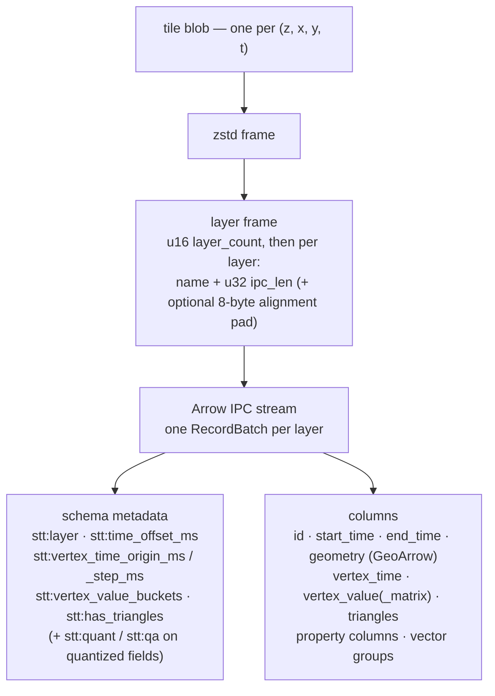

# STT tile payload format

> **Scope:** this page is the normative spec for the **tile payload** (Apache
> Arrow IPC + GeoArrow), which is identical regardless of container. The
> **container** is the packed format —
> [`docs/spec/stt-packed-format.md`](../spec/stt-packed-format.md), which also
> specifies the v5 directory codec (§4 there). The single-file layout under
> "Top-level layout" below documents the **retired single-file container** —
> removed from the Rust toolchain (no writer, reader, or transcode) and no
> longer read by either reference reader; it survives only as a committed legacy
> fixture (`sample.stt`) that a test helper transcodes to packed so the existing
> cross-implementation tests keep exercising its tiles.

An STT dataset combines a spatial tile pyramid with a temporal axis. Tile
payloads are **Apache Arrow IPC** record batches with **GeoArrow**-encoded
geometry, so a browser can decode a tile with one library (`apache-arrow`) and
feed the resulting columnar buffers directly to deck.gl.

**This document is the normative spec for the tile payload.** The reference
implementations are `crates/stt-core/src/arrow_tile.rs` (payload),
`crates/stt-core/src/pack.rs` (packed container) and
`crates/stt-core/src/directory.rs` (the tile index codec) on the Rust side,
and `packages/core/src/archive.ts` / `tile.ts` on the TypeScript side. If an
implementation and this document disagree, that divergence is a **bug in one
of them** — resolved by an erratum to whichever is wrong, never by silently
redefining the spec to match the code. Spec revisions follow the stability
promise and changelog in the
[packed spec §9.1/§9.3](../spec/stt-packed-format.md#91-stability--versioning-promise).
(This spec page is CC-BY-4.0 alongside `docs/spec/` — see the license note in
the packed spec's header.)

## Top-level layout (single-file container)

> The container below is the **single-file** archive. The primary
> container is the packed format (`manifest.json` + content-addressed
> `packs/*.sttp` + `index/*.sttd`); see
> [`stt-packed-format.md`](../spec/stt-packed-format.md). The single-file
> container has been **removed** from the Rust toolchain — `stt-build` emits the
> packed format directly (the non-arrow `--streaming` path streams into the
> `PackWriter`). Neither reference reader decodes it anymore (the TypeScript
> reader is packed-only). The layout below is retained only as a paper record of
> the committed `sample.stt` fixture, which a test-only helper
> (`packages/core/test/helpers/packed-fixture.ts`, `parseV4`) transcodes to an
> in-memory packed dataset before the packed reader consumes it.

```
┌─────────────────────────┐  offset 0
│ Header (64 bytes)       │  fixed-size, little-endian
├─────────────────────────┤
│ Tile blobs              │  compressed Arrow IPC layer frames
│ ...                     │  back to back, no padding
├─────────────────────────┤
│ Dictionary (optional)   │  shared zstd dictionary — no shipped producer
├─────────────────────────┤
│ Index (directory codec) │  the directory — one entry per tile
├─────────────────────────┤
│ Metadata (UTF-8 JSON)   │  human-inspectable; serde-versioned
└─────────────────────────┘  offset = file length
```

Every byte after the header is addressable by `(offset, length)` pairs that
live in the header itself, so a reader can fetch the header, then the
dictionary (if present), index and metadata, then each tile, with O(1) range
requests per addressable unit.

## Magic and version

The first four bytes are the magic number; the trailing byte is the format
version.

| Magic     | Version | Status                                                                                                                                                 |
| --------- | ------- | ------------------------------------------------------------------------------------------------------------------------------------------------------ |
| `STT\x01` | 1       | retired (pre-Arrow protobuf tiles)                                                                                                                     |
| `STT\x02` | 2       | retired (gzip + BLAKE3-64 dedup)                                                                                                                       |
| `STT\x03` | 3       | retired (zstd + CRC32C, no dedup)                                                                                                                      |
| `STT\x04` | 4       | single-file container (dedup + run-length directory); retired — read by neither reference reader, kept only as the committed `sample.stt` test fixture |

> The **current container is the packed format**, which has no single-file magic
> — a dataset is identified by `manifest.json` with `"format": "stt-packed"`. The
> magic table above applies only to single-file archives, which neither reference
> reader decodes anymore: the Rust in-repo reader has been removed, and the
> TypeScript reader is packed-only (`packages/core/src/directory.ts` rejects any
> non-v5 directory). The v4 codec survives only as a test-only helper (`parseV4`)
> that transcodes the frozen `sample.stt` fixture. Readers MUST refuse archives
> whose version they do not understand.

## Header (64 bytes, little-endian)

```rust
struct ArchiveHeader {
    magic: [u8; 4],             // "STT\x04" (4th byte doubles as the version)
    version: u8,                // 4
    compression: u8,            // 0 = none, 2 = zstd (1 = gzip: RETIRED/reserved)
    index_offset: u64,          // start of Index, bytes from file start
    index_length: u64,
    metadata_offset: u64,       // start of Metadata
    metadata_length: u64,
    dictionary_offset: u64,     // 0 if no dictionary present
    dictionary_length: u64,     // 0 if no dictionary present
    reserved: [u8; 10],         // MUST be zero, RESERVED for future use
}
```

Total: 4 + 1 + 1 + 8 + 8 + 8 + 8 + 8 + 8 + 10 = **64 bytes**.

`compression` is the algorithm applied to every tile blob; the header itself,
the index, the metadata, and the dictionary are always uncompressed.

## Tile blobs

Tile blobs are written immediately after the header, back to back, with no
padding. The directory tells a reader where each one starts and how long it
is.

Each blob is **zstd(layer frame)** (the default — `stt-build` is zstd-only)
or the raw layer frame, depending on the header's `compression` byte.
Compression **byte 1 (gzip) is retired/reserved**: no writer ever emitted it,
and no reference reader accepts a v2 (gzip) archive, so byte 1 is never observed
on a v4 blob.

**Deduplication.** The packed `PackWriter` blake3-hashes each compressed blob
and writes byte-identical blobs once — a static cell repeated across time
buckets stores one physical blob, which the directory's run-length encoding
then collapses into a single run.

Every blob carries a **CRC32C of its compressed bytes** as an integrity tag
in its directory entry. Verification status:

- The Rust packed reader (`stt-core::PackedReader`) verifies the tag on read,
  and `stt-validate` checks all tiles up front.
- The TypeScript reader (`packages/core/src/archive.ts`) decodes the tag from
  the directory but does **not** verify it on the hot decode path — a corrupt
  blob surfaces as an Arrow/zstd decode error instead. Readers SHOULD verify
  the tag.

### Layer frame

A tile may carry several named layers (e.g. one for points and one for
linestrings). The blob payload is a tiny frame around one Arrow IPC stream
per layer:

```
[u16 layer_count]            // high bit = ALIGNED_FRAME_FLAG (0x8000)
  repeated layer_count times:
    [u16 name_len][name utf8][u32 ipc_len][pad?][ipc stream bytes]
```

All integers are little-endian. `ipc stream bytes` is the output of an Arrow
`StreamWriter` containing exactly one `RecordBatch`.

**Arrow IPC envelope (normative):**

- **Stream format only.** Each layer's bytes are an Arrow IPC **stream**
  (schema message, then record batch), _not_ the IPC file format — no
  `ARROW1` magic, no footer.
- **Exactly one `RecordBatch` per layer on write.** A conformant writer
  emits one record batch per layer. A conformant reader MAY accept a
  multi-batch stream by concatenating batches in stream order, but MUST NOT
  depend on more than one being present.
- **No IPC-level body compression.** Record-batch bodies are raw (no
  `LZ4_FRAME`/`ZSTD` IPC body codec) — compression is the per-blob zstd
  frame around the whole layer frame, and the zero-copy GPU path depends on
  the IPC buffers arriving uncompressed.
- **No delta dictionaries.** Dictionary-encoded columns (categorical
  properties) ship their complete dictionary inside the layer's own stream;
  delta dictionary batches and dictionary replacement are not permitted —
  every tile decodes standalone.

**Size ceilings (normative):** `ipc_len` is `u32`, capping one layer's IPC
stream at 4 GiB − 1; the directory likewise caps a tile's compressed blob
length, uncompressed payload size, and `feature_count` at `u32` — see the
[packed spec §12 (Container limits)](../spec/stt-packed-format.md#12-container-limits).
A writer MUST fail loudly at these ceilings, never wrap or clamp.

When the leading `u16`'s `ALIGNED_FRAME_FLAG` (`0x8000`) bit is set, the
writer inserts `(8 - pos % 8) % 8` zero bytes after each `ipc_len` so every
IPC stream starts 8-byte aligned relative to the payload start — the
alignment Arrow requires for zero-copy buffer views. `ipc_len` is the exact
IPC byte length (padding excluded); the pad is never stored, readers derive
it from the same alignment math. Layer count is therefore capped at
`0x7fff`. Frames with the flag unset carry no padding; readers MUST accept
both shapes. See the packed spec §5.1.

The whole payload, unwrapped:



### Layer frame v2 (packed formatVersion 2)

Datasets written as packed **formatVersion 2** replace the frame above with
the **sectioned, template-referencing** frame — normatively specified in the
[packed spec §5.2](../spec/stt-packed-format.md#52-tile-payload-layer-frame-v2-sectioned-template-referencing).
The Arrow envelope rules above (stream format, one `RecordBatch` per layer,
no IPC body compression, no delta dictionaries, u32 size ceilings) are
unchanged; what moves is _where_ the schema and the per-tile metadata live:

- The layer's Arrow IPC **schema message** is hoisted into a per-dataset
  **template** (referenced by blake3-128 hash, resolved through
  `manifest.schemas`) instead of being repeated in every tile — the frame
  carries only the stream **tail** (dictionary batches + record batch +
  end-of-stream), and the reader splices `concat(template, tail)` back into
  a stock Arrow stream. Dictionary batches stay per-tile (categories vary);
  an empty tile still carries one DictionaryBatch per dictionary column.
- Reserved columns form a **CORE** batch and property columns a **PROPS**
  batch (own schema/template), each in its own TOC section, so properties
  can be decoded lazily and unknown future sections are skippable.
- The **per-tile-varying** schema-metadata keys of the diagram above —
  `stt:qa` (per property field), `stt:time_offset_ms`,
  `stt:vertex_time_origin_ms`/`stt:vertex_time_step_ms`,
  `stt:vertex_value_buckets` — move into the frame's canonical-JSON
  `TILE_META` section (`qa` / `t0` / `vt` / `vb`, plus `sorted`). The
  dataset-constant keys (`stt:layer`, `stt:geometry`, `stt:quant`,
  `stt:has_triangles`, the GeoArrow extension metadata) stay in the
  template. Reference decoders **re-inject** the TILE_META values into the
  decoded batch's schema/field metadata, so every consumer downstream of
  decode sees the v1-shaped layer of this document, unchanged.
- v2 rows are stable-sorted by `start_time` at encode (after feature-id
  assignment), declared by `TILE_META.sorted`.

`stt-serve` responses keep emitting the v1 frame regardless of build
version (see the [serve protocol](../spec/stt-serve-protocol.md)); the v2
frame appears only inside packed formatVersion-2 datasets.

### Per-layer Arrow schema

| column                | type                                                                                                                   | nullability | notes                                                                                                                                                                                                                                                                                                                    |
| --------------------- | ---------------------------------------------------------------------------------------------------------------------- | ----------- | ------------------------------------------------------------------------------------------------------------------------------------------------------------------------------------------------------------------------------------------------------------------------------------------------------------------------ |
| `id`                  | `UInt64`                                                                                                               | non-null    | per-feature id (H3 / quadbin cell index in summary tiles)                                                                                                                                                                                                                                                                |
| `start_time`          | `Int64`                                                                                                                | non-null    | Unix ms, absolute                                                                                                                                                                                                                                                                                                        |
| `end_time`            | `Int64`                                                                                                                | non-null    | Unix ms, absolute                                                                                                                                                                                                                                                                                                        |
| `geometry`            | GeoArrow Point / LineString / Polygon                                                                                  | non-null    | interleaved lon/lat, `Float64` by default (`Int32` fixed-point when coordinate-quantized, `[x,y,z]` when the point-elevation fold is applied) — see below                                                                                                                                                                |
| `vertex_time`         | `List<UInt16>` (deltas) or `List<Int64>` (exact)                                                                       | nullable    | per-vertex times (LineString only) — see below                                                                                                                                                                                                                                                                           |
| `vertex_value`        | `List<Float32>`                                                                                                        | nullable    | per-vertex scalar (e.g. SST on drifters/currents); decoded to `BinaryFeatures.vertexValues`                                                                                                                                                                                                                              |
| `vertex_value_matrix` | `List<Float32>`                                                                                                        | nullable    | per-vertex × per-bucket value matrix (vertex-major) for static-geometry overview animation; bucket count in schema metadata `stt:vertex_value_buckets`                                                                                                                                                                   |
| `triangles`           | `List<UInt16>` or `List<UInt32>`                                                                                       | non-null    | feature-local earcut indices (Polygon, `--pre-tessellate`); `UInt16` when the feature-local max index fits, else `UInt32`                                                                                                                                                                                                |
| `<prop>`              | `Float64` (numeric) or `Dictionary<UInt16, Utf8>` (categorical); `UInt16`/`Int32` fixed-point when attribute-quantized | nullable    | one column per property, by name — see below                                                                                                                                                                                                                                                                             |
| `<vector-group>`      | `FixedSizeList<Float32 \| UInt8, N>`                                                                                   | nullable    | interleaved GPU-ready vector column fused from N scalar properties (`--vector-group NAME=col1,col2,…[:f32\|u8]`, e.g. `surfel_quat=qx,qy,qz,qw` or `point_rgba=r,g,b,a:u8`); decoded to `BinaryFeatures.vectorProps` and bound zero-copy to an instanced attribute. The source scalar columns are removed from the tile. |

Geometry uses the GeoArrow extension metadata key
`ARROW:extension:name` with values `geoarrow.point`, `geoarrow.linestring`,
or `geoarrow.polygon` — see [GeoArrow interop](#geoarrow-interop) below.
Coordinates are interleaved `[x, y]` pairs (`[x, y, z]` for elevation-folded
points — see below) in WGS84 degrees. By default the leaf is `Float64` and
the writer does **not** quantize or delta-encode it — per-blob zstd on the
IPC bytes does the work (the writer is zstd-only). A layer built with
coordinate quantization ships the identical List/FixedSizeList nesting with
an `Int32` leaf instead — see below.

Layers within one tile MUST agree on feature count for the rows they each
cover, but they MAY carry different property columns.

#### Coordinate quantization

A layer built with coordinate quantization stores its geometry leaf as
**`Int32` grid indices** instead of `Float64` lon/lat. The List/FixedSizeList
nesting is unchanged — Point is still `FixedSizeList<_, 2>`, LineString still
`List<FixedSizeList<_, 2>>`, Polygon still `List<List<FixedSizeList<_, 2>>>` —
only the leaf `DataType` and its values change, so a reader that already
walks the nesting only has to branch on the leaf type.

The reconstruction affine rides in the `geometry` field's **field-level**
Arrow metadata:

| field metadata key | value                                                                                   |
| ------------------ | --------------------------------------------------------------------------------------- |
| `stt:quant`        | JSON `{"x0","y0","sx","sy"}` (adds `"z0","sz"` for elevation-folded points — see below) |

A reader reconstructs each coordinate as `lon = x0 + qx * sx`,
`lat = y0 + qy * sy` (and, for 3D points, `alt = z0 + qz * sz`). Absence of
`stt:quant` on the `geometry` field means the leaf is the default `Float64`
lon/lat; a reader MUST check for the key rather than assume `Float64` (the
Arrow `DataType` — `Int32` vs `Float64` — also distinguishes the two shapes,
but the metadata key is the documented contract, and is required to recover
`x0`/`y0`/`sx`/`sy`).

The grid is a single **world-anchored** grid — origin `(x0, y0) = (-180,
-90)` and a uniform step in degrees, `sx = sy = meters_precision / 111320`
(mean meters per degree of latitude) — not a per-tile, bbox-relative grid.
This is deliberate: a bbox-relative grid would give the same real-world
coordinate a different quantized index in different tiles, defeating the
packed format's content-addressed blob dedup; a world-anchored grid keeps
identical geometry byte-identical across tiles. `x0`, `y0`, `sx`, `sy` are
therefore identical across every tile of a dataset built at one precision.
Because the step is uniform in degrees, ground precision in meters is
`meters_precision` at the equator and `meters_precision * cos(lat)`
elsewhere — always at or finer than the requested precision, never coarser.
Worst-case reconstruction error is half a quantum (`~meters_precision / 2`).
Quantized indices are clamped to the `Int32` range.

> Quantized geometry is no longer literal GeoArrow — see the callout in
> [GeoArrow interop](#geoarrow-interop).

#### Point-elevation fold (3D points)

A layer can fold a numeric property into POINT geometry as a 3rd coordinate
instead of shipping it as a separate property column. The geometry leaf
becomes `FixedSizeList<_, 3>` of `[x, y, z]` (rather than the default
`FixedSizeList<_, 2>`); the folded property is removed from the layer's
property set entirely — it exists only inside the geometry. Only POINT
layers are affected; on LineString/Polygon layers the fold is a no-op and
the named column, if present, ships as an ordinary property. A reader
distinguishes 2D from 3D points purely from the geometry field's
`FixedSizeList` width — there is no separate metadata flag for the fold
itself.

The fold composes independently with [coordinate quantization](#coordinate-quantization):

- **Without** coordinate quantization: the leaf is `Float64`, 3-wide, and
  the `geometry` field carries no `stt:quant` metadata.
- **With** coordinate quantization: the leaf is `Int32`, 3-wide, and the
  `stt:quant` affine carries the additional `z0`/`sz` keys. `z0` is a fixed
  global datum (`z0 = 0`, not a per-layer minimum — unlike the attribute
  quantization offset below) so identical altitudes stay byte-identical
  across tiles, the same dedup-preserving reasoning as the `x`/`y` world
  grid. `z` is metres, not degrees, so `sz` is the requested ground
  precision directly (`sz = meters_precision`, vs. `sx`/`sy` which are in
  degrees since `x`/`y` are lon/lat), giving `alt = z0 + qz * sz`.

A feature with no value for the folded property encodes `z = 0`
(`qz = 0` when quantized).

#### `vertex_time` (per-vertex timestamps)

LineString layers built with `--end-time-field` carry a per-vertex time
column. The writer encodes it as `List<UInt16>` **deltas** relative to a per-layer
`(origin, step)`: the absolute time of a vertex is
`origin + delta * step`. The origin and step are recorded in the layer's
**schema-level** Arrow metadata under the keys:

| schema metadata key         | meaning                                   |
| --------------------------- | ----------------------------------------- |
| `stt:vertex_time_origin_ms` | absolute Unix-ms origin (`i64` as string) |
| `stt:vertex_time_step_ms`   | ms per delta unit (`u32` as string)       |

The encoder picks the smallest `step` (≥ 1) that keeps every
`(t - origin)` inside `u16::MAX`, **bounded by a precision ceiling**
(`DEFAULT_VERTEX_TIME_MAX_STEP_MS` = 1000 ms, configurable via
`stt-build --vertex-time-precision`). A layer whose span would need a
coarser step — anything over ~18.2 h at the default — takes the exact
absolute `List<Int64>` shape instead and omits the two metadata keys, so
quantization error is always bounded by the ceiling. A reader
that sees a `List<Int64>` column (or no origin/step metadata) treats the
values as absolute Unix ms; a reader that sees `List<UInt16>` reconstructs
`origin + delta * step`.

#### `triangles` (pre-tessellated polygon meshes)

`triangles` is present only when the archive was built with
`stt-build --pre-tessellate` (the layer also carries the schema metadata
key `stt:has_triangles = "true"`). The column is emitted only for polygon
layers — an over-eager builder that attaches it to a point/line layer has
it silently dropped at encode time. The Rust writer stores feature-LOCAL
indices, narrowed to `List<UInt16>` when every feature-local index fits in
16 bits (the common case) and `List<UInt32>` otherwise; the TS decoder
pre-shifts them by each feature's `startIndices[i]` and exposes a single
tile-global `triangles: Uint32Array` on `BinaryFeatures` so the renderer can
hand it straight to deck.gl / WebGL.

#### Space-time cube payload (`vertex_value_matrix`)

Two columns carry per-vertex scalars, and the distinction is the difference
between _animating geometry_ and _animating a value over static geometry_:

| column                | shape                                                                       | use when                                                                                                                             |
| --------------------- | --------------------------------------------------------------------------- | ------------------------------------------------------------------------------------------------------------------------------------ |
| `vertex_value`        | `List<Float32>`, one value per vertex                                       | each vertex has a single, time-invariant scalar (e.g. drifter sea-surface temperature) while the **geometry** animates along a trail |
| `vertex_value_matrix` | `List<Float32>`, `vertex_count × num_buckets` per feature, **vertex-major** | the **geometry is static** but each vertex carries a per-bucket _time series_ (e.g. flow-corridor counts per hour)                   |

`vertex_value_matrix` is STT's **space-time cube** primitive. The geometry is
written once; the temporal variation lives entirely in the value matrix. Each
feature's row is flattened vertex-major — `matrix[v * num_buckets + b]` is the
value of vertex `v` in bucket `b` — and `num_buckets` is recorded in the
schema-level metadata key `stt:vertex_value_buckets` (the reader reshapes the
flat list back to a `[vertex][bucket]` grid with it). The encoding reuses the
`vertex_value` `List<Float32>` representation; rows are just longer.

This reframes a tile as a **cube**: the `(x, y)` of each vertex is the spatial
face, and the bucket axis `b ∈ [0, num_buckets)` (each bucket
`temporal_bucket_ms` wide, anchored per the [time model](../spec/time-model.md))
is the temporal face. Because the buckets are columns of one resident array, the
renderer animates by **selecting the active bucket column at the playhead** —
no tile re-fetch, no re-upload, no re-decode as the clock advances. The TS
decoder (`packages/core/src/tile.ts`) concatenates features into one globally
vertex-major `Float32Array` aligned with the position buffer; layers such as
[`FlowCorridorLayer`](../api/flow-corridor-layer.md) read the current column per
frame, and the [`TimeFilterExtension`](../api/time-filter-extension.md) can lift
the value into the _time-as-height_ "squash" cube with a single uniform.

> **Mutually exclusive with `vertex_time`.** A layer carries either per-vertex
> _timestamps_ (`vertex_time`, for trails that move through their own geometry) or
> a per-vertex _value-over-buckets_ matrix (`vertex_value_matrix`, for static
> geometry whose value pulses) — never both. The builder omits `vertex_time`
> whenever a matrix is present (`crates/stt-build/src/columnar.rs`).

`vertex_value_matrix` is the payload substrate any build-time analytic would
sit on: a pass that produces a per-cell, per-bucket scalar field lands in
exactly this column. (A full preprocessing framework — cube / aggregation /
trend recipes — was designed and deliberately counted out; see the counted-out
register in `docs/roadmap/stt-packed-format-decisions.md`.)

#### Numeric attribute quantization

Any `<prop>` numeric column can ship as fixed-point integers instead of
`Float64` — either at an explicit per-column ground precision, or, for every
otherwise-raw numeric column, range-adaptively (the column's own
`[min, max]` span mapped onto the full 16-bit index space). An explicit
per-column precision always wins over the range-adaptive default for that
column.

A quantized property field carries the reconstruction affine in its own
**field-level** Arrow metadata:

| field metadata key | value            |
| ------------------ | ---------------- |
| `stt:qa`           | JSON `{"o","s"}` |

A reader reconstructs the value as `value = o + q * s`. Absence of `stt:qa`
on a numeric property field means the column is the default `Float64`; a
reader MUST check for the key rather than infer quantization from the Arrow
`DataType` alone. A `null` cell stays `null` in the quantized column —
quantization never manufactures a value for a missing one. The property
folded by the [point-elevation fold](#point-elevation-fold-3d-points), if
any, is removed from the property set before quantization runs, so it is
never separately attribute-quantized.

| mode                  | leaf type                                                  | `o` / `s`                                                                                                                                                                           |
| --------------------- | ---------------------------------------------------------- | ----------------------------------------------------------------------------------------------------------------------------------------------------------------------------------- |
| explicit precision    | `UInt16` if the quantized range fits 16 bits, else `Int32` | `o` = the column's finite minimum; `s` = the requested precision                                                                                                                    |
| range-adaptive (auto) | always `UInt16`                                            | `o` = the column's finite minimum (`0.0` if the tile has none); `s` = `(max - min) / 65535` (or `1.0` when there's no range — a constant column, or none, or a single finite value) |

Unlike the [coordinate-quantization](#coordinate-quantization) affine, whose
`x0`/`y0`/`sx`/`sy` are fixed dataset-wide constants, `o` and `s` here are
derived from **that tile's own** column values, so the same property's
`stt:qa` affine — and, under the explicit-precision mode, even its leaf type
(`UInt16` vs `Int32`) — can differ from tile to tile. A reader decodes
`stt:qa` fresh from each tile's schema rather than caching it across tiles of
the same property. The range-adaptive mode fixes the leaf to `UInt16` in
every tile (it never falls back to `Int32`), so a reader need not branch on
leaf width in that mode — only the affine varies.

### Summary-tier layers

An archive built with `--summary-tier` carries pre-aggregated cell tiles at
low zooms, declared by `metadata.summary_tier` (see
[Metadata](#metadata-utf-8-json)). A summary tile is an ordinary tile — same
layer frame, same Arrow envelope, same required columns — with these
additional normative constraints:

- **Layer name.** The summary layer is named `summary_tier.layer_name`
  (default `summary`, `--summary-layer`).
- **`id` is a cell index, not a feature id (normative).** In a summary layer
  the `id` column MUST be a **valid cell index of the declared
  `summary_tier.scheme`** — an H3 cell index (`"h3"`) or a CARTO quadbin cell
  index (`"quadbin"`) — at the resolution
  `summary_tier.cell_resolution_per_zoom[z - summary_tier.min_zoom]` for the
  tile's zoom `z` (clamped to the table's ends outside
  `[min_zoom, max_zoom]`). Renderers derive the cell polygon from the id and
  any `u64` decodes without error, so a wrong id fails silently: three shipped
  archives once carried sequential row numbers here, decoded cleanly, passed
  validation, and rendered blank. `stt-validate` now checks cell-id validity
  per scheme/resolution.
- **Geometry.** The `geometry` column is a GeoArrow **Point at the cell's
  centroid** — a representative lon/lat for picking and fallbacks; the cell
  outline is reconstructed client-side from the id (h3-js for H3, the
  quadbin→tile math for quadbin).
- **Aggregate columns.** The layer always carries a `count` `Float64`
  property (features aggregated into the cell). Each `summary_tier.columns[]`
  entry with a non-`count` `agg` ships as one additional `Float64` property
  column; a cell with no source values for a column is `null`, never `0`.
- **`sub_buckets` contract.** When `summary_tier.sub_buckets = N > 1`
  (`--summary-sub-buckets N`, keep ≤ 32), the layer carries N additional
  `Float64` columns named `bucket_0 … bucket_<N-1>`: `bucket_i` counts the
  source features assigned to sub-bucket
  `i = min(floor((t − bucket_start) / w), N − 1)` with sub-width
  `w = max(floor(temporal_bucket_ms / N), 1)` — the clamp makes the last
  sub-bucket absorb any division remainder. The renderer animates inside an
  outer bucket by indexing these columns with a uniform — no re-fetch.
- **Times.** Per-cell `start_time` / `end_time` are the min/max observed
  source timestamps in the cell (tight, per the
  [time model](../spec/time-model.md)), not the bucket edges.

### GeoArrow interop

An STT tile layer **is** a valid [GeoArrow](https://geoarrow.org/format.html)
record batch. The Rust writer (`crates/stt-core/src/arrow_tile.rs`) tags
the `geometry` field's Arrow metadata with the standard extension keys:

| field metadata key         | values                                                        |
| -------------------------- | ------------------------------------------------------------- |
| `ARROW:extension:name`     | `geoarrow.point` / `geoarrow.linestring` / `geoarrow.polygon` |
| `ARROW:extension:metadata` | `{"crs":"OGC:CRS84","crs_type":"authority_code"}`             |

The `ARROW:extension:metadata` value is the GeoArrow per-type metadata JSON.
STT pins the CRS to **OGC:CRS84** — WGS84 with the GeoJSON longitude-first axis
order, matching the interleaved `[lon, lat]` storage — _not_ `EPSG:4326`, whose
strict (lat/lon) axis order would mislabel the data. Carrying it makes every
tile self-describing to GDAL / GeoPandas / lonboard / QGIS; a reader that wants
the CRS reads this key, and a reader that ignores it is unaffected (the key is
additive). Archives that carry only `ARROW:extension:name` (no CRS metadata)
should be treated as OGC:CRS84.

> **Anchored-local frames.** Coordinates are _always_ CRS84 lon/lat at the
> payload level, but the [scene-bundle profile](../spec/sidecar-assets.md#4-georeferencing-georeferenced-vs-anchored-local)
> defines an `anchored-local` case where those lon/lat values are a local metric
> frame _anchored_ to an approximate position (e.g. Waymo, whose true georeference
> is undisclosed) rather than authoritative WGS84. The coordinates are still
> CRS84-shaped; they are simply not basemap-aligned. The distinction lives in the
> bundle envelope, not the tile.

Coordinates use the GeoArrow **interleaved** convention
(`FixedSizeList<Float64, 2>` of `[x, y]` pairs), which matches the
`xy` storage Lonboard and `@geoarrow/deck.gl-layers` consume by
default. Polygons are encoded as `List<List<FixedSizeList<Float64, 2>>>`
(rings inside features), and linestrings as `List<FixedSizeList<Float64, 2>>`.
This is the default shape only — see the callout immediately below for the
two encoder features that depart from it.

> **Quantized / elevation-folded tiles are not literal GeoArrow.** The
> "is a valid GeoArrow record batch" guarantee above assumes the default
> `Float64`, 2-wide interleaved leaf. A layer built with [coordinate
> quantization](#coordinate-quantization) (`Int32` leaf) or the
> [point-elevation fold](#point-elevation-fold-3d-points) (3-wide leaf) no
> longer matches what a generic GeoArrow consumer
> (`@geoarrow/deck.gl-layers`, Lonboard, geoarrow-rs) expects, and such a
> consumer will misread the coordinates. A reader MUST check the `geometry`
> field for `stt:quant` (and inspect the `FixedSizeList` width) before
> treating a tile as vanilla GeoArrow; the STT decoder
> (`packages/core/src/tile.ts`) always does.

The schema-level metadata also carries `stt:layer` (the layer name),
`stt:time_offset_ms` (the layer's minimum `start_time`, baked at encode time
so a reader can relativize times against a Float32-safe offset without a
min-scan over the column — written whenever a start-time column exists), and
a legacy `stt:geometry` key for back-compat; readers SHOULD prefer the
standard field-level key and fall back to `stt:geometry` only when it is
absent.

In TypeScript, the decoded `Layer` exposes both surfaces:

```ts
import { toGeoArrowTable } from '@poopdeck.gl/core';
import { GeoArrowPathLayer } from '@geoarrow/deck.gl-layers';

const table = toGeoArrowTable(tile.layers[0]);
new GeoArrowPathLayer({
  id: 'paths',
  data: table,
  getPath: table.getChild('geometry')!,
});
```

`Layer.geometryExtensionName` carries the same string for callers
that want to dispatch on geometry kind without touching the Arrow
schema directly. This means any GeoArrow-aware renderer
(`@geoarrow/deck.gl-layers`, Lonboard, geoarrow-rs in WASM) can consume
STT tiles as-is — no per-tile conversion step.

### Naming conventions

Layer name `default` is the conventional "everything" layer. The build
pipeline may emit a `default_originals` companion layer containing
unsimplified geometry when `--simplify` is used; clients can pick the
appropriate one based on zoom. Summary-tier tiles use the layer name
`summary` by default (overridable via `--summary-layer`).

#### Per-vertex column names across the pipeline

One per-vertex concept is spelled differently at each stage. The input
(GeoParquet) columns are **plural**; the wire (Arrow) columns are **singular**
(matching `start_time` / `end_time` and deck.gl's `getTimestamps`); the decoded
TypeScript fields are camelCase. This is the canonical contract:

| concept                        | input column (GeoParquet) | wire column (Arrow — **FROZEN**) | decoded TS field (`BinaryFeatures`) |
| ------------------------------ | ------------------------- | -------------------------------- | ----------------------------------- |
| per-vertex timestamps          | `vertex_timestamps`       | `vertex_time`                    | `vertexTimestamps`                  |
| per-vertex scalar value        | `vertex_values`           | `vertex_value`                   | `vertexValues`                      |
| per-vertex × per-bucket matrix | `vertex_value_matrix`     | `vertex_value_matrix`            | `vertexValueMatrix`                 |

The plural→singular flip on the first two rows is **intentional** — the wire
names are frozen (see [the packed spec](../spec/stt-packed-format.md)).
`vertex_value_matrix` keeps a single name through all three stages (only the
case changes). The input reader matches the plural column name exactly, with no
singular fallback: a singular `vertex_time` / `vertex_value` _input_ column is
not recognized and its data decodes to a silent `null`.

## Dictionary (optional — no shipped producer)

The single-file header reserves a slot (`dictionary_offset` /
`dictionary_length`) for a single shared zstd dictionary that would apply to
every tile blob, but **no producer ever shipped one** — the Rust single-file
writer and reader that trained and loaded it have been removed, and `stt-build`
writes packed datasets via `PackWriter` (explicitly dictionary-less so the
browser's `fzstd` decoder works). The packed format has **no dictionary slot at
all** — every blob is an independent zstd frame. `dictionary_offset == 0` means
no dictionary.

## Index (the directory)

The directory is **not** Arrow IPC — it is a compact columnar binary codec
(`crates/stt-core/src/directory.rs`): delta + zig-zag LEB128 varint key
columns plus blob-run RLE, sorted by `(zoom, hilbert, time_start)` so every
column delta-codes to ~1 byte per entry. The wire encoding is specified in
[the packed format spec §4](../spec/stt-packed-format.md); the
single-file container embeds the same codec at the header's
`index_offset` (its variant has no per-run `pack_id` column —
whole-file offsets, decoded as `pack_id = 0`).

Each entry decodes to these logical fields (`stt_core::TileEntry`, defined in
`directory.rs`):

| field                | type          | description                                                                   |
| -------------------- | ------------- | ----------------------------------------------------------------------------- |
| `zoom`               | `u8`          | zoom level                                                                    |
| `x`                  | `u32`         | tile x                                                                        |
| `y`                  | `u32`         | tile y                                                                        |
| `time_start`         | `i64`         | inclusive temporal start, Unix ms (bucket boundary)                           |
| `time_end`           | `i64`         | inclusive temporal end, Unix ms                                               |
| `pack_id`            | `u32`         | pack object index (always 0 in a single-file archive)                         |
| `offset`             | `u64`         | byte offset of the compressed blob (pack-relative; whole-file in single-file) |
| `length`             | `u32`         | compressed blob length                                                        |
| `uncompressed_size`  | `u32`         | uncompressed payload length                                                   |
| `feature_count`      | `u32`         | total features across the tile's layers                                       |
| `hilbert`            | `u64`         | Hilbert index of `(zoom, x, y)` — directory sort key                          |
| `crc32c`             | `u32`         | CRC32C of the compressed blob (integrity tag)                                 |
| `temporal_bucket_ms` | `Option<u64>` | bucket size this tile covers (base vs temporal-LOD tier)                      |
| `cover_t_min`        | `Option<i64>` | tight lower covering bound — earliest feature start actually in the tile      |

The Hilbert ordering is what makes range coalescing work: viewport tiles at
the same zoom level tend to be contiguous in blob order, so a reader can
issue one HTTP Range request that covers several tiles.

`temporal_bucket_ms` is `None` on archives without a temporal-LOD pyramid
(readers fall back to the archive-level `Metadata::temporal_bucket_ms`);
`cover_t_min` is `None` on pre-covering builds (readers fall back to
`time_start`).

## Metadata (UTF-8 JSON)

Stored as a single `serde_json::Value`. Schema below; unknown fields are
preserved on round-trip via serde defaults so old readers don't break on
new fields.

```jsonc
{
  "name": "earthquakes",
  "description": "USGS feed",
  "attribution": "USGS",
  "bounds": {
    "min_lon": -180.0,
    "min_lat": -85.05,
    "max_lon": 180.0,
    "max_lat": 85.05,
  },
  "time_range": { "start": 1577836800000, "end": 1735689599000 },
  "min_zoom": 0,
  "max_zoom": 8,
  "tile_count": 1234,
  "feature_count": 56789,
  "layers": ["default"],
  "properties": {},
  "temporal_bucket_ms": 3600000,

  // Optional — present when the archive was built with --summary-tier;
  // the layer-level contract is in "Summary-tier layers" above
  "summary_tier": {
    "scheme": "h3", // "h3" (Uber H3 hexes) or "quadbin" (CARTO quadbin)
    "min_zoom": 0,
    "max_zoom": 4,
    "cell_resolution_per_zoom": [0, 1, 2, 3, 4],
    "columns": [
      { "name": "_count", "agg": "count" },
      { "name": "magnitude", "agg": "mean" },
    ],
    "layer_name": "summary",
    "sub_buckets": 1, // >1 (--summary-sub-buckets N; keep ≤32) emits
    // bucket_0..bucket_<N-1> per-cell count columns
  },

  // Optional — present when the archive was built with --temporal-lod.
  // Each level's bucket_ms is a strict multiple of temporal_bucket_ms,
  // sorted ascending. Readers pick the coarsest level whose
  // max_zoom_level >= current zoom.
  "temporal_lod": [
    { "bucket_ms": 86400000, "max_zoom_level": 8 },
    { "bucket_ms": 2592000000, "max_zoom_level": 4 },
  ],

  // Optional — present when built with --heatmap-weight / --heatmap-class.
  // HeatmapLayer pins colorDomain to [min, max] (95p of weight, not absolute
  // max) instead of doing a runtime GPU readback.
  "heatmap_domain": {
    "classes": [
      { "id": "default", "min": 4.0, "max": 6.2, "property": "magnitude" },
    ],
  },
}
```

`temporal_bucket_ms` is load-bearing: the client tileset enumerates exactly
these bucket boundaries when prefetching forward in time, which keeps the
cache-hit rate high during animation.

## Read order

**Packed (current):** `GET manifest.json` → `GET` the directory object →
per visible tile, a Range request into the right pack — see
[the packed format spec §6](../spec/stt-packed-format.md). The TypeScript
reader coalesces ranges within a pack when their gap is under 2 MiB
(`DEFAULT_RANGE_COALESCE_GAP` in `packages/core/src/archive.ts`,
overridable via `ArchiveOptions.coalesceGapBytes`) — tuned for HTTP/2
against edge caches, where re-fetching a small gap is cheaper than an
extra request.

**Single-file container** (the retired format's read order, mirrored by the
`parseV4` test helper that transcodes the `sample.stt` fixture to packed):

1. Bytes `[0, 64)` → header. Verify magic and version.
2. If `dictionary_length > 0`: read the dictionary slot and construct a
   shared zstd decompressor with it.
3. `[index_offset, index_offset + index_length)` → index. Decode the
   directory codec; build in-memory secondary indices.
4. `[metadata_offset, metadata_offset + metadata_length)` → metadata.
5. Per tile: `[entry.offset, entry.offset + entry.length)` → blob. Verify
   the CRC32C, decompress, decode the layer frame, hand the resulting Arrow
   `RecordBatch`es to the consumer.

## Forward and backward compatibility

- The `compression` byte is the only place new compression algorithms are
  added; readers MUST reject values they do not understand.
- The directory codec carries its own version byte (currently v5 packed /
  v4 single-file) and evolves independently of the container.
- New per-layer columns are tolerated automatically — they appear in the
  Arrow schema and a property-aware client passes them through to the
  renderer.
- Coordinate quantization (`stt:quant`) and numeric attribute quantization
  (`stt:qa`) are opt-in re-typings of the _existing_ `geometry` and `<prop>`
  columns, not new columns — unlike a new column, a reader that doesn't
  check for these keys won't skip the data, it will silently misdecode it
  (e.g. reading raw `Int32` grid indices as tiny lon/lat degrees, or a raw
  quantized index as an enormous property value). A reader MUST check both
  keys before decoding `geometry` / any numeric `<prop>` field. The writer
  additionally declares each such re-typing in `manifest.capabilities`
  (`coord-quant` / `attr-quant` / `elevation-fold` — packed spec §3.1), so a
  reader that lacks the feature refuses the dataset at open instead of
  misdecoding it.
- New metadata fields use serde defaults so old archives decode under new
  readers; new fields are skipped when unset so new archives decode under
  old readers that ignore them.
- The 10 reserved header bytes (single-file) are reserved for additive
  features. They MUST be zero on write.

## Validating an archive

`stt-validate <dataset>` accepts a packed dataset directory or its
`manifest.json` (the single-file `.stt` container has been removed). It first
verifies the content-addressing contract (every pack/directory object
blake3-hashes to its filename, declared lengths match, no out-of-range
`pack_id`), then verifies every tile's CRC32C, decodes each payload, and
reports schema and feature-count anomalies. Use it after generating data
and in CI. Pass `--json` for a machine-readable report, `--fail-fast` to
stop on the first failure, `--skip-decode` to verify only integrity.
