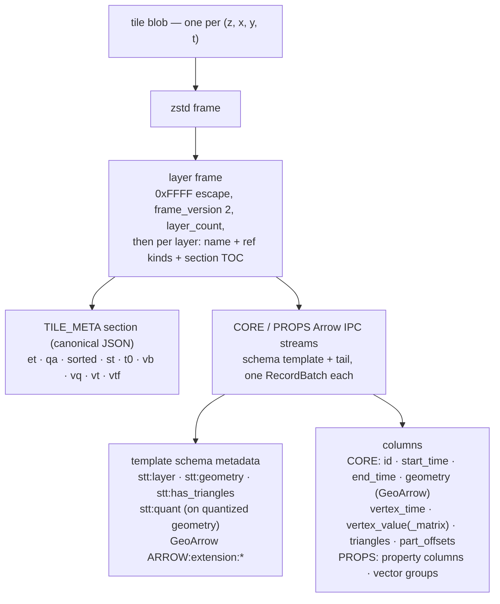

# STT tile payload format

> **Scope:** this page is the normative spec for the **tile payload** (Apache
> Arrow IPC + GeoArrow) — what one tile's bytes decode to. The **container**
> that stores those bytes is the packed format,
> [`docs/spec/stt-packed-format.md`](../spec/stt-packed-format.md), which owns
> the manifest, the v6 directory codec (§4 there), and the layer-frame
> envelope (§5.2 there). One payload shape is current; this page describes
> only that shape.

An STT dataset combines a spatial tile pyramid with a temporal axis. Tile
payloads are **Apache Arrow IPC** record batches with **GeoArrow**-encoded
geometry, so a browser can decode a tile with one library (`apache-arrow`) and
feed the resulting columnar buffers directly to deck.gl.

The reference implementations are `crates/stt-core/src/arrow_tile/` (payload),
`crates/stt-core/src/pack/` (packed container) and
`crates/stt-core/src/directory.rs` (the directory codec) on the Rust side,
and `packages/core/src/archive.ts` / `tile.ts` on the TypeScript side. If an
implementation and this document disagree, that divergence is a **bug in one
of them** — resolved by an erratum to whichever is wrong, never by silently
redefining the spec to match the code. Spec revisions follow the stability
promise in
[packed spec §9.1](../spec/stt-packed-format.md#91-stability--versioning-promise).
(This spec page is CC-BY-4.0 alongside `docs/spec/` — see the license note in
the packed spec's header.)

## Tile blobs

Tile blobs are written back to back inside a `packs/*.sttp` object, with no
padding. The directory tells a reader which pack each one lives in, where it
starts, and how long it is.

Each blob is **zstd(layer frame)** — `stt-build` is zstd-only, and each blob
is an independent frame with no shared dictionary, so a browser decoder can
decompress any one tile on its own.

**Deduplication.** The packed `PackWriter` blake3-hashes each compressed blob
and writes byte-identical blobs once — a static cell repeated across time
buckets stores one physical blob, which the directory's run-length encoding
then collapses into a single run.

Every blob carries a **CRC32C of its compressed bytes** as an integrity tag
in its directory entry. Verification status:

- The Rust packed reader (`stt-core::PackedReader`) verifies the tag on read,
  and `stt-validate` checks all tiles up front.
- The TypeScript reader (`packages/core/src/archive.ts`) decodes the tag from
  the directory but does **not** verify it on the hot decode path — a corrupt
  blob surfaces as an Arrow/zstd decode error instead. Readers SHOULD verify
  the tag.

### Layer frame

A tile may carry several named layers (e.g. one for points and one for
linestrings). The blob payload is the **sectioned, template-referencing layer
frame**, whose byte layout is normative in
[packed spec §5.2](../spec/stt-packed-format.md#52-tile-payload-layer-frame-v2-sectioned-template-referencing).
This page specifies what that frame's sections decode to.

The whole payload, unwrapped:



Three properties of the frame shape the decode, and every one of them is
specified in packed spec §5.2:

- The layer's Arrow IPC **schema message** is hoisted into a per-dataset
  **template** (referenced by blake3-128 hash, resolved through
  `manifest.schemas`) rather than repeated in every tile. A section carries
  only the stream **tail** — dictionary batches, record batch,
  end-of-stream — and the reader splices `concat(template, tail)` back into a
  stock Arrow stream. Dictionary batches ride in the per-tile tail whenever
  any dictionary in the stream is tile-local; when **every** dictionary in a
  PROPS stream was built against a dataset-global pinned category list the
  messages are byte-identical across tiles and move into the template
  instead. The split is all-or-nothing per stream, because the
  template/tail cut is a single byte offset into one IPC stream.
- Reserved columns form a **CORE** batch and property columns a **PROPS**
  batch, each with its own template and its own TOC section, so properties
  can be decoded lazily and unknown future sections are skippable.
- **Per-tile-varying** metadata lives in the frame's canonical-JSON
  `TILE_META` section (`et` · `qa` · `sorted` · `st` · `t0` · `vb` · `vq` ·
  `vt` · `vtf`), not in the Arrow schema — the schema is dataset-constant,
  which is what makes the template shareable. Dataset-constant keys (`stt:layer`,
  `stt:geometry`, `stt:quant`, `stt:has_triangles`, the GeoArrow extension
  metadata) stay in the template. Reference decoders **re-inject** the
  `TILE_META` values into the decoded batch's schema and field metadata, so
  everything downstream of decode sees one flat, absolute shape — the one
  this document specifies. Decode also stamps the `visgl:temporal-*`
  vocabulary onto the time columns — a decode-side contract, never on the
  wire; normative in
  [packed spec §10.7](../spec/stt-packed-format.md#107-visgl-temporal-column-metadata).

Rows are stable-sorted by `start_time` at encode (after feature-id
assignment), declared by `TILE_META.sorted`.

`st`, `et` and `vq` are **re-typings** rather than relocations: they change a
column's wire type (compact feature times and per-vertex value
quantization). Each is declared in `manifest.capabilities` (`time-delta`,
`vertex-value-quant`) so a reader that lacks it refuses the dataset at open
instead of misdecoding it. Reference decoders **re-inflate** them at decode,
so consumers still see the absolute `Int64` times and `Float32` vertex values
specified below. Wire shapes: the sections below, and normatively packed spec
§5.2.4 / §5.2.6.

**Arrow IPC envelope (normative):**

- **Stream format only.** Each layer's bytes are an Arrow IPC **stream**
  (schema message, then record batch), _not_ the IPC file format — no
  `ARROW1` magic, no footer.
- **Exactly one `RecordBatch` per layer on write.** A conformant writer
  emits one record batch per layer. A conformant reader MAY accept a
  multi-batch stream by concatenating batches in stream order, but MUST NOT
  depend on more than one being present.
- **No IPC-level body compression.** Record-batch bodies are raw (no
  `LZ4_FRAME`/`ZSTD` IPC body codec) — compression is the per-blob zstd
  frame around the whole layer frame, and the zero-copy GPU path depends on
  the IPC buffers arriving uncompressed.
- **No delta dictionaries.** When a categorical property selects dictionary
  encoding, it ships its complete dictionary inside the layer's own stream;
  delta dictionary batches and dictionary replacement are not permitted —
  every tile decodes standalone.
- **Buffer alignment is 8, not 64 (normative).** Every stream is written by
  an IPC writer configured for 8-byte buffer alignment — the Arrow IPC
  spec's own requirement, _not_ arrow-rs' `IpcWriteOptions::default()` of 64
  (a SIMD recommendation). A third-party writer at any other alignment will
  not reproduce STT content addresses, and 64 inflates uncompressed payload
  by 19–39% across the reference fleet. Rationale and measurements:
  [packed spec §5.2](../spec/stt-packed-format.md#52-tile-payload-layer-frame-v2-sectioned-template-referencing).

**Size ceilings (normative):** each frame section's TOC `length` is `u32`,
capping one layer's IPC stream at 4 GiB − 1; the directory likewise caps a
tile's compressed blob length, uncompressed payload size, and `feature_count`
at `u32` — see the
[packed spec §12 (Container limits)](../spec/stt-packed-format.md#12-container-limits).
A writer MUST fail loudly at these ceilings, never wrap or clamp.

`stt-serve` emits **self-contained** frames — every layer inlines its own
schema section, since a live server has no manifest to carry a `schemas`
registry. Its `/metadata.json` carries an **advisory** `capabilities` array,
derived from the same `required_capabilities()` the offline build declares
with — but nothing makes a client read it before fetching a tile, so every
re-typing lever is **opt-in** there: `--compact-times` and
`--partial-triangles` are off by default even though the offline build has
both on. See the [serve protocol](../spec/stt-serve-protocol.md).

### Per-layer Arrow schema

Columns are listed in **wire order**: the reserved columns below (each
optional member omitted, never null-filled) form the CORE batch, in exactly
this order; `<prop>` / `<vector-group>` columns form the PROPS batch.

| column                | type                                                                                                                           | nullability | notes                                                                                                                                                                                                                                                                                                                    |
| --------------------- | ------------------------------------------------------------------------------------------------------------------------------ | ----------- | ------------------------------------------------------------------------------------------------------------------------------------------------------------------------------------------------------------------------------------------------------------------------------------------------------------------------ |
| `id`                  | `UInt64`                                                                                                                       | non-null    | per-feature id (H3 / quadbin cell index in summary tiles)                                                                                                                                                                                                                                                                |
| `start_time`          | `Int64` absolute, or `UInt32` offset from `TILE_META.t0`                                                                       | non-null    | Unix ms. `UInt32` iff `TILE_META.st == "u32"` — see [compact feature times](#compact-feature-times-start_time--end_time)                                                                                                                                                                                                 |
| `end_time`            | `Int64` absolute, or `UInt32` duration, or **absent**                                                                          | non-null    | Unix ms. `UInt32` iff `TILE_META.et == "dur32"`; the column is omitted entirely iff `et == "zero"` — see below                                                                                                                                                                                                           |
| `geometry`            | GeoArrow Point / LineString / Polygon                                                                                          | non-null    | interleaved lon/lat, `Float64` by default (`Int32` fixed-point when coordinate-quantized, `[x,y,z]` when the point-elevation fold is applied) — see below                                                                                                                                                                |
| `vertex_time`         | `List<UInt16>` or `List<UInt32>` (deltas) or `List<Int64>` (exact)                                                             | nullable    | per-vertex times (LineString only) — see below                                                                                                                                                                                                                                                                           |
| `vertex_value`        | `List<Float32>`, or `List<UInt16>` when quantized                                                                              | nullable    | per-vertex scalar (e.g. SST on drifters/currents); decoded to `BinaryFeatures.vertexValues`                                                                                                                                                                                                                              |
| `vertex_value_matrix` | `List<Float32>`, or `List<UInt16>` when quantized                                                                              | nullable    | per-vertex × per-bucket value matrix (vertex-major) for static-geometry overview animation; bucket count in schema metadata `stt:vertex_value_buckets`                                                                                                                                                                   |
| `triangles`           | `List<UInt16>` or `List<UInt32>`                                                                                               | non-null    | feature-local earcut indices (Polygon); `UInt16` when the feature-local max index fits, else `UInt32` — see below for when it is emitted                                                                                                                                                                                 |
| `part_offsets`        | `List<UInt32>`                                                                                                                 | non-null    | per-feature MultiPolygon part boundaries as feature-local ring indices (Polygon only). **Absent ⇒ every feature is single-part** — see below                                                                                                                                                                             |
| `<prop>`              | `Float64` (numeric); `Utf8` or `Dictionary<UInt16, Utf8>` (categorical); `UInt16`/`Int32` fixed-point when attribute-quantized | nullable    | one column per property, by name — the affine, the integer leaf and the `Utf8`-vs-dictionary verdict are pinned from the column's dataset domain; see below                                                                                                                                                              |
| `<vector-group>`      | `FixedSizeList<Float32 \| UInt8, N>`                                                                                           | nullable    | interleaved GPU-ready vector column fused from N scalar properties (`--vector-group NAME=col1,col2,…[:f32\|u8]`, e.g. `surfel_quat=qx,qy,qz,qw` or `point_rgba=r,g,b,a:u8`); decoded to `BinaryFeatures.vectorProps` and bound zero-copy to an instanced attribute. The source scalar columns are removed from the tile. |

The three re-typed shapes in that table (`start_time`/`end_time`,
`vertex_value(_matrix)`, and a quantized `<prop>`) are discriminated by a
`TILE_META` key, **never by the Arrow `DataType` alone**, and reference
decoders reconstruct the canonical shape before anything downstream sees the
batch. That is the format's standing convention for a re-typed column — the
same one `stt:quant` established for geometry.

Geometry uses the GeoArrow extension metadata key
`ARROW:extension:name` with values `geoarrow.point`, `geoarrow.linestring`,
or `geoarrow.polygon` — see [GeoArrow interop](#geoarrow-interop) below.
Coordinates are interleaved `[x, y]` pairs (`[x, y, z]` for elevation-folded
points — see below) in WGS84 degrees. By default the leaf is `Float64` and
the writer does **not** quantize or delta-encode it — per-blob zstd on the
IPC bytes does the work (the writer is zstd-only). A layer built with
coordinate quantization ships the identical List/FixedSizeList nesting with
an `Int32` leaf instead — see below.

Each layer holds exactly one geometry kind and so has its own row count;
layers in one tile need **not** agree on it, and the directory entry's
`feature_count` is the **sum** of the layers' row counts (what `stt-validate`
checks). Layers MAY carry different property columns.

#### Coordinate quantization

A layer built with coordinate quantization stores its geometry leaf as
**`Int32` grid indices** instead of `Float64` lon/lat. The List/FixedSizeList
nesting is unchanged — Point is still `FixedSizeList<_, 2>`, LineString still
`List<FixedSizeList<_, 2>>`, Polygon still `List<List<FixedSizeList<_, 2>>>` —
only the leaf `DataType` and its values change, so a reader that already
walks the nesting only has to branch on the leaf type.

The reconstruction affine rides in the `geometry` field's **field-level**
Arrow metadata:

| field metadata key | value                                                                                   |
| ------------------ | --------------------------------------------------------------------------------------- |
| `stt:quant`        | JSON `{"x0","y0","sx","sy"}` (adds `"z0","sz"` for elevation-folded points — see below) |

A reader reconstructs each coordinate as `lon = x0 + qx * sx`,
`lat = y0 + qy * sy` (and, for 3D points, `alt = z0 + qz * sz`). Absence of
`stt:quant` on the `geometry` field means the leaf is the default `Float64`
lon/lat; a reader MUST check for the key rather than assume `Float64` (the
Arrow `DataType` — `Int32` vs `Float64` — also distinguishes the two shapes,
but the metadata key is the documented contract, and is required to recover
`x0`/`y0`/`sx`/`sy`).

The grid is a single **world-anchored** grid — origin `(x0, y0) = (-180,
-90)` and a uniform step in degrees, `sx = sy = meters_precision / 111320`
(mean meters per degree of latitude) — not a per-tile, bbox-relative grid.
This is deliberate: a bbox-relative grid would give the same real-world
coordinate a different quantized index in different tiles, defeating the
packed format's content-addressed blob dedup; a world-anchored grid keeps
identical geometry byte-identical across tiles. `x0`, `y0`, `sx`, `sy` are
therefore identical across every tile of a dataset built at one precision.
Because the step is uniform in degrees, ground precision in meters is
`meters_precision` at the equator and `meters_precision * cos(lat)`
elsewhere — always at or finer than the requested precision, never coarser.
Worst-case reconstruction error is half a quantum (`~meters_precision / 2`).

Lon/lat indices are clamped into the `Int32` range; an **altitude** index
outside `Int32` is a hard encode error naming the offending value, because
clamping would silently relocate the point instead. Precisions finer than
≈0.0187 m (~19 mm) are rejected at config time, since at that step the world
grid's ±180° longitude index would itself overflow `Int32`.

> Quantized geometry is not literal GeoArrow — see the callout in
> [GeoArrow interop](#geoarrow-interop).

#### Point-elevation fold (3D points)

A layer can fold a numeric property into POINT geometry as a 3rd coordinate
instead of shipping it as a separate property column. The geometry leaf
becomes `FixedSizeList<_, 3>` of `[x, y, z]` (rather than the default
`FixedSizeList<_, 2>`); the folded property is removed from the layer's
property set entirely — it exists only inside the geometry. Only POINT
layers are affected; on LineString/Polygon layers the fold is a no-op and
the named column, if present, ships as an ordinary property. A reader
distinguishes 2D from 3D points purely from the geometry field's
`FixedSizeList` width — there is no separate metadata flag for the fold
itself.

The fold composes independently with [coordinate quantization](#coordinate-quantization):

- **Without** coordinate quantization: the leaf is `Float64`, 3-wide, and
  the `geometry` field carries no `stt:quant` metadata.
- **With** coordinate quantization: the leaf is `Int32`, 3-wide, and the
  `stt:quant` affine carries the additional `z0`/`sz` keys. `z0` is a fixed
  global datum (`z0 = 0`, not a per-layer minimum — unlike the attribute
  quantization offset below) so identical altitudes stay byte-identical
  across tiles, the same dedup-preserving reasoning as the `x`/`y` world
  grid. `z` is metres, not degrees, so `sz` is the requested ground
  precision directly (`sz = meters_precision`, vs. `sx`/`sy` which are in
  degrees since `x`/`y` are lon/lat), giving `alt = z0 + qz * sz`.

A feature with no value for the folded property encodes `z = 0`
(`qz = 0` when quantized).

#### Compact feature times (`start_time` / `end_time`)

Absolute `Int64` Unix ms per feature is the **canonical decoded shape** —
every reader reconstructs it, and every consumer downstream of decode sees
it. On the wire, a layer MAY instead ship either column in a compact form
keyed by `TILE_META.st` / `.et` against the layer's `t0` anchor, whose wire
types, reconstructions and reader obligations are normative in [packed spec
§5.2.4](../spec/stt-packed-format.md#524-compact-feature-times-st--et--capability-time-delta).

This is a re-typing, so a writer using it declares the **`time-delta`**
capability. It is **on by default** (`stt-build --no-compact-times`
suppresses both the encoding and the declaration), which makes `time-delta`
the first capability a default build emits.

#### `vertex_time` (per-vertex timestamps)

LineString layers built with `--end-time-field` carry a per-vertex time
column. The writer encodes it as integer **deltas** against an anchor and a
`step`: the absolute time of a vertex is `anchor + delta * step`. The anchor
is either a per-layer origin (`TILE_META.vt`) or **each feature's own
`start_time`** (`TILE_META.vtf`) — the two are mutually exclusive, never both
on one layer. Both keys vary per tile and are re-injected into the decoded
layer's **schema-level** Arrow metadata under these names:

| schema metadata key               | meaning                                                                                                                                                                                  |
| --------------------------------- | ---------------------------------------------------------------------------------------------------------------------------------------------------------------------------------------- |
| `stt:vertex_time_origin_ms`       | absolute Unix-ms origin (`i64` as string) — layer-anchored form only                                                                                                                     |
| `stt:vertex_time_step_ms`         | ms per delta unit (`u32` as string) — layer-anchored form only                                                                                                                           |
| `stt:vertex_time_feature_step_ms` | ms per delta unit (`u32` as string) — feature-anchored form. There is no companion origin key: the deltas are measured from each feature's own `start_time`, which already ships in CORE |

The encoder walks a **tier ladder**, taking the first tier whose smallest
sufficient `step` (≥ 1, chosen so every delta fits the width) is still within
the precision ceiling (`DEFAULT_VERTEX_TIME_MAX_STEP_MS` = 1000 ms,
configurable via `stt-build --vertex-time-precision`). At that default
ceiling:

1. **layer-anchored `List<UInt16>`** — spans up to ~18.2 h;
2. **feature-anchored `List<UInt16>`** (`vtf`), tried next because a
   trip-shaped layer has a wide _layer_ span but a narrow _per-feature_ one.
   It **declines** rather than wrapping when any vertex time precedes its
   feature's `start_time`, which would need a signed delta;
3. **layer-anchored `List<UInt32>`** — exact ms out to ~49.7 days, and
   reachable at coarser steps out to ~136 years at the 1 s ceiling;
4. the exact absolute **`List<Int64>`** shape, only past that; it omits every
   metadata key above.

Quantization error is therefore always bounded by the ceiling regardless of
which rung is used. The feature-anchored tier re-anchors the deltas against
something an older reader cannot guess, so emitting it declares the
**`vertex-time-feature-anchor`** capability.

**A reader MUST key "is this a delta column, and against what?" off
`TILE_META.vt` / `.vtf` and "how wide is the leaf?" off the Arrow type — they
are independent decisions.** Every delta tier carries one of the two keys and
reconstructs identically; the absolute `List<Int64>` shape carries neither.
Taking the delta path from `vt` and then assuming a `UInt16` leaf silently
misreads every `UInt32` tile.

#### `triangles` (pre-tessellated polygon meshes)

`triangles` carries baked earcut indices so renderers skip CPU tessellation
on tile arrival. The layer also carries the schema metadata key
`stt:has_triangles = "true"`. It is emitted only for polygon layers — an
over-eager builder that attaches it to a point/line layer has it silently
dropped at encode time.

Two independent triggers turn it on, **either** of which suffices:

1. `stt-build --pre-tessellate` — the explicit, whole-build opt-in.
2. **Any feature in the layer needing a non-trivial tessellation** — a
   feature with more than one ring (a polygon with holes, or a MultiPolygon)
   — because the renderers cannot derive the correct mesh from the ring list
   alone.

**Per-feature emission (normative).** A triangle-bearing layer bakes indices
only for the features a renderer's own single-boundary earcut cannot
reproduce — the ones with holes or with multiple parts — and ships an
**empty** index list for every other feature. A reader MUST backfill an empty
run by earcutting that feature's single ring; a reader that instead trusts
each feature's slice verbatim draws nothing for it, so every single-ring
polygon silently vanishes.

Mixing empty and non-empty lists therefore obliges the **`triangles-partial`**
capability, and it is declared from what the encoder actually **observed**: a
layer in which every feature needs baking mixes nothing, stays byte-identical
to the all-baked shape, and declares nothing.
`stt-build --no-partial-triangles` restores bake-everything (so does
`--pre-tessellate`, which additionally adds the column to layers that would
carry none), and `stt-serve` defaults per-feature emission off behind
`--partial-triangles`.

The Rust writer stores feature-LOCAL indices, narrowed to `List<UInt16>`
when every feature-local index fits in 16 bits (the common case) and
`List<UInt32>` otherwise; the TS decoder pre-shifts them by each feature's
`startIndices[i]` and exposes a single tile-global `triangles: Uint32Array`
on `BinaryFeatures` so the renderer can hand it straight to deck.gl / WebGL.

#### `part_offsets` (MultiPolygon part boundaries)

**GeoArrow has no part level**, so part-vs-hole is unrecoverable from the
geometry column alone and `part_offsets` carries the boundary out of band.
This is not exotic input — the tiler emits a MultiPolygon whenever clipping
cuts one source polygon into several pieces inside a tile. The column's
type, units, presence rule and purely-additive status are normative in
[packed spec §5.2.5](../spec/stt-packed-format.md#525-part_offsets-additive--no-capability).

The TS decoder republishes it as `BinaryFeatures.partIndices`: global
layer-rebased **vertex** indices, `totalParts + 1` long, terminator = the
total position count — the identical convention to `ringIndices`.
`partIndices === undefined` is the single-part case.

#### Geometry admission (what reaches a tile)

Every row in a layer carries real source geometry. A feature whose geometry
cannot be read as the layer's kind is **dropped and counted**, never
replaced with a placeholder: the builder logs one aggregated warning per
layer build with the dropped count and the first reason, and the id, time
and property columns are built over exactly the surviving rows, so every
column stays index-aligned with `geometry`.

Two real classes hit this: `GeometryCollection` features (member extraction
is not implemented), and polygons whose only rings have fewer than four
positions. `metadata.feature_count` counts exactly the surviving rows, so it
is what the archive actually holds. If a polygon _part_ has no usable
exterior ring the whole part is dropped rather than promoting one of its
holes to exterior; individual unusable holes are dropped alone.

#### Space-time cube payload (`vertex_value_matrix`)

Two columns carry per-vertex scalars, and the distinction is the difference
between _animating geometry_ and _animating a value over static geometry_:

| column                | shape                                                                       | use when                                                                                                                             |
| --------------------- | --------------------------------------------------------------------------- | ------------------------------------------------------------------------------------------------------------------------------------ |
| `vertex_value`        | `List<Float32>`, one value per vertex                                       | each vertex has a single, time-invariant scalar (e.g. drifter sea-surface temperature) while the **geometry** animates along a trail |
| `vertex_value_matrix` | `List<Float32>`, `vertex_count × num_buckets` per feature, **vertex-major** | the **geometry is static** but each vertex carries a per-bucket _time series_ (e.g. flow-corridor counts per hour)                   |

`vertex_value_matrix` is STT's **space-time cube** primitive. The geometry is
written once; the temporal variation lives entirely in the value matrix. Each
feature's row is flattened vertex-major — `matrix[v * num_buckets + b]` is the
value of vertex `v` in bucket `b` — and `num_buckets` is recorded in the
schema-level metadata key `stt:vertex_value_buckets` (the reader reshapes the
flat list back to a `[vertex][bucket]` grid with it). The encoding reuses the
`vertex_value` `List<Float32>` representation; rows are just longer.

This reframes a tile as a **cube**: the `(x, y)` of each vertex is the spatial
face, and the bucket axis `b ∈ [0, num_buckets)` (each bucket
`temporal_bucket_ms` wide, anchored per the [time model](../spec/time-model.md))
is the temporal face. Because the buckets are columns of one resident array, the
renderer animates by **selecting the active bucket column at the playhead** —
no tile re-fetch, no re-upload, no re-decode as the clock advances. The TS
decoder (`packages/core/src/tile.ts`) concatenates features into one globally
vertex-major `Float32Array` aligned with the position buffer; layers such as
[`FlowCorridorLayer`](../api/flow-corridor-layer.md) read the current column per
frame, and the [`TimeFilterExtension`](../api/time-filter-extension.md) can lift
the value into the _time-as-height_ "squash" cube with a single uniform.

> **Mutually exclusive with `vertex_time`.** A layer carries either per-vertex
> _timestamps_ (`vertex_time`, for trails that move through their own geometry) or
> a per-vertex _value-over-buckets_ matrix (`vertex_value_matrix`, for static
> geometry whose value pulses) — never both. The builder omits `vertex_time`
> whenever a matrix is present (`crates/stt-build/src/columnar.rs`).

`vertex_value_matrix` is the payload substrate any build-time analytic would
sit on: a pass that produces a per-cell, per-bucket scalar field lands in
exactly this column.

##### Per-vertex value quantization (`TILE_META.vq`)

These two are the format's only `List<Float32>` columns, and on
matrix-heavy datasets they dominate the payload (measured: 96.1% of
`bixi-corridors` tile bytes, 64.2% of `nyc-taxi-flows`). Built with
`stt-build --quantize-vertex-values`, either ships as `List<UInt16>` indices
under its own range-adaptive affine, recorded per column in
`TILE_META.vq` as `{column: [o, s]}` — `value = o + q * s`. Exactly halves
the column.

| rule              | value                                                                                                                                                  |
| ----------------- | ------------------------------------------------------------------------------------------------------------------------------------------------------ |
| key set           | CLOSED: `vertex_value`, `vertex_value_matrix`. Any other key, a key naming an absent column, or a named column whose leaf is not `UInt16` is malformed |
| per-column        | the affine is chosen per column per layer **independently** — one column may be quantized while the other stays raw `Float32`                          |
| finite range      | maps onto `[0, 0xFFFE]` (65 535 levels); finite values are clamped so none can reach the sentinel                                                      |
| `0xFFFF`          | reserved sentinel → decodes to `NaN`, the format's "no value at this vertex" marker                                                                    |
| no finite value   | `{o: 0, s: 1}` — every entry is the sentinel, so the affine is never applied; pinned so the bytes stay reproducible                                    |
| constant column   | `{o: min, s: 1}` — every value maps to index 0 and reconstructs to `o` exactly                                                                         |
| absent `vq` entry | that column is raw `List<Float32>`                                                                                                                     |

A reader MUST branch on `vq`, not on the Arrow leaf type (a mixed tile with
one quantized and one raw column is legal and is exactly what catches the
type-sniffing shortcut). This is the **one lossy encoding** in this set — 16
bits across the column's own range, on data a map colours by — which is why
it is opt-in, and why it declares the **`vertex-value-quant`** capability.

#### Numeric attribute quantization

Any `<prop>` numeric column can ship as fixed-point integers instead of
`Float64` — either at an explicit per-column ground precision, or, for every
otherwise-raw numeric column, range-adaptively (the column's own
`[min, max]` span mapped onto the full 16-bit index space). An explicit
per-column precision always wins over the range-adaptive default for that
column.

A quantized property field carries the reconstruction affine in its own
**field-level** Arrow metadata:

| field metadata key | value            |
| ------------------ | ---------------- |
| `stt:qa`           | JSON `{"o","s"}` |

A reader reconstructs the value as `value = o + q * s`. Absence of `stt:qa`
on a numeric property field means the column is the default `Float64`; a
reader MUST check for the key rather than infer quantization from the Arrow
`DataType` alone. A `null` cell stays `null` in the quantized column —
quantization never manufactures a value for a missing one. The property
folded by the [point-elevation fold](#point-elevation-fold-3d-points), if
any, is removed from the property set before quantization runs, so it is
never separately attribute-quantized.

Both modes have two encoding regimes: an **exact integer** regime for
columns whose finite values are all integer-valued, and the lossy
fixed-point regime for everything else. The exact regime exists because
mapping an integer column onto a fractional step is not a size win at all —
it corrupts the values while spending the same bytes.

| mode                  | condition                                                                    | leaf type                                                  | `o` / `s`                                                                  |
| --------------------- | ---------------------------------------------------------------------------- | ---------------------------------------------------------- | -------------------------------------------------------------------------- |
| explicit precision    | integer-valued column, requested `s ≥ 1.0`, `max\|v\| ≤ 2^53`, span ≤ 65 535 | `UInt16`                                                   | `o` = finite min; `s` **snapped down to `1.0`** (exact)                    |
| explicit precision    | otherwise                                                                    | `UInt16` if the quantized range fits 16 bits, else `Int32` | `o` = finite min; `s` = the requested precision                            |
| range-adaptive (auto) | some finite `max\|v\| ≥ `i32::MAX`` (≈ 2.147e9)                              | **not quantized** — stays `Float64`                        | (no `stt:qa` key) — the ONLY refusal                                       |
| range-adaptive (auto) | no finite value at all                                                       | `UInt16`, all-null                                         | `{o: 0, s: 1}`                                                             |
| range-adaptive (auto) | integer-valued, span ≤ 65 535                                                | `UInt16`                                                   | `o` = finite min; `s = 1.0` — **exact**                                    |
| range-adaptive (auto) | integer-valued, 65 535 < span ≤ `i32::MAX`                                   | `Int32`                                                    | `o` = finite min; `s = 1.0` — **exact**                                    |
| range-adaptive (auto) | span 0 (or `span/65535` underflows)                                          | `UInt16`                                                   | `o` = finite min; `s = 1.0` (every value at index 0, reconstructs exactly) |
| range-adaptive (auto) | everything else — non-integer, or integer with span > `i32::MAX`             | `UInt16`                                                   | `o` = finite min; `s = (max - min) / 65535`                                |

The explicit mode's snap-down is capped at the `UInt16` span so that asking
for a _coarser_ precision can never make the column _bigger_: past 65 535
quanta the requested precision stands verbatim rather than snapping to 1.0
and widening the leaf to `Int32`.

The auto mode's single refusal is a **magnitude** test at `i32::MAX`, keyed
off magnitude rather than span or distribution so the verdict is a property of
the column's _domain_ and cannot drift between tiles — a column whose Arrow
type depends on which rows a tile caught is structural schema drift, which
`stt-validate` hard-fails. Identifier domains therefore stay `Float64`, which
is lossless up to 2^53, instead of being spread across a lossy affine that
makes every distinct id wrong. A small-magnitude column whose span is inflated
by a rare outlier still quantizes, coarsely, by design: detecting that needs a
distribution test, which is irreducibly a property of the tile's own sample.

By default those rules are evaluated **once per column over the dataset's own
domain**, not per tile: `stt-build`'s pass 1 resolves each numeric column's
affine origin — and, on the auto path, its step and integer leaf — plus each
categorical column's dictionary-vs-`Utf8` verdict, and pins them for every
tile. One source value then decodes identically everywhere, an auto-quantized
column has one Arrow type dataset-wide, and it forks exactly one PROPS schema
template ([packed spec §3.2](../spec/stt-packed-format.md#32-schema-templates-schemas--formatversion-3)).
A tile value that escapes its pin is a **hard encode error**, never a clamp:
the pin describes the whole dataset, so an out-of-range index is evidence the
pins are stale. Under an explicit `--quantize-attr` precision only the origin
is dataset-wide — the requested step stands and the leaf still narrows to that
tile's widest index.

`stt-build --single-pass`, and any caller that supplies no pins (a one-shot
external encoder, `stt-serve`), restores the per-tile affine; only there can a
property's `stt:qa` affine or its leaf type differ from tile to tile. Either
way a reader decodes the affine fresh from each tile's own `TILE_META.qa`
(re-injected as `stt:qa` field metadata at decode) rather than caching it
across tiles of the same property, and MUST accept `UInt16` and `Int32`
interchangeably.

### Summary-tier layers

An archive built with `--summary-tier` carries pre-aggregated cell tiles at
low zooms, declared by `metadata.summary_tier` (see
[The `metadata` block](#the-metadata-block)). A summary tile is an ordinary
tile — same
layer frame, same Arrow envelope, same required columns — with these
additional normative constraints:

- **Layer name.** The summary layer is named `summary_tier.layer_name`
  (default `summary`, `--summary-layer`).
- **`id` is a cell index, not a feature id (normative).** In a summary layer
  the `id` column MUST be a **valid cell index of the declared
  `summary_tier.scheme`** — an H3 cell index (`"h3"`) or a CARTO quadbin cell
  index (`"quadbin"`) — at the resolution
  `summary_tier.cell_resolution_per_zoom[z - summary_tier.min_zoom]` for the
  tile's zoom `z` (clamped to the table's ends outside
  `[min_zoom, max_zoom]`). Renderers derive the cell polygon from the id, and
  any `u64` decodes without error — so a wrong id (a sequential row number,
  say) renders blank rather than erroring. `stt-validate` checks cell-id
  validity per scheme and resolution.
- **Geometry.** The `geometry` column is a GeoArrow **Point at the cell's
  centroid** — a representative lon/lat for picking and fallbacks; the cell
  outline is reconstructed client-side from the id (h3-js for H3, the
  quadbin→tile math for quadbin).
- **Aggregate columns.** The layer always carries a `count` `Float64`
  property (features aggregated into the cell) — the `count` aggregation is
  emitted once, under that bare name, never as `count__count`. Each
  `summary_tier.columns[]` entry with a non-`count` `agg` ships as one
  additional `Float64` column named **`<agg>_<name>`**, so
  `{"name": "magnitude", "agg": "mean"}` produces `mean_magnitude`
  (`--summary-columns magnitude:mean,…`). A cell with no source values for a
  column is `null`, never `0`.
- **`sub_buckets` contract.** When `summary_tier.sub_buckets = N > 1`
  (`--summary-sub-buckets N`, keep ≤ 32), the layer carries N additional
  `Float64` columns named `bucket_0 … bucket_<N-1>`: `bucket_i` counts the
  source features assigned to sub-bucket
  `i = min(floor((t − bucket_start) / w), N − 1)` with sub-width
  `w = max(floor(temporal_bucket_ms / N), 1)` — the clamp makes the last
  sub-bucket absorb any division remainder. The renderer animates inside an
  outer bucket by indexing these columns with a uniform — no re-fetch.
- **Times.** Per-cell `start_time` / `end_time` are the min/max observed
  source timestamps in the cell (tight, per the
  [time model](../spec/time-model.md)), not the bucket edges.

### GeoArrow interop

An STT tile layer **is** a valid [GeoArrow](https://geoarrow.org/format.html)
record batch. The Rust writer (`crates/stt-core/src/arrow_tile/encode.rs`) tags
the `geometry` field's Arrow metadata with the standard extension keys:

| field metadata key         | values                                                        |
| -------------------------- | ------------------------------------------------------------- |
| `ARROW:extension:name`     | `geoarrow.point` / `geoarrow.linestring` / `geoarrow.polygon` |
| `ARROW:extension:metadata` | `{"crs":"OGC:CRS84","crs_type":"authority_code"}`             |

The `ARROW:extension:metadata` value is the GeoArrow per-type metadata JSON.
STT pins the CRS to **OGC:CRS84** — WGS84 with the GeoJSON longitude-first axis
order, matching the interleaved `[lon, lat]` storage — _not_ `EPSG:4326`, whose
strict (lat/lon) axis order would mislabel the data. Carrying it makes every
tile self-describing to GDAL / GeoPandas / lonboard / QGIS; a reader that wants
the CRS reads this key, and a reader that ignores it is unaffected (the key is
additive). `ARROW:extension:name` is always written; `ARROW:extension:metadata`
is written only on **unquantized** geometry — a coordinate-quantized layer
carries `stt:quant` in its place, because a CRS does not describe `Int32` grid
indices. Coordinates are OGC:CRS84 by definition here, so a reader that finds
`ARROW:extension:name` without the metadata key MAY assume it rather than
treating the CRS as unknown.

> **Anchored-local frames.** Coordinates are _always_ CRS84 lon/lat at the
> payload level, but the [scene-bundle profile](../spec/sidecar-assets.md#4-georeferencing-georeferenced-vs-anchored-local)
> defines an `anchored-local` case where those lon/lat values are a local metric
> frame _anchored_ to an approximate position (e.g. Waymo, whose true georeference
> is undisclosed) rather than authoritative WGS84. The coordinates are still
> CRS84-shaped; they are simply not basemap-aligned. The distinction lives in the
> bundle envelope, not the tile.

Coordinates use the GeoArrow **interleaved** convention
(`FixedSizeList<Float64, 2>` of `[x, y]` pairs), which matches the
`xy` storage Lonboard and `@geoarrow/deck.gl-layers` consume by
default. Polygons are encoded as `List<List<FixedSizeList<Float64, 2>>>`
(rings inside features), and linestrings as `List<FixedSizeList<Float64, 2>>`.
This is the default shape only — see the callout immediately below for the
two encoder features that depart from it.

> **MultiPolygon parts are not representable in `geoarrow.polygon`.** STT
> ships the boundary out-of-band in
> [`part_offsets`](#part_offsets-multipolygon-part-boundaries), which a
> GeoArrow-only reader will not look at — the tile is still a valid GeoArrow
> record batch, just one whose multi-part features such a reader renders wrong.

> **Quantized / elevation-folded tiles are not literal GeoArrow.** The
> "is a valid GeoArrow record batch" guarantee above assumes the default
> `Float64`, 2-wide interleaved leaf. A layer built with [coordinate
> quantization](#coordinate-quantization) (`Int32` leaf) or the
> [point-elevation fold](#point-elevation-fold-3d-points) (3-wide leaf) no
> longer matches what a generic GeoArrow consumer
> (`@geoarrow/deck.gl-layers`, Lonboard, geoarrow-rs) expects, and such a
> consumer will misread the coordinates. On a quantized layer the missing
> `ARROW:extension:metadata` key is itself part of that signal. A reader MUST
> check the `geometry` field for `stt:quant` (and inspect the `FixedSizeList`
> width) before treating a tile as vanilla GeoArrow; the STT decoder
> (`packages/core/src/tile.ts`) always does.

The schema-level metadata also carries `stt:layer` (the layer name),
`stt:time_offset_ms` (the layer's minimum `start_time`, baked at encode time
so a reader can relativize times against a Float32-safe offset without a
min-scan over the column — written whenever a start-time column exists), and
a redundant `stt:geometry` key that the writer still emits alongside the
GeoArrow extension metadata; readers SHOULD prefer the standard field-level
key and fall back to `stt:geometry` only when it is absent.

In TypeScript, the decoded `Layer` exposes both surfaces:

```ts
import { toGeoArrowTable } from '@poopdeck.gl/core';
import { GeoArrowPathLayer } from '@geoarrow/deck.gl-layers';

const table = toGeoArrowTable(tile.layers[0]);
new GeoArrowPathLayer({
  id: 'paths',
  data: table,
  getPath: table.getChild('geometry')!,
});
```

`Layer.geometryExtensionName` carries the same string for callers
that want to dispatch on geometry kind without touching the Arrow
schema directly. This means any GeoArrow-aware renderer
(`@geoarrow/deck.gl-layers`, Lonboard, geoarrow-rs in WASM) can consume
STT tiles as-is — no per-tile conversion step.

### Naming conventions

Layer name `default` is the conventional "everything" layer (`--layer`
renames it). Within a single tile the builder may also emit a
`<layer>_originals` companion: when a tile holds **both** features clipped at
its edges and features carried whole, the clipped ones keep the base name and
the whole ones take the `_originals` suffix, purely so the two layer names
stay unique inside that tile. A tile with only one of the two kinds emits
only the base name. A single layer holds exactly one geometry kind, so when a
tile holds features of more than one kind every layer there takes a kind
suffix — `<layer>_points`, `<layer>_lines`, `<layer>_polygons`; a tile with a
single kind keeps the bare name. The two suffixes compose. Summary-tier tiles
use the layer name `summary` by default (overridable via `--summary-layer`).

#### Per-vertex column names across the pipeline

One per-vertex concept is spelled differently at each stage. The input
(GeoParquet) columns are **plural**; the wire (Arrow) columns are **singular**
(matching `start_time` / `end_time` and deck.gl's `getTimestamps`); the decoded
TypeScript fields are camelCase. This is the canonical contract:

| concept                        | input column (GeoParquet) | wire column (Arrow — **FROZEN**) | decoded TS field (`BinaryFeatures`) |
| ------------------------------ | ------------------------- | -------------------------------- | ----------------------------------- |
| per-vertex timestamps          | `vertex_timestamps`       | `vertex_time`                    | `vertexTimestamps`                  |
| per-vertex scalar value        | `vertex_values`           | `vertex_value`                   | `vertexValues`                      |
| per-vertex × per-bucket matrix | `vertex_value_matrix`     | `vertex_value_matrix`            | `vertexValueMatrix`                 |

The plural→singular flip on the first two rows is **intentional** — the wire
names are frozen (see [the packed spec](../spec/stt-packed-format.md)).
`vertex_value_matrix` keeps a single name through all three stages (only the
case changes). The input reader matches the plural column name exactly, with no
singular fallback: a singular `vertex_time` / `vertex_value` _input_ column is
not recognized and its data decodes to a silent `null`.

## The directory

The directory is **not** Arrow IPC — it is a compact columnar binary codec
(`crates/stt-core/src/directory.rs`): delta + zig-zag LEB128 varint key
columns plus blob-run RLE, sorted by
`(zoom, hilbert, time_start, variant_id)` so every column delta-codes to ~1
byte per entry. The wire encoding is normative in
[the packed format spec §4](../spec/stt-packed-format.md#4-directory-format-v6);
this section lists only what an entry decodes to.

Each entry decodes to these logical fields (`stt_core::TileEntry`, defined in
`directory.rs`):

| field                | type          | description                                                                                               |
| -------------------- | ------------- | --------------------------------------------------------------------------------------------------------- |
| `zoom`               | `u8`          | zoom level                                                                                                |
| `x`                  | `u32`         | tile x                                                                                                    |
| `y`                  | `u32`         | tile y                                                                                                    |
| `time_start`         | `i64`         | inclusive temporal start, Unix ms (bucket boundary)                                                       |
| `time_end`           | `i64`         | inclusive temporal end, Unix ms                                                                           |
| `variant_id`         | `u32`         | logical payload variant — part of the address, so raw and summary tiles may share `(z, x, y, time_start)` |
| `pack_id`            | `u32`         | index into the manifest's `packs[]` table                                                                 |
| `offset`             | `u64`         | byte offset of the compressed blob, absolute within its pack object                                       |
| `length`             | `u32`         | compressed blob length                                                                                    |
| `uncompressed_size`  | `u32`         | uncompressed payload length                                                                               |
| `feature_count`      | `u32`         | total features across the tile's layers                                                                   |
| `hilbert`            | `u64`         | Hilbert index of `(zoom, x, y)` — directory sort key                                                      |
| `crc32c`             | `u32`         | CRC32C of the compressed blob (integrity tag)                                                             |
| `temporal_bucket_ms` | `Option<u64>` | bucket size this tile covers (base vs temporal-LOD tier)                                                  |
| `cover_t_min`        | `Option<i64>` | tight lower covering bound — earliest feature start actually in the tile                                  |

The Hilbert ordering is what makes range coalescing work: viewport tiles at
the same zoom level tend to be contiguous in blob order, so a reader can
issue one HTTP Range request that covers several tiles.

A pre-v6 (v5) directory buffer has no `variant_id` column, so a reader decodes
every entry of one as the raw variant.

`temporal_bucket_ms` is `None` on archives without a temporal-LOD pyramid;
readers fall back to the archive-level `Metadata::temporal_bucket_ms`.
`cover_t_min` rides in an optional trailing covering section that the writer
emits only when **every** entry has one, so it is `None` for all entries or
for none; readers fall back to `time_start`.

## The `metadata` block

The packed manifest folds the full `stt-core` `Metadata` object into
`manifest.metadata` verbatim, in **snake_case**, so a cold reader needs no
second request to learn what the dataset is. The
[manifest schema](../spec/manifest.schema.json) treats the block as opaque
except for the optional `style_hints`, `ordering_workload`, `z_range` and
`content_fingerprint` sub-blocks it pins; the reference definition is
`stt_core::metadata::Metadata`. Its shape:

```jsonc
{
  "name": "earthquakes",
  "description": "USGS feed",
  "attribution": "USGS",
  "bounds": {
    "min_lon": -180.0,
    "min_lat": -85.05,
    "max_lon": 180.0,
    "max_lat": 85.05,
  },
  "time_range": { "start": 1577836800000, "end": 1735689599000 },
  "min_zoom": 0,
  "max_zoom": 8,
  "tile_count": 1234,
  "feature_count": 56789,
  "layers": ["default"],
  "properties": {}, // free-form string→string attestations about the build,
  // NOT the tile's column list — read `manifest.schemas` for that
  "temporal_bucket_ms": 3600000,

  // Optional — omitted entirely when unset, never null-filled.
  "z_range": [0.0, 8848.0], // elevation extent, when the source carries z
  "distinct_feature_count": 41002, // features before cross-tile replication

  // Present when the archive was built with --summary-tier;
  // the layer-level contract is in "Summary-tier layers" above
  "summary_tier": {
    "scheme": "h3", // "h3" (Uber H3 hexes) or "quadbin" (CARTO quadbin)
    "min_zoom": 0,
    "max_zoom": 4,
    "cell_resolution_per_zoom": [0, 1, 2, 3, 4],
    "columns": [
      { "name": "_count", "agg": "count" },
      { "name": "magnitude", "agg": "mean" },
    ],
    "layer_name": "summary",
    "sub_buckets": 1, // >1 (--summary-sub-buckets N; keep ≤32) emits
    // bucket_0..bucket_<N-1> per-cell count columns
  },

  // Present when the archive was built with --temporal-lod.
  // Each level's bucket_ms is a strict multiple of temporal_bucket_ms,
  // sorted ascending. Readers pick the coarsest level whose
  // max_zoom_level >= current zoom.
  "temporal_lod": [
    { "bucket_ms": 86400000, "max_zoom_level": 8 },
    { "bucket_ms": 2592000000, "max_zoom_level": 4 },
  ],

  // How base-tier features are distributed across zooms.
  // Absent = "replicated" = every feature appears at every zoom in its band.
  // "home-zoom" puts each feature at exactly one zoom and REQUIRES the
  // must-understand capability `additive-partition` (packed spec §3.1).
  "partition": "replicated",

  // Present when built with --heatmap-weight / --heatmap-class.
  // HeatmapLayer pins colorDomain to [min, max] (95p of weight, not absolute
  // max) instead of doing a runtime GPU readback.
  "heatmap_domain": {
    "classes": [
      { "id": "default", "min": 4.0, "max": 6.2, "property": "magnitude" },
    ],
  },

  // Pinned by the manifest schema — see it for the full shapes.
  "style_hints": { "version": 1, "properties": [] },
  "ordering_workload": { "coalesce_gap_bytes": 2097152 },
  "content_fingerprint": { "version": 1 },
}
```

`temporal_bucket_ms` is load-bearing: the client tileset enumerates exactly
these bucket boundaries when prefetching forward in time, which keeps the
cache-hit rate high during animation.

## Read order

`GET manifest.json` → `GET` the directory object (or, on a paged directory,
the root plus the leaves the viewport needs) → per visible tile, a Range
request into the right pack. The full reader flow is normative in
[the packed format spec §6](../spec/stt-packed-format.md#6-reader-flow-identical-contract-rust--ts).

The TypeScript reader coalesces ranges within a pack when their gap is under
2 MiB (`DEFAULT_RANGE_COALESCE_GAP` in `packages/core/src/archive.ts`,
overridable via `ArchiveOptions.coalesceGapBytes`) — tuned for HTTP/2 against
edge caches, where re-fetching a small gap is cheaper than an extra request.

## Forward and backward compatibility

- The directory codec carries its own version byte and evolves independently
  of both the container and this payload; writers emit **v6** (packed spec
  §4).
- New per-layer columns are tolerated automatically — they appear in the
  Arrow schema and a property-aware client passes them through to the
  renderer.
- **Re-typings and re-shapings of existing columns are the dangerous class.**
  Unlike a new column, a reader that doesn't check the discriminating key
  won't skip the data — it will silently misdecode it. The full set, each with
  the
  `manifest.capabilities` entry that makes a lacking reader refuse at open
  instead (packed spec §3.1):

  | re-typing / re-shaping            | key to check                                                | capability                   | misdecode if ignored                                                                 |
  | --------------------------------- | ----------------------------------------------------------- | ---------------------------- | ------------------------------------------------------------------------------------ |
  | quantized `geometry`              | `stt:quant` (field metadata)                                | `coord-quant`                | `Int32` grid indices read as tiny lon/lat degrees                                    |
  | quantized numeric `<prop>`        | `stt:qa` / `TILE_META.qa`                                   | `attr-quant`                 | a raw index read as an enormous property value                                       |
  | 3-wide POINT leaf                 | `FixedSizeList` width                                       | `elevation-fold`             | `[x,y,z]` read as `[x,y]` pairs                                                      |
  | compact `start_time` / `end_time` | `TILE_META.st` / `.et`                                      | `time-delta`                 | ms offsets read as absolute Unix ms → 1970                                           |
  | quantized `vertex_value(_matrix)` | `TILE_META.vq`                                              | `vertex-value-quant`         | 0..65534 indices rendered as physical values                                         |
  | feature-anchored `vertex_time`    | `TILE_META.vtf`                                             | `vertex-time-feature-anchor` | deltas resolved against an invented layer origin — every vertex at the wrong instant |
  | partial `triangles`               | an empty per-feature index list in a triangle-bearing layer | `triangles-partial`          | every single-ring polygon silently vanishes                                          |

  A reader MUST check the key, never infer from the Arrow `DataType` alone.

- **Additive columns never get a capability**, because ignoring them is
  safe: `part_offsets`, vector groups, summary-tier columns.
- New metadata fields use serde defaults so old archives decode under new
  readers; new fields are skipped when unset so new archives decode under
  old readers that ignore them.
- Unknown `TILE_META` **keys** and unknown frame **section tags** are
  skippable by design, which is what makes additive frame evolution possible
  without a version bump (packed spec §5.2).

## Validating an archive

`stt-validate <dataset>` accepts a packed dataset directory or its
`manifest.json`. It first
verifies the content-addressing contract (every pack/directory object
blake3-hashes to its filename, declared lengths match, no out-of-range
`pack_id`), then verifies every tile's CRC32C, decodes each payload, and
reports schema and feature-count anomalies. Use it after generating data
and in CI. Pass `--json` for a machine-readable report, `--fail-fast` to
stop on the first failure, `--skip-decode` to verify only integrity.
