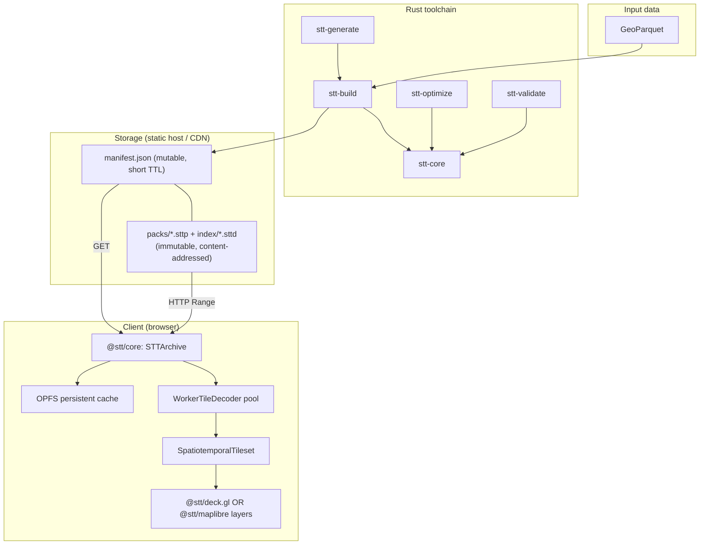

# System overview

STT has two stacks: a **Rust** toolchain that turns GeoParquet into a **packed
dataset** (`manifest.json` + content-addressed packs), and a **TypeScript**
client that streams tiles from that dataset into deck.gl.

## Rust toolchain

### `stt-build` (CLI)
Reads a GeoParquet file (WKB, GeoArrow, or `lon`/`lat` columns) and writes a
**packed dataset directory** (`manifest.json` + `index/*.sttd` + `packs/*.sttp`).
`-o foo.stt` is accepted for convenience — the extension is stripped to a `foo/`
directory. Pipeline:

1. **Load**: stream Arrow record batches from Parquet; extract geometry,
   timestamps (Unix ms, Unix s, or ISO 8601), and per-feature properties.
2. **Clip**: LineStrings with a duration (`--end-time-field`) are clipped
   to each zoom's tile boundaries with Liang-Barsky; per-vertex timestamps
   are interpolated so a tile's trajectory still animates correctly.
3. **Simplify** (optional): per-zoom Visvalingam-Whyatt simplification.
4. **Tile**: bucket features by `(zoom, x, y, time-bucket)`, where the
   bucket size is `--temporal-bucket` (default `1h`).
5. **Encode**: each tile becomes an Arrow IPC layer frame (see
   [Data format](./data-format.md)).
6. **Write**: `stt-core::PackWriter` orders blobs for locality, per-blob
   zstd-compresses and byte-dedups them (no shared dictionary), then cuts the
   stream into content-addressed packs (≤64 MiB each) and emits `manifest.json`
   + `index/<hash>.sttd` + `packs/<hash>.sttp`. The bounded-RAM
   `--streaming-arrow` path builds a temp single-file archive first, then
   transcodes it to packs.

Optional pipeline extras: `--summary-tier h3` adds a server-aggregated
H3-hex tier alongside the raw tier (so 100M-feature point datasets render
at low zooms without shipping the raw points); `--temporal-lod 1d,30d`
adds coarser-bucket aggregate tiles so animating decades of data picks
the appropriate temporal LOD; `--pre-tessellate` runs earcut at build time
and stores triangle indices in a sidecar column.

Inputs must be GeoParquet. Convert other formats first:
`ogr2ogr -f Parquet out.parquet in.geojson`, or use DuckDB
(`COPY ... TO 'out.parquet' (FORMAT 'parquet')`). See
[Building from Python](../guides/python.md) for GeoPandas / DuckDB / pyarrow
recipes.

### `stt-optimize`
Reads a Parquet or `.stt` and prints recommended `stt-build` settings —
zoom range, temporal bucket size, compression — based on the data's
spatial density and temporal distribution. Wired into the builder via
`stt-build --auto`: every flag the user did NOT pass explicitly is
filled in from the recommendation.

### `stt-validate`
Opens a packed dataset (a directory or its `manifest.json`) — or a legacy
single-file `.stt` — and reports anomalies. For packed inputs it first checks the
**content-addressing contract** (each pack/directory object blake3-hashes to its
filename, declared lengths match, no out-of-range `pack_id`), then verifies the
content hash of every tile, decodes each Arrow IPC payload, and checks
feature-count and temporal-extent consistency. Suitable for CI.

### `stt-generate`
Convenience CLI that downloads + processes + builds the showcase datasets
(earthquakes, AIS, flights, hurricanes, wildfires, NYC rideshare, satellites).
Each subcommand emits GeoParquet and calls `stt-build` internally.

### `stt-core`
The library every CLI uses. Owns the archive format, Arrow tile codec,
compression abstraction, Hilbert/temporal indexing, and metadata.

## TypeScript stack

### `@stt/core`
- **`STTArchive`** — packed-format reader over HTTP Range. Fetches
  `manifest.json` (metadata + directory pointer + pack table), then the
  directory object, then per-tile blobs via Range requests against the pack
  objects. Coalesces adjacent reads **within a pack** (≤2 MiB gap by default; a
  range never bridges two packs) and runs groups through a bounded concurrency
  pool. Caches compressed bytes (device-aware sizing). Exposes `asTileSource()`
  for loaders.gl-style integrations.
- **`OpfsTileCache`** — optional persistent cache backed by the Origin
  Private File System. Survives reloads; uses `isOpfsAvailable()` to
  feature-detect.
- **`TileDecoder`** — see [stt-loader.md](../api/stt-loader.md). Worker-pool
  by default in browsers; inline fallback elsewhere. Crashed workers are
  replaced automatically.
- **`SpatiotemporalTileset`** — viewport + time-aware tile selection,
  bucket-aligned prefetch, direction hysteresis to suppress scrub jitter,
  grace-period LRU eviction. Dispatches between the raw and **summary**
  tiers per zoom (`tier: 'raw' | 'summary' | 'auto'`). Temporal-LOD
  dispatch is reader-API-only (`STTArchive.pickTemporalLodForZoom` /
  `getTilesInBoundsForTemporalLod`) and is not yet wired into the tileset.
- **`createSttTileSource`** — a structural (no runtime dependency)
  loaders.gl-style tile source over an `STTArchive`, so apps already
  using `@loaders.gl/*` can drop STT into their existing tile source
  plumbing. (The old standalone `SttLoader` parser object was removed —
  see the [tile decoding](../api/stt-loader.md) page.)

### `@stt/deck.gl`
- **`SpatioTemporalLayer`** — composite layer; owns the archive + tileset,
  delegates rendering to specialized sublayers.
- **`AnimatedPointLayer` / `AnimatedPathLayer` / `AnimatedPolygonLayer` /
  `AnimatedTripsLayer`** — deck.gl layers with GPU time filtering.
- **`VatTripsLayer`** — Vertex-Animation-Texture variant of trip rendering;
  one quad per active trip, positions sampled from a per-tile texture.
  Scales independently of per-trajectory vertex count.
- **`HeatmapLayer`** — GPU-splat temporal heatmap with stacked categorical
  channels and bake-time intensity-domain support.
- **`H3SummaryLayer`** — renders the server-aggregated summary tier as
  extrudable H3 hexagons (wraps `H3HexagonLayer`).
- **`TimeFilterExtension`** — relativizes time against a per-layer
  `timeOffset` so f32 stays exact; supports window mode (whole feature on
  / off) and trail mode (per-vertex fade).
- **`PolygonTimeFilterExtension`** — same idea for `SolidPolygonLayer`,
  which can't take `TimeFilterExtension` directly.
- **`CategoryColorExtension`** — texture-based palette lookup, scales to
  many categories without CPU-side color expansion.
- **`TimeController`** — `requestAnimationFrame`-driven playback clock.

### `@stt/maplibre`
Same archive reader and tileset, rendered through MapLibre GL's
`CustomLayerInterface` in raw WebGL — for sites that don't want a deck.gl
dependency or that need to interleave STT layers between native MapLibre
style layers. Five layer classes mirror the deck.gl coverage:
`STTPointLayer`, `STTLineLayer`, `STTPolygonLayer`, `STTTripsLayer`,
`STTHeatmapLayer`. See [stt-maplibre.md](../api/stt-maplibre.md).

## Design decisions

### Arrow IPC instead of a bespoke binary format
Standard, columnar, browser-native via `apache-arrow`. The same library
parses the archive's directory and its tile payloads. GeoArrow gives the
deck.gl layers exactly the buffer shape they need.

### Custom tileset, not deck.gl `TileLayer`
- 4D addressing — `(z, x, y, t)` — that `TileLayer` doesn't model.
- Bucket-aligned temporal prefetch needs first-class access to the time axis.
- Cache eviction needs to be temporal-aware (keep tiles for the active
  time window even when they're off-viewport for a frame).

### GPU time filtering, not CPU per-frame filtering
Each visible tile gets its own deck.gl sublayer bound to that tile's
Arrow-backed attribute buffers (uploaded once on tile arrival — there is no
cross-tile consolidation pass). Animation then costs nothing extra: the CPU
updates one uniform per frame and the shader does the filter and the fade.

### Content-addressed packs, cacheable on any static host
A dataset is a `manifest.json` plus many immutable, content-addressed pack
objects (and one directory object), served as static bytes by any host that
honours Range requests — R2, S3, GCS, nginx. Because each pack is small and
immutable, a dumb CDN caches every one natively (no Worker, no vendor lock-in);
only the tiny manifest is mutable. This is what fixed the uncacheable multi-GB
single-file archive (`cf-cache-status: BYPASS` on every range request).

## Key interactions

1. **Generation** — run `stt-build` once to convert GeoParquet into a packed
   dataset directory.
2. **Hosting** — sync the dataset tree to S3 / R2 / Cloudflare / nginx; ship
   packs + index as `immutable`, the manifest with a short TTL
   (`scripts/r2-sync.sh`).
3. **Loading** — the browser fetches `manifest.json`, then the directory object,
   then each viewport tile via a Range request against the right pack.
4. **Streaming** — as the user pans or plays the timeline, the tileset
   coalesces per-pack ranges, the decoder pool decodes off the main thread, and
   deck.gl renders one per-tile sublayer each with the time filter applied.
