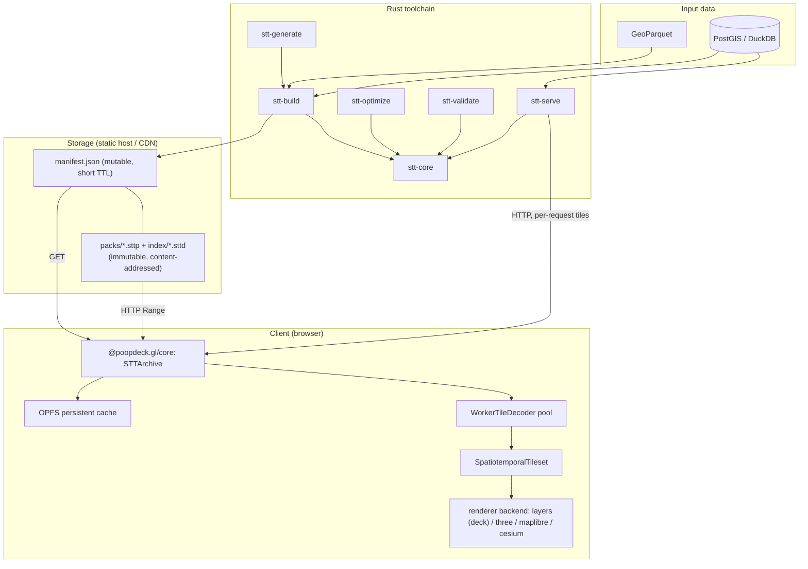

# System overview

STT has two stacks: a **Rust** toolchain that accepts either a GeoParquet file
or a live **PostGIS**/**DuckDB** source, and either builds a **packed
dataset** (`manifest.json` + content-addressed packs) or serves tiles
dynamically, per request, over HTTP (`stt-serve`); and a **TypeScript**
client that streams tiles from that dataset into one of four renderer
backends — deck.gl, Three.js, MapLibre, or Cesium.

## Rust toolchain

### `stt-build` (CLI)
Reads a GeoParquet file (WKB, GeoArrow, or `lon`/`lat` columns) and writes a
**packed dataset directory** (`manifest.json` + `index/*.sttd` + `packs/*.sttp`).
`-o foo.stt` is accepted for convenience — the extension is stripped to a `foo/`
directory. Pipeline:

1. **Load**: stream Arrow record batches from Parquet; extract geometry,
   timestamps (Unix ms, Unix s, or ISO 8601), and per-feature properties.
2. **Clip**: LineStrings with a duration (`--end-time-field`) are clipped
   to each zoom's tile boundaries with Liang-Barsky; per-vertex timestamps
   are interpolated so a tile's trajectory still animates correctly.
3. **Simplify** (optional): per-zoom Visvalingam-Whyatt simplification.
4. **Tile**: bucket features by `(zoom, x, y, time-bucket)`, where the
   bucket size is `--temporal-bucket` (default `1h`).
5. **Encode**: each tile becomes an Arrow IPC layer frame (see
   [Data format](./data-format.md)).
6. **Write**: `stt-core::PackWriter` orders blobs for locality, per-blob
   zstd-compresses and byte-dedups them (no shared dictionary), then cuts the
   stream into content-addressed packs (≤64 MiB each) and emits `manifest.json`
   + `index/<hash>.sttd` + `packs/<hash>.sttp`. The lower-memory `--streaming`
   path writes tiles into the same `PackWriter` as each zoom level completes,
   trimming peak RAM on large inputs.

Optional pipeline extras: `--summary-tier h3` adds a server-aggregated
H3-hex tier alongside the raw tier (so 100M-feature point datasets render
at low zooms without shipping the raw points); `--temporal-lod 1d,30d`
adds coarser-bucket aggregate tiles so animating decades of data picks
the appropriate temporal LOD; `--pre-tessellate` runs earcut at build time
and stores triangle indices in a sidecar column.

GeoParquet is the default file input. A live **PostGIS** or **DuckDB** source
is a first-class alternative: pass `--postgres <CONN>` or `--duckdb <PATH>`
instead of `--input` and `stt-build` reads features straight from a table or
query, geometry bridged through WKB — everything downstream (LOD,
quantization, summary tiers) works unchanged. See
[cli-reference.md](../api/cli-reference.md) for the connection and query
flags.

For anyone with neither: convert to GeoParquet first —
`ogr2ogr -f Parquet out.parquet in.geojson`, or DuckDB
(`COPY ... TO 'out.parquet' (FORMAT 'parquet')`). See
[Building from Python](../guides/python.md) for GeoPandas / DuckDB / pyarrow
recipes.

### `stt-optimize`
Reads a GeoParquet input and prints recommended `stt-build` settings —
zoom range, temporal bucket size, compression — based on the data's
spatial density and temporal distribution. Wired into the builder via
`stt-build --auto`: every flag the user did NOT pass explicitly is
filled in from the recommendation.

### `stt-validate`
Opens a packed dataset (a directory or its `manifest.json`) and reports
anomalies. It first checks the
**content-addressing contract** (each pack/directory object blake3-hashes to its
filename, declared lengths match, no out-of-range `pack_id`), then verifies every
tile's CRC32C, decodes each Arrow IPC payload, and checks
feature-count and temporal-extent consistency. Suitable for CI.

### `stt-generate`
Convenience CLI that downloads + processes + builds the showcase datasets
(earthquakes, AIS, flights, hurricanes, wildfires, storms, NYC rideshare,
NYC taxi points, BIXI, satellites, drifters, drifters-hourly, animals,
OSM edits).
Each subcommand emits GeoParquet and calls `stt-build` internally.

### `stt-serve`
An axum HTTP server that generates STT tiles **on the fly**, one per request,
from a live PostGIS or DuckDB source — the `ST_AsMVT` analog for the STT
format. No `manifest.json` or packs are written to disk; each tile is
produced, encoded, and returned within the request. Two backends, selected by
`--postgres <CONN>` or `--duckdb <PATH>` (mutually exclusive): PostGIS uses an
async connection pool, while DuckDB (embedded, blocking) runs its pool
checkout, query, decode, and encode on a blocking task.

Each `GET /tiles/{z}/{x}/{y}/{t}.stt` request maps `(z, x, y)` to a WGS84
bounding box and `t` to a temporal bucket, runs a source query filtered by
that bbox and time window, decodes the matching rows to features, and encodes
exactly one tile. Parity with `stt-build` comes from a shared
`EncoderConfig`/`build_options` seam: both binaries parse the same flags
(clip, simplify, pre-tessellate, min-/max-zoom-field, per-tile budget,
attribute filter, coordinate/attribute quantization, vector grouping) into
the same config types and call the same per-tile encode path, so a served
tile is byte-identical to the offline-built tile for the same `(z, x, y, t)`
and source rows. `--summary-tier` (cross-tile aggregation) and
`--adaptive-temporal` (windows sized across a cell's whole time range) are
rejected at startup — neither can be computed from a single tile's rows;
pre-bake them with `stt-build` and serve the resulting static archive
instead. `GET /metadata.json` reports the dataset's extent, time range, zoom
range, and (if configured) heatmap domain; `--config <FILE>` serves several
datasets from one process under `/{name}/…`.

Tiles are regenerated on every request — there is no app-level cache — so
unlike the packed format this path is not edge-cacheable; that is the
trade-off for serving directly off a live source. See
[cli-reference.md](../api/cli-reference.md) for the full flag surface.

### `stt-core`
The library every CLI uses. Owns the packed format, Arrow tile codec,
compression abstraction, Hilbert/temporal indexing, and metadata.

## TypeScript stack

### `@poopdeck.gl/core`
- **`STTArchive`** — packed-format reader over HTTP Range. Fetches
  `manifest.json` (metadata + directory pointer + pack table), then the
  directory object, then per-tile blobs via Range requests against the pack
  objects. Coalesces adjacent reads **within a pack** (≤2 MiB gap by default; a
  range never bridges two packs) and runs groups through a bounded concurrency
  pool. Caches compressed bytes (device-aware sizing). Exposes `asTileSource()`
  for loaders.gl-style integrations.
- **`OpfsTileCache`** — optional persistent cache backed by the Origin
  Private File System. Survives reloads; uses `isOpfsAvailable()` to
  feature-detect.
- **`TileDecoder`** — see [stt-loader.md](../api/stt-loader.md). Worker-pool
  by default in browsers; inline fallback elsewhere. Crashed workers are
  replaced automatically.
- **`SpatiotemporalTileset`** — viewport + time-aware tile selection,
  bucket-aligned prefetch, direction hysteresis to suppress scrub jitter,
  grace-period LRU eviction. Dispatches between the raw and **summary**
  tiers per zoom (`tier: 'raw' | 'summary' | 'auto'`). Temporal-LOD
  dispatch is reader-API-only (`STTArchive.pickTemporalLodForZoom` /
  `getTilesInBoundsForTemporalLod`); an app calls these methods to select a
  coarser tier.
- **`createSttTileSource`** — a structural (no runtime dependency)
  loaders.gl-style tile source over an `STTArchive`, so apps already
  using `@loaders.gl/*` can drop STT into their existing tile source
  plumbing. See the [tile decoding](../api/stt-loader.md) page.

### `@poopdeck.gl/core` render kernel
The framework-free logic every renderer backend shares, exposed as tree-shakeable
sub-paths so the four backends stay CONSISTENT by importing one copy instead of
hand-maintaining forks (see
[renderer-architecture.md](../roadmap/renderer-architecture.md)):
- **`core/time-filter`** — the CPU time-filter alpha (window/wake/cumulative/trail),
  `relativizeTime` + the `MAX_RELATIVE_TIME_MS` f32 guard, `resolveTimeFilterParams`
  (full-width `timeWindow` ⇄ half-width vocabulary), and `DEFAULT_WAKE_TAIL_SCALE`.
- **`core/shader-codegen`** — the scalar alpha authored ONCE as an `Expr` AST
  (`ALPHA_EXPR`); `evalExpr` is the CPU oracle and `emitGLSL100`/`emitGLSL300`
  machine-emit each backend's shader snippet (no hand-copied GPU math).
- **`core/style`** — categorical / ramp / RGB color expansion (`'u8'`|`'f32'`).
- **`core/geometry`** — OD endpoint derivation + pre-baked-aware `tessellateFeature`.
- **`core/geo`** — pluggable `Projection` (`LocalEnu`/`Mercator`/`Globe` with a
  WGS84-ellipsoid datum) + `ViewState` (with `roll`/`altitude`) + zoom helpers.
- **`core/picking`** — `SttPickResult` shape, the 24-bit id scheme, and the
  `InstanceProvenance` merged-buffer identity contract.
- **`core/tileset-adapter`** — `makeTilesetCallbacks(archive)`, the single
  `SpatiotemporalTileset` fetch-callback bundle all backends consume.
- **`core/capabilities`** — the `LayerKind`/`Capability`/`TimeFilterMode`
  vocabulary + `BackendDescriptor` + typed `Degradation` + `assertDescriptorConsistent`
  over-claim gate. Each backend publishes a descriptor; the generated
  [backend-capabilities.md](../spec/backend-capabilities.md) is the matrix.

### `@poopdeck.gl/layers`
- **`SpatioTemporalLayer`** — composite layer; owns the archive + tileset,
  delegates rendering to specialized sublayers.
- **`AnimatedPointLayer` / `AnimatedPathLayer` / `AnimatedPolygonLayer` /
  `AnimatedTripsLayer`** — deck.gl layers with GPU time filtering.
- **`AnimatedTripHeadsLayer`** — a moving dot at the head of each active trip;
  the head position is interpolated along the path per frame on the CPU and
  drawn through a stock ScatterplotLayer (fp64, globe, circular markers).
- **`AnimatedHeatmapLayer`** — temporal density heatmap built on the canonical
  `@deck.gl/aggregation-layers` HeatmapLayer + `DataFilterExtension`
  (per-channel categorical splits, bake-time intensity-domain support;
  visible-tile data is consolidated into one buffer set per channel).
- **`FlowCorridorLayer`** — static corridor geometry animated by a per-vertex
  × per-bucket value matrix (pre-aggregated flow overviews).
- **`H3SummaryLayer`** — renders the server-aggregated summary tier as
  extrudable H3 hexagons (wraps `H3HexagonLayer`).
- **`TimeFilterExtension`** — relativizes time against a per-layer
  `timeOffset` so f32 stays exact; supports window mode (whole feature on
  / off) and trail mode (per-vertex fade). Runs on both instanced layers and
  `SolidPolygonLayer` directly.
- **`CategoryColorExtension`** — texture-based palette lookup, scales to
  many categories without CPU-side color expansion.
- **`TimeController`** — `requestAnimationFrame`-driven playback clock.
- **`PlaybackGovernor`** — video-player-style buffering: gates play/seek on a
  buffered runway ahead of the playhead and can auto-adapt playback speed to
  measured throughput.

### `@poopdeck.gl/three`
The same tiles + clock rendered through a Three.js **WebGPU** renderer with TSL
node materials, as a retained scene that merges resident tiles into one
`InstancedMesh` per layer (rebased to a scene-wide `timeOrigin`). Owns its own
scene/camera/projection (`core/geo`) + streaming; the basemap rides a separate
camera-synced overlay canvas (TSL compiles only on `WebGPURenderer`, so it can't
interleave into a WebGL context). Near-deck-parity layer catalog; defers GPU
heatmap + live edge-bundling. See
[renderer-architecture.md](../roadmap/renderer-architecture.md).

### `@poopdeck.gl/maplibre`
Same archive reader and tileset, rendered through MapLibre GL's
`CustomLayerInterface` in raw WebGL — for sites that don't want a deck.gl
dependency or that need to interleave STT layers between native MapLibre
style layers. Five layer classes mirror a subset of the deck.gl coverage:
`STTPointLayer`, `STTLineLayer`, `STTPolygonLayer`, `STTTripsLayer`,
`STTHeatmapLayer` (`window`/`trail` time modes only). Mercator-only — the
shaders assume the mercator projection, so there is no globe support. See
[stt-maplibre.md](../api/stt-maplibre.md).

### `@poopdeck.gl/cesium`
A CesiumJS backend that renders STT on a real **WGS84 globe** (CesiumJS is
Apache-2.0; no Cesium ion token needed). The first green-field consumer of the
render kernel — a `CesiumPointLayer` (`SttRenderNode`) + a `BackendDescriptor` +
a `ViewState`⇄Cesium camera bridge, built entirely from `core/{geo,style,
time-filter,shader-codegen,tileset-adapter,picking}` with no new shared code. A
worked `point` scaffold today (rendering is browser-verified). See
[stt-cesium.md](../api/stt-cesium.md).

## Design decisions

### Arrow IPC instead of a bespoke binary format
Tile payloads are standard, columnar, and browser-native via `apache-arrow`;
GeoArrow gives the deck.gl layers exactly the buffer shape they need. (The
directory index is the one bespoke structure — a compact varint + RLE codec;
see the packed format spec §4.)

### Custom tileset, not deck.gl `TileLayer`
- 4D addressing — `(z, x, y, t)` — that `TileLayer` doesn't model.
- Bucket-aligned temporal prefetch needs first-class access to the time axis.
- Cache eviction needs to be temporal-aware (keep tiles for the active
  time window even when they're off-viewport for a frame).

### GPU time filtering, not CPU per-frame filtering
Most layers give each visible tile its own deck.gl sublayer bound to that
tile's Arrow-backed attribute buffers, uploaded once on tile arrival.
(Two exceptions consolidate across tiles for perf: the heatmap merges
visible tiles into one buffer set per channel, and cumulative point
datasets pack tiles into a few large slabs.) Animation then costs nothing
extra: the CPU updates one uniform per frame and the shader does the filter
and the fade.

### Content-addressed packs, cacheable on any static host
A dataset is a `manifest.json` plus many immutable, content-addressed pack
objects (and one directory object), served as static bytes by any host that
honours Range requests — R2, S3, GCS, nginx. Because each pack is small and
immutable, a dumb CDN caches every one natively (no Worker, no vendor lock-in);
only the tiny manifest is mutable. A single multi-GB file cannot be edge-cached
once it exceeds the CDN per-object limit; small immutable packs can.

## Key interactions

1. **Generation** — run `stt-build` once to convert GeoParquet into a packed
   dataset directory.
2. **Hosting** — sync the dataset tree to S3 / R2 / Cloudflare / nginx; ship
   packs + index as `immutable`, the manifest with a short TTL
   (`scripts/r2-sync.sh`).
3. **Loading** — the browser fetches `manifest.json`, then the directory object,
   then each viewport tile via a Range request against the right pack.
4. **Streaming** — as the user pans or plays the timeline, the tileset
   coalesces per-pack ranges, the decoder pool decodes off the main thread, and
   deck.gl renders one per-tile sublayer each with the time filter applied.
