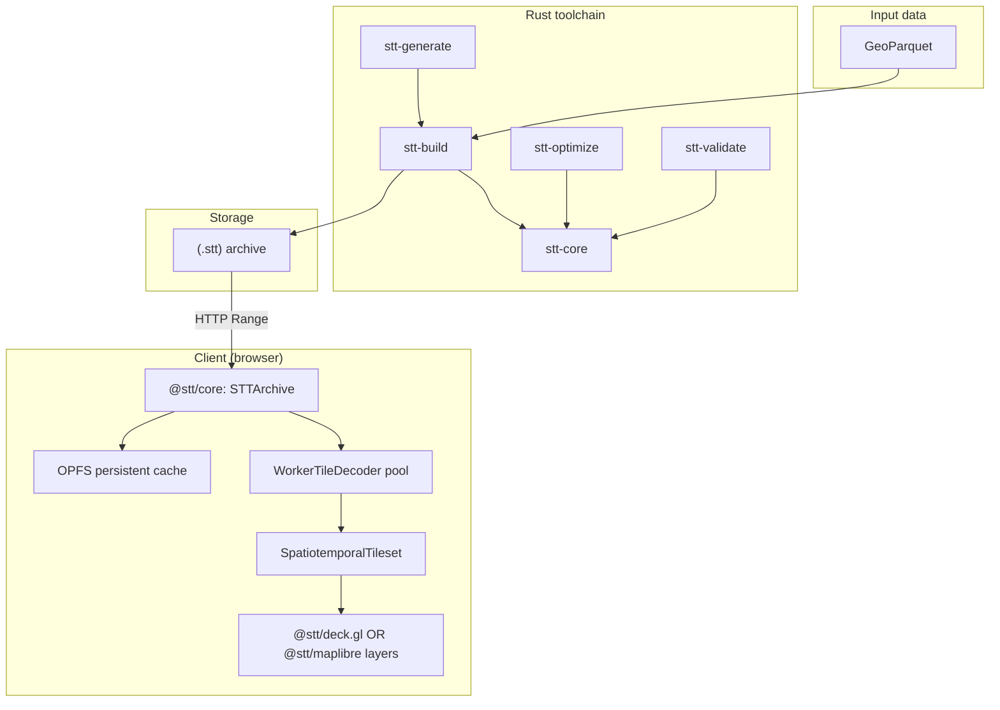

# System overview

STT has two stacks: a **Rust** toolchain that turns GeoParquet into a `.stt`
archive, and a **TypeScript** client that streams tiles from that archive
into deck.gl.

## Rust toolchain

### `stt-build` (CLI)
Reads a GeoParquet file (WKB, GeoArrow, or `lon`/`lat` columns) and writes
one `.stt` archive. Pipeline:

1. **Load**: stream Arrow record batches from Parquet; extract geometry,
   timestamps (Unix ms, Unix s, or ISO 8601), and per-feature properties.
2. **Clip**: LineStrings with a duration (`--end-time-field`) are clipped
   to each zoom's tile boundaries with Liang-Barsky; per-vertex timestamps
   are interpolated so a tile's trajectory still animates correctly.
3. **Simplify** (optional): per-zoom Visvalingam-Whyatt simplification.
4. **Tile**: bucket features by `(zoom, x, y, time-bucket)`, where the
   bucket size is `--temporal-bucket` (default `1h`).
5. **Encode**: each tile becomes an Arrow IPC layer frame (see
   [Data format](./data-format.md)).
6. **Write**: `stt-core::Archive::create()` → zstd (default) or gzip →
   CRC32C-tagged, content-addressed dedup → write directory + JSON metadata
   + 64-byte header. Optionally emits a shared zstd training dictionary
   for better ratios on small/repetitive tiles.

Optional pipeline extras: `--summary-tier h3` adds a server-aggregated
H3-hex tier alongside the raw tier (so 100M-feature point datasets render
at low zooms without shipping the raw points); `--temporal-lod 1d,30d`
adds coarser-bucket aggregate tiles so animating decades of data picks
the appropriate temporal LOD; `--pre-tessellate` runs earcut at build time
and stores triangle indices in a sidecar column.

Inputs must be GeoParquet. Convert other formats first:
`ogr2ogr -f Parquet out.parquet in.geojson`, or use DuckDB
(`COPY ... TO 'out.parquet' (FORMAT 'parquet')`). See
[Building from Python](../guides/python.md) for GeoPandas / DuckDB / pyarrow
recipes.

### `stt-optimize`
Reads a Parquet or `.stt` and prints recommended `stt-build` settings —
zoom range, temporal bucket size, compression — based on the data's
spatial density and temporal distribution. Wired into the builder via
`stt-build --auto`: every flag the user did NOT pass explicitly is
filled in from the recommendation.

### `stt-validate`
Opens an archive, verifies the content hash of every tile, decodes each
Arrow IPC payload, and reports any anomalies (decode failures, feature-count
mismatches, tile extents outside the metadata range). Suitable for CI.

### `stt-generate`
Convenience CLI that downloads + processes + builds the showcase datasets
(earthquakes, AIS, flights, hurricanes, wildfires, NYC rideshare, satellites).
Each subcommand emits GeoParquet and calls `stt-build` internally.

### `stt-core`
The library every CLI uses. Owns the archive format, Arrow tile codec,
compression abstraction, Hilbert/temporal indexing, and metadata.

## TypeScript stack

### `@stt/core`
- **`STTArchive`** — HTTP Range reader. Header → optional dictionary →
  index → metadata → per-tile blob fetch. Range-coalesces adjacent tile
  reads (≤32 KiB gap). Caches compressed bytes (device-aware sizing).
  Exposes `asTileSource()` for loaders.gl-style integrations.
- **`OpfsTileCache`** — optional persistent cache backed by the Origin
  Private File System. Survives reloads; uses `isOpfsAvailable()` to
  feature-detect.
- **`TileDecoder`** — see [stt-loader.md](../api/stt-loader.md). Worker-pool
  by default in browsers; inline fallback elsewhere. Crashed workers are
  replaced automatically.
- **`SpatiotemporalTileset`** — viewport + time-aware tile selection,
  bucket-aligned prefetch, direction hysteresis to suppress scrub jitter,
  grace-period LRU eviction. Aware of summary-tier and temporal-LOD
  dispatch (picks the right tier per zoom).
- **`SttLoader` / `createSttTileSource`** — structural shims that let
  apps already using `@loaders.gl/*` drop STT into their existing tile
  source plumbing.

### `@stt/deck.gl`
- **`SpatioTemporalLayer`** — composite layer; owns the archive + tileset,
  delegates rendering to specialized sublayers.
- **`AnimatedPointLayer` / `AnimatedPathLayer` / `AnimatedPolygonLayer` /
  `AnimatedTripsLayer`** — deck.gl layers with GPU time filtering.
- **`VatTripsLayer`** — Vertex-Animation-Texture variant of trip rendering;
  one quad per active trip, positions sampled from a per-tile texture.
  Scales independently of per-trajectory vertex count.
- **`HeatmapLayer`** — GPU-splat temporal heatmap with stacked categorical
  channels and bake-time intensity-domain support.
- **`H3SummaryLayer`** — renders the server-aggregated summary tier as
  extrudable H3 hexagons (wraps `H3HexagonLayer`).
- **`TimeFilterExtension`** — relativizes time against a per-layer
  `timeOffset` so f32 stays exact; supports window mode (whole feature on
  / off) and trail mode (per-vertex fade).
- **`PolygonTimeFilterExtension`** — same idea for `SolidPolygonLayer`,
  which can't take `TimeFilterExtension` directly.
- **`CategoryColorExtension`** — texture-based palette lookup, scales to
  many categories without CPU-side color expansion.
- **`TimeController`** — `requestAnimationFrame`-driven playback clock.

### `@stt/maplibre`
Same archive reader and tileset, rendered through MapLibre GL's
`CustomLayerInterface` in raw WebGL — for sites that don't want a deck.gl
dependency or that need to interleave STT layers between native MapLibre
style layers. Five layer classes mirror the deck.gl coverage:
`STTPointLayer`, `STTLineLayer`, `STTPolygonLayer`, `STTTripsLayer`,
`STTHeatmapLayer`. See [stt-maplibre.md](../api/stt-maplibre.md).

## Design decisions

### Arrow IPC instead of a bespoke binary format
Standard, columnar, browser-native via `apache-arrow`. The same library
parses the archive's directory and its tile payloads. GeoArrow gives the
deck.gl layers exactly the buffer shape they need.

### Custom tileset, not deck.gl `TileLayer`
- 4D addressing — `(z, x, y, t)` — that `TileLayer` doesn't model.
- Bucket-aligned temporal prefetch needs first-class access to the time axis.
- Cache eviction needs to be temporal-aware (keep tiles for the active
  time window even when they're off-viewport for a frame).

### GPU time filtering, not CPU per-frame filtering
Once a tile is consolidated into the deck.gl layer's attribute buffers,
animation costs nothing extra. The CPU updates one uniform per frame; the
shader does the filter and the fade.

### One archive, one HTTP origin
A `.stt` file is served as static bytes by any HTTP server that honours
Range requests. No tile server, no database, no CDN smarts beyond
range-aware caching.

## Key interactions

1. **Generation** — run `stt-build` once to convert GeoParquet into a `.stt`.
2. **Hosting** — drop the `.stt` on S3, R2, Cloudflare Pages, nginx, etc.
3. **Loading** — the browser fetches the 64-byte header, then the index
   table and metadata, then each viewport tile via a Range request.
4. **Streaming** — as the user pans or plays the timeline, the tileset
   coalesces ranges, the decoder pool decodes off the main thread, and
   deck.gl renders the consolidated buffers with the time filter applied.
