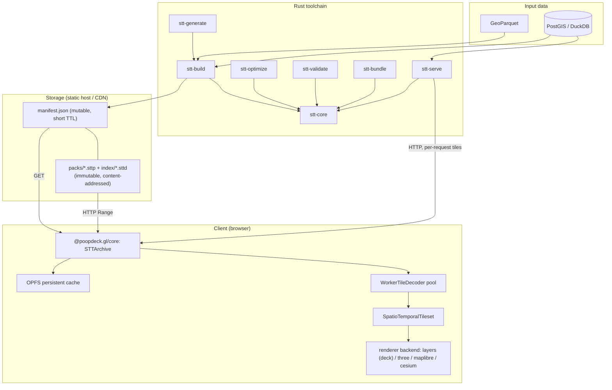

# System overview

STT has two stacks. A **Rust** toolchain reads either a GeoParquet file or a live
PostGIS/DuckDB source, and either builds a packed dataset (`manifest.json` +
content-addressed packs) or serves tiles per request over HTTP (`stt-serve`). A
**TypeScript** client then streams tiles from that dataset into one of four
renderer backends: deck.gl, Three.js, MapLibre, or Cesium.

## Rust toolchain

### `stt-build` (CLI)

Reads a GeoParquet file (WKB, GeoArrow, or `lon`/`lat` columns) and writes a
**packed dataset directory** (`manifest.json` + `index/*.sttd` + `packs/*.sttp`).
`-o foo.stt` is accepted for convenience — the extension is stripped to a `foo/`
directory. Pipeline:

1. **Load**: stream Arrow record batches from Parquet; extract geometry,
   timestamps (Unix ms, Unix s, or ISO 8601), and per-feature properties.
2. **Clip**: LineStrings with a duration (`--end-time-field`) are clipped
   to each zoom's tile boundaries with Liang-Barsky; per-vertex timestamps
   are interpolated so a tile's trajectory still animates correctly.
3. **Simplify** (optional): per-zoom Visvalingam-Whyatt simplification.
4. **Tile**: bucket features by `(zoom, x, y, time-bucket)`, where the
   bucket size is `--temporal-bucket` (default `1h`).
5. **Encode**: each tile becomes an Arrow IPC layer frame (see
   [Data format](./data-format.md)).
6. **Write**: `stt-core::PackWriter` orders blobs for locality, per-blob
   zstd-compresses and byte-dedups them (no shared dictionary), then cuts the
   stream into content-addressed packs (≤64 MiB each) and emits `manifest.json`,
   `index/<hash>.sttd`, and `packs/<hash>.sttp`. The lower-memory `--streaming`
   path writes tiles into the same `PackWriter` as each zoom level completes,
   trimming peak RAM on large inputs.

Optional pipeline extras: `--summary-tier h3` adds a server-aggregated
H3-hex tier alongside the raw tier (so 100M-feature point datasets render
at low zooms without shipping the raw points); `--temporal-lod 1d,30d`
adds coarser-bucket aggregate tiles so animating decades of data picks
the appropriate temporal LOD; `--pre-tessellate` runs earcut at build time
and stores triangle indices in a sidecar column.

GeoParquet is the default file input. A live **PostGIS** or **DuckDB** source
is a first-class alternative: pass `--postgres <CONN>` or `--duckdb <PATH>`
instead of `--input` and `stt-build` reads features straight from a table or
query, geometry bridged through WKB — everything downstream (LOD,
quantization, summary tiers) works unchanged. See
[cli-reference.md](../api/cli-reference.md) for the connection and query
flags.

For anyone with neither: convert to GeoParquet first —
`ogr2ogr -f Parquet out.parquet in.geojson`, or DuckDB
(`COPY ... TO 'out.parquet' (FORMAT 'parquet')`). See
[Building from Python](../guides/python.md) for GeoPandas / DuckDB / pyarrow
recipes.

### `stt-optimize`

Reads a GeoParquet input and prints recommended `stt-build` settings —
zoom range, temporal bucket size, compression — based on the data's
spatial density and temporal distribution. Wired into the builder via
`stt-build --auto`: bare `--auto` fills in the zoom range and temporal bucket;
`--auto encode` also applies the non-lossy byte levers (zstd level,
`--blob-ordering`, `--pack-size`). An explicitly passed flag always wins, and
lossy advice (quantization, per-tile budgets) is logged, never applied.

The other five subcommands work on an already-built archive rather than on
GeoParquet: `inspect` (per-zoom directory stats, dedup and compression ratios,
per-column compressed cost), `diff` (two archives compared), `doctor`
(severity-ranked findings each with a remediation flag), `export` (back out to
GeoParquet, whole or bbox/time-subset), and `order-audit` (measured
per-ordering range-read cost, recommending `--blob-ordering`).

### `stt-validate`

Opens a packed dataset (a directory or its `manifest.json`) and reports
anomalies. It first checks the
**content-addressing contract** (each pack/directory object blake3-hashes to its
filename, declared lengths match, no out-of-range `pack_id`), then verifies every
tile's CRC32C, decodes each Arrow IPC payload, and checks
feature-count and temporal-extent consistency. Suitable for CI. It accepts a
`.sttb` bundle directly as well as a directory or `manifest.json`.

### `stt-bundle`

Folds an exploded packed dataset (`manifest.json` + its content-addressed
objects) into a single `.sttb` file for hand-off, and explodes one back
(`pack` / `unpack`). Objects round-trip byte-identical: `pack` re-hashes each
one on the way in and `unpack` re-verifies with the same integrity pass
`stt-validate` runs. Strictly an interchange profile (packed format spec §13) —
production serving stays on the exploded layout, because nothing serves bundles
over HTTP Range requests.

### `stt-generate`

Convenience CLI that downloads + processes + builds the showcase datasets.
Each subcommand emits GeoParquet and calls `stt-build` internally. The dataset
inventory is generated from the CLI and CI-checked, so read it from
[`stt-generate-datasets.json`](../spec/stt-generate-datasets.json) rather than
from a hand-maintained prose list.

### `stt-serve`

An axum HTTP server that generates STT tiles **on the fly**, one per request,
from a live PostGIS or DuckDB source — the `ST_AsMVT` analog for the STT
format. No `manifest.json` or packs are written to disk; each tile is
produced, encoded, and returned within the request. Two backends, selected by
`--postgres <CONN>` or `--duckdb <PATH>` (mutually exclusive): PostGIS uses an
async connection pool, while DuckDB (embedded, blocking) runs its pool
checkout, query, decode, and encode on a blocking task.

Each `GET /tiles/{z}/{x}/{y}/{t}.stt` request maps `(z, x, y)` to a WGS84
bounding box and `t` to a temporal bucket, runs a source query filtered by that
bbox and time window, decodes the matching rows to features, and encodes exactly
one tile.

Parity with `stt-build` comes from a shared `EncoderConfig`/`build_options` seam.
Both binaries parse the same flags — clip, simplify, pre-tessellate,
min-/max-zoom-field, per-tile budget, attribute filter, coordinate/attribute
quantization, vector grouping — into the same config types and call the same
per-tile encode path, so a served tile is byte-identical to the offline-built
tile for the same `(z, x, y, t)` and source rows.

Two flags are rejected at startup because neither can be computed from a single
tile's rows: `--summary-tier` (cross-tile aggregation) and `--adaptive-temporal`
(windows sized across a cell's whole time range). Pre-bake them with `stt-build`
and serve the resulting static archive instead.

`GET /metadata.json` reports the dataset's extent, time range, zoom range, and —
if configured — heatmap domain. `--config <FILE>` serves several datasets from
one process under `/{name}/…`.

Tiles are regenerated on every request — there is no app-level cache — so
unlike the packed format this path is not edge-cacheable; that is the
trade-off for serving directly off a live source. See
[cli-reference.md](../api/cli-reference.md) for the full flag surface.

### `stt-core`

The library every CLI uses. Owns the packed format, Arrow tile codec,
compression abstraction, Hilbert/temporal indexing, and metadata.

## TypeScript stack

The client half splits along one seam. **`@poopdeck.gl/core`** owns everything
that is not a renderer: `STTArchive`, the packed-format reader over HTTP Range
(with its OPFS persistent cache and worker decoder pool — see
[tile decoding](../api/stt-loader.md)), and `SpatioTemporalTileset`, the
viewport- and time-aware selector behind bucket-aligned prefetch, raw/summary
tier dispatch and temporal-aware eviction (see
[the tileset](../api/spatiotemporal-tileset.md)). The same package carries the
framework-free **render kernel** — time-filter math, style expansion,
projection and view state, geometry and trip helpers, edge bundling, picking
identity, and the `LayerKind`/`Capability` vocabulary — exposed as
tree-shakeable sub-paths so the backends share one copy instead of maintaining
forks ([render kernel](../api/render-kernel.md)).

Four renderer backends sit on the far side of that seam and consume the kernel
rather than reimplementing it: **deck.gl**
([`SpatioTemporalLayer`](../api/spatiotemporal-layer.md)), **Three.js**
([`@poopdeck.gl/three`](../api/stt-three.md) — a retained WebGPU scene with TSL
node materials), **MapLibre**
([`@poopdeck.gl/maplibre`](../api/stt-maplibre.md) — raw WebGL through
`CustomLayerInterface`, no deck.gl dependency) and **Cesium**
([`@poopdeck.gl/cesium`](../api/stt-cesium.md) — a real WGS84 globe). Each
publishes a `BackendDescriptor`, and the generated
[capability matrix](../spec/backend-capabilities.md) is the authority on which
layer kinds and capabilities a given backend renders natively and where it
degrades; [renderer-architecture.md](../roadmap/renderer-architecture.md)
records how the backends are tiered and why. Playback is renderer-free and
sits beside them: `@poopdeck.gl/playback` carries the clock, the buffering
governor and an `HTMLMediaElement`-shaped facade, and is imported directly
rather than re-exported by the layers.

## Design decisions

### Arrow IPC instead of a bespoke binary format

Tile payloads are standard, columnar, and browser-native via `apache-arrow`;
GeoArrow gives the deck.gl layers exactly the buffer shape they need. (The
directory index is the one bespoke structure — a compact varint + RLE codec;
see the packed format spec §4.)

### Custom tileset, not deck.gl `TileLayer`

- 4D addressing — `(z, x, y, t)` — that `TileLayer` doesn't model.
- Bucket-aligned temporal prefetch needs first-class access to the time axis.
- Cache eviction needs to be temporal-aware (keep tiles for the active
  time window even when they're off-viewport for a frame).

### GPU time filtering, not CPU per-frame filtering

Most layers give each visible tile its own deck.gl sublayer bound to that
tile's Arrow-backed attribute buffers, uploaded once on tile arrival.
(Two exceptions consolidate across tiles for perf: the heatmap merges
visible tiles into one buffer set per channel, and cumulative point
datasets pack tiles into a few large slabs.) Animation then costs nothing
extra: the CPU updates one uniform per frame and the shader does the filter
and the fade.

### Content-addressed packs, cacheable on any static host

A dataset is a `manifest.json` plus many immutable, content-addressed pack
objects (and one directory object), served as static bytes by any host that
honours Range requests — R2, S3, GCS, nginx. Because each pack is small and
immutable, a plain CDN caches every one natively — no Worker required; only the
tiny manifest is mutable. A single multi-GB file cannot be edge-cached
once it exceeds the CDN per-object limit; small immutable packs can.

## Key interactions

1. **Generation** — run `stt-build` once to convert GeoParquet into a packed
   dataset directory.
2. **Hosting** — sync the dataset tree to S3 / R2 / Cloudflare / nginx; ship
   packs + index as `immutable`, the manifest with a short TTL
   (`scripts/r2-sync.sh`).
3. **Loading** — the browser fetches `manifest.json`, then the directory object,
   then each viewport tile via a Range request against the right pack.
4. **Streaming** — as the user pans or plays the timeline, the tileset
   coalesces per-pack ranges, the decoder pool decodes off the main thread, and
   deck.gl renders one per-tile sublayer each with the time filter applied.
