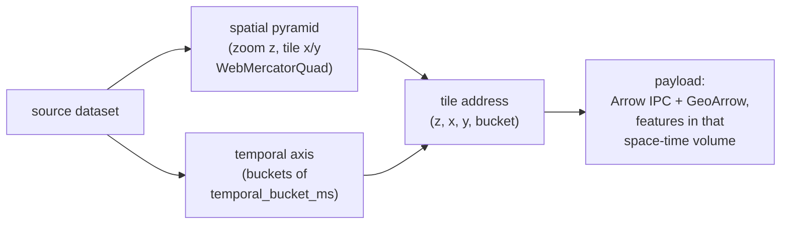
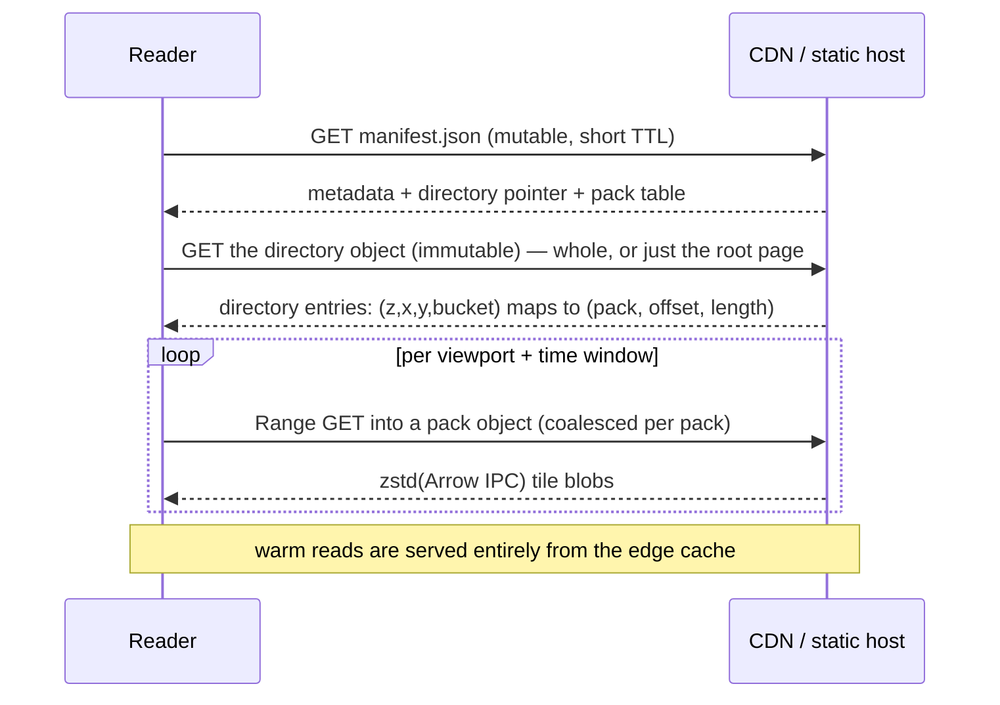

# Core Concepts

This guide introduces the fundamental concepts behind Spatiotemporal Tiles (STT).

## What is a Spatiotemporal Tile?

A **Spatiotemporal Tile** is a unit of data that organizes geospatial features not just by space (X, Y coordinates at a Zoom level) but also by **Time**. Unlike traditional vector tiles (MVT) which are static snapshots, an STT tile is addressed by `(zoom, x, y, time bucket)` and contains the features that exist within that space-time volume.

Each tile represents:
- A specific spatial bounds (Web Mercator tile).
- A specific time interval (start time to end time).
- A collection of features that exist within that space-time volume.

The temporal axis is specified in full in the
[time model](../spec/time-model.md); the addressing maps onto an OGC
WebMercatorQuad tile matrix set plus a regular time dimension
([`tile-matrix-set.json`](../spec/tile-matrix-set.json)).

### Why add Time?

Traditional approaches to animating massive datasets (millions of points) usually involve:
1.  **Loading everything:** Heavy memory usage, slow initial load.
2.  **GeoJSON per frame:** Huge network overhead, redundant data.
3.  **Filtering static tiles:** CPU intensive on the client to filter millions of points every frame.

STT solves this by pre-indexing data temporally. The client only downloads data relevant to the current viewport, time window, and animation speed — and the GPU does the per-frame time filtering, so nothing is re-uploaded as the clock advances.

## The packed container

A dataset is **not** one big file. It is a small tree of objects designed so
that *cacheability is a property of the format* — a dumb CDN or static host
(S3, R2, GCS) serves it efficiently with no server-side code:

- **`manifest.json`** — the only mutable object. Tiny; embeds the full dataset
  metadata plus pointers to everything else, so a cold start needs no separate
  metadata fetch.
- **`index/<blake3>.sttd`** — the **directory**: a compact binary index mapping
  every `(zoom, x, y, time bucket)` to its byte range. Run-length encoded, so a
  spatial cell whose content is identical across many consecutive time buckets
  costs one index run.
- **`packs/<blake3>.sttp`** — the tile data, cut into **content-addressed
  packs** of ≤ 64 MiB (default). Each tile payload inside a pack is an
  independently zstd-compressed blob, deduplicated by hash.

Packs and the directory are named by their own blake3 hash, so their bytes can
never change without their name changing — they ship with
`Cache-Control: immutable` and live at the edge forever. A deploy only ever
invalidates the few-KB manifest. Reads are HTTP range requests into packs; the
reader groups nearby tiles by pack and coalesces their ranges into a handful of
requests. The full contract is in
[the packed format spec](../spec/stt-packed-format.md).

A cold load is **1 manifest + 1 directory (or root page) + N pack ranges**; for a
paged directory the directory bytes are proportional to the viewport, not the
dataset. Everything but the tiny manifest is immutable and edge-cached forever.

## Key Concepts

### 1. Apache Arrow IPC + GeoArrow tile payloads

Each tile payload is one Apache Arrow `RecordBatch` per layer, with geometry
encoded as standard **GeoArrow** (interleaved `[x, y]` Float64 inside a
`FixedSizeList`). Coordinates are absolute WGS84 — no delta or zig-zag
encoding — so a tile is "a chunk of the source dataset, broken up by
`(zoom, x, y, time)`" and a decompressed tile opens directly in any Arrow tool
(GeoPandas, Lonboard, …). Per-blob zstd does the size compression; the client
decodes with `apache-arrow` + a small zstd decoder, and the columnar buffers
feed the GPU directly. See [the payload spec](../architecture/data-format.md).

### 2. Temporal Bucketing

Not all data needs millisecond precision. **Temporal Bucketing** groups
features into fixed-width time slots — the same bucket size everywhere
in the archive, configurable as `--temporal-bucket` (default `1h`).
Bucket boundaries become the cache-hit pivot for predictive prefetch
during animation.

### 3. Temporal LOD pyramid

For multi-year datasets you'd animate at fine bucket resolution, the
build can emit one or more coarser-bucket tiers alongside the base
(`--temporal-lod 1d,30d` or `1d@8,30d@4`). The **reader API** can pick the
coarsest tier whose `max_zoom_level` covers the current zoom
(`STTArchive.pickTemporalLodForZoom` + `getTilesInBoundsForTemporalLod`) —
so "zoomed out, scrubbing a decade" can read 30-day aggregates instead of
streaming per-hour base tiles. These coarser tiers are exposed through the
reader API; an app calls these methods to select a tier. (The summary tier
below, by contrast, is selected automatically by the tileset.)

### 4. Summary tier (server-side aggregation)

For 100M+ point datasets, a `--summary-tier h3` build emits a
server-aggregated H3-hex tier alongside the raw tier. Each hex carries a
`count` plus any configured `name:agg` (mean / sum / max / min) columns.
The reader dispatches to summary tiles below the configured zoom
threshold, so low-zoom rendering never streams the raw points.

### 5. Blob ordering (space–time locality)

Tile blobs are laid out inside packs so that blobs a client reads together sit
near each other, letting the per-pack range-coalescer satisfy several tiles
with one request. There is no single best curve — it depends on the dataset's
space-vs-time shape, so the default is **`--blob-ordering auto`**:

- **Time-deep data** (few cells, thousands of buckets — e.g. four decades of
  ocean drifters) → **spatial-major** `(zoom, hilbert, time)`: each cell's
  whole timeline is byte-contiguous, which is what playback reads. Measured
  ~3× better than a 3D space-time curve here.
- **Balanced or space-dominant data** (e.g. one day of flights) →
  **3D Hilbert** over `(x, y, time bucket)`: the robust generalist with no
  catastrophic query.

Explicit `spatial`, `time-major`, `hilbert3`, and `morton3` orders are
available when you know your access pattern.

## Client-Side Rendering

### Optimistic Rendering

The STT client implementation (`@poopdeck.gl/core`) is designed for smooth animation. It employs **Optimistic Rendering**:
- It immediately displays whatever data is available in the cache.
- It fetches higher-resolution or adjacent temporal data in the background.
- It never blocks the animation loop waiting for network requests.

Time filtering happens on the GPU: tiles are uploaded once per bucket, and a
per-frame uniform window selects what's visible, so a 60 fps clock costs no
re-decode or re-upload.

### Predictive Prefetching

When you play an animation, the client predicts which time buckets will be
needed next and fetches them ahead of the playhead, in small byte-budgeted,
nearest-first slices (~1 s of measured network throughput at a time) so a
seek or pan is never stuck behind a huge speculative download.

### Buffered playback (the governor)

Prefetch alone can't guarantee the playhead never outruns the network. The
[`PlaybackGovernor`](../api/playback-governor.md) couples the playback clock to
the loader the way a video player does: it gates `play()` and seeks on a
buffered runway ahead of the playhead, freezes the clock (with resume
hysteresis) when the runway drains instead of advancing into unloaded time,
and can drive an **Auto speed** that adapts the playback rate to measured
throughput. The result is "buffering…" semantics — never silently empty
frames.

## Specifications

This page is the orientation; the normative detail lives in the spec set:

| Spec | Covers |
| --- | --- |
| [Packed format](../spec/stt-packed-format.md) | The container: manifest, content-addressed packs, the v5 directory codec (+ paged), caching, reproducibility, standards relationships. Machine-checkable [`manifest.schema.json`](../spec/manifest.schema.json). |
| [Tile payload](../architecture/data-format.md) | The per-tile Arrow IPC + GeoArrow schema, `vertex_time`, pre-tessellation, and the [space-time cube](../architecture/data-format.md#space-time-cube-payload-vertex_value_matrix) (`vertex_value_matrix`). |
| [Time model](../spec/time-model.md) | The temporal axis: Unix-ms UTC, instants vs intervals, fixed-width start-anchored buckets, temporal LOD, read-time pruning, and the OGC TMS mapping ([`tile-matrix-set.json`](../spec/tile-matrix-set.json)). |
| [Sidecar assets](../spec/sidecar-assets.md) | The scene-bundle profile: multi-stream bundles, non-tile sidecars, and `georeferenced` vs `anchored-local` frames. Machine-checkable [`scene.schema.json`](../spec/scene.schema.json). |
| [Conformance](../spec/conformance.md) | What a conformant reader/writer MUST/SHOULD do, the golden fixtures, and the `stt-validate` reference validator. |
