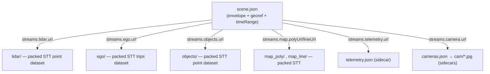

# STT Sidecar Assets & the Scene-Bundle Profile

> **Scope:** how STT composes **several co-registered datasets plus non-tile
> assets** into one playable scene, and how it represents data that is only
> **approximately georeferenced**. This is a *profile* layered on the core
> format — the [packed container](./stt-packed-format.md) and
> [tile payload](../architecture/data-format.md) are unchanged. The reference
> realization is the AV (autonomous-vehicle) cockpit; the conventions here are
> general. Authorities: `scripts/data-generation/av_common.py` (the producer
> contract), `examples/showcase/src/datasets.ts` (the consumer), and
> `scripts/r2-sync.sh` (the deploy/caching contract).

## 1. Why a profile

The core format answers "stream one georeferenced vector dataset over space and
time." Three needs fall *outside* a single packed dataset and motivated this
profile — each previously handled by ad-hoc code with no written contract:

1. **Multiple co-registered streams on one playhead.** An AV scene is a lidar
   point cloud *and* an ego trajectory *and* tracked-object boxes *and* an HD
   map, all sharing one clock and one coordinate frame. Each is its own STT
   dataset (different geometry kind, different bucket size); they must compose
   without colliding.
2. **Non-tile, time-indexed assets.** CAN-bus telemetry (50–100 Hz scalar
   channels) and camera keyframes are time series, not spatial tiles. Tiling
   them would be wrong; they belong beside the tiles as **sidecars** the cockpit
   samples at the playhead.
3. **Approximate / local-frame georeferencing.** Some sources (e.g. Waymo
   Perception) disclose no usable global georeference. Their geometry is a local
   metric frame *anchored* to a plausible lon/lat, not authoritative WGS84 — a
   case the core spec's CRS pinning (§3.4) did not previously cover.

This document makes all three normative so a third party can produce or consume
a scene bundle, and so the profile's deviations from the core spec are explicit
rather than silent.

## 2. The scene bundle

A **scene bundle** is a directory containing one `scene.json` envelope, zero or
more **stream sub-datasets** (each a complete packed STT dataset in its own
subdirectory), and zero or more **sidecar files**:

```
<sceneId>/
  scene.json              # bundle envelope (manifest of manifests) — schema below
  lidar/                  # packed STT point dataset   (manifest.json + index/ + packs/)
  ego/                    # packed STT trips dataset    (one LineString = ego path)
  objects/                # packed STT point dataset    (one point / object / sample)
  map_poly/               # [optional] packed STT polygon dataset (HD-map fills)
  map_line/               # [optional] packed STT line dataset    (HD-map dividers)
  telemetry.json          # [optional] CAN-bus time-series sidecar
  cameras.json            # [optional] camera keyframe sidecar
  cam/0000.jpg ...        # [optional] camera frame images (relative URLs in cameras.json)
```



**Every stream sub-dataset is a fully conformant packed STT dataset** — nothing
about it is special. A reader that only understands the core format can open
`<sceneId>/lidar/manifest.json` directly and animate the point cloud. The bundle
adds only the *envelope* (`scene.json`) and the *sidecars*. Streams are
**optional and source-dependent**: a dashcam-only source ships `ego` + `telemetry`;
a maps-less source omits `map_poly`/`map_line`.

## 3. `scene.json` — the bundle envelope

`scene.json` is the cockpit's source of truth: it points at every stream and
sidecar (by **relative** URL), declares the time range and georeferencing, and
bakes in the categorical palettes so a client renders without a second
round-trip. The machine-checkable definition is
[`scene.schema.json`](./scene.schema.json). Shape:

```jsonc
{
  "id": "nuscenes-0061",
  "name": "nuScenes · Boston Seaport",
  "dataset": "nuScenes v1.0-mini",
  "license": "CC-BY-NC-SA-4.0",
  "location": "boston-seaport",
  "frame": "georeferenced",                 // RECOMMENDED (§4); inferred from `georef` if absent
  "georef": { "originLat": 42.33685, "originLon": -71.05785 },
  "timeRange": { "start": 1700000000000, "end": 1700000020000 },  // Unix ms, UTC
  "initialView": { "longitude": -71.0506, "latitude": 42.3413, "zoom": 18, "pitch": 55, "bearing": 20 },
  "objectColors": { "car": [255,158,0,235], "pedestrian": [0,80,230,240], "...": [] },
  "lidarColors": { "vehicle": [], "road": [] },   // present iff lidar colored by seg_class
  "streams": {
    "lidar":     { "url": "lidar/manifest.json", "points": 159996 },
    "ego":       { "url": "ego/manifest.json", "path": [{ "t": 1700000000000, "lon": -71.05, "lat": 42.34 }] },
    "objects":   { "url": "objects/manifest.json", "categories": ["car", "pedestrian"] },
    "map":       { "polyUrl": "map_poly/manifest.json", "lineUrl": "map_line/manifest.json", "layers": ["drivable_area"] },
    "telemetry": { "url": "telemetry.json" },
    "camera":    { "url": "cameras.json" }
  }
}
```

- **All `url` values are relative to the bundle directory.** A consumer resolves
  them against `scene.json`'s own URL, so a bundle relocates (local ↔ R2) without
  rewriting.
- `objectColors` / `lidarColors` are the categorical palettes baked at build time
  (mirroring the canonical `OBJECT_COLORS` / `LIDARSEG_COLORS`); they let the
  client color without inferring a palette. **If a client keeps its own copy of
  these palettes, the bundle's copy is authoritative.**

## 3.1 Stream sub-dataset conventions

Each stream is an ordinary packed STT dataset; the profile fixes *which columns*
each carries so the cockpit can render them uniformly (full column list in
`av_common.py`):

| stream | geometry | key columns | notes |
| --- | --- | --- | --- |
| `lidar` | Point | `height_band` (categorical), `z`, `intensity`, optional `seg_class` | colored by `seg_class` when present, else `height_band` |
| `ego` | LineString | `vertex_timestamps`, optional `vertex_values` (speed) | one trip = the ego path; per-vertex time drives the trail |
| `objects` | Point | `category`, `heading` (rad, 0 = east, CCW+), `length`/`width`/`height`, `track_id`, `speed` | rendered as oriented boxes by [`AnimatedBoundingBoxLayer`](../api/animated-bounding-box-layer.md) |
| `map_poly` / `map_line` | Polygon / LineString | `map_layer` (categorical) | **static**: built with one temporal bucket ≥ scene duration so the map loads once and persists |

> **Categorical-column gotcha (normative for producers).** `stt-build` promotes
> an all-numeric-string column to a numeric column, which silently disables
> categorical color mapping. Profile categorical columns (`height_band`,
> `map_layer`) MUST use non-numeric range labels (e.g. `"0-2"`, `"2-4"`, `">10"`),
> never bare numbers.

## 3.2 Sidecar files

Sidecars are plain JSON (and image) files sampled at the playhead — **not** STT
tiles. Two are defined:

**`telemetry.json`** — scalar time-series channels (CAN bus, IMU, GNSS):

```jsonc
{
  "t0": 1700000000000,          // Unix ms of the first sample
  "hz": 50.0,                   // nominal sample rate
  "fields": {
    "speed": { "unit": "m/s", "label": "Speed", "samples": [[1700000000000, 7.99], [1700000000020, 7.99]] },
    "steer": { "unit": "rad", "label": "Steering", "samples": [[1700000000000, 0.04]] }
  }
}
```

- `samples` is an array of `[t_ms, value]` pairs and **MUST be sorted ascending
  by `t_ms`** (the cockpit binary-searches at the playhead).
- `fields` is open: any subset of channels may be present; the cockpit renders a
  gauge per present field using its `unit`/`label`. (Unit nuances such as
  nuScenes CAN brake being a `[0,126]` bar value, not a 0–1000 pedal value, are a
  producer concern, recorded in `av_common.py` / the cockpit refinement notes.)

**`cameras.json`** — camera keyframes pointing at frame images:

```jsonc
{
  "camera": "CAM_FRONT",
  "frames": [
    { "t": 1700000000000, "url": "cam/0000.jpg" },
    { "t": 1700000001000, "url": "cam/0001.jpg" }
  ]
}
```

- `url` is **relative to the bundle directory** (`cam/0001.jpg` →
  `<sceneId>/cam/0001.jpg`).
- `frames` **MUST be sorted ascending by `t`**; an empty array is valid (the
  cockpit hides the camera inset). One camera channel per sidecar.

## 3.3 Caching contract — sidecars are **not** content-addressed

This is the profile's one sharp departure from the core caching model, and it is
deliberate:

| object | addressing | `Cache-Control` |
| --- | --- | --- |
| `packs/*.sttp`, `index/*.sttd` (in every stream) | content-addressed (blake3) | `immutable, max-age=31536000` |
| `manifest.json` (in every stream) | mutable | `max-age=60, must-revalidate` |
| `scene.json`, `telemetry.json`, `cameras.json`, `cam/*.jpg` | **mutable, stable path** | `max-age=60, must-revalidate` |

Sidecars (and `scene.json`) live at **stable filenames whose bytes change on a
re-extract** — they are not hashed. So they ride the **mutable / short-TTL**
regime like `manifest.json`, and `scripts/r2-sync.sh` applies that class to the
`scene.json` / `telemetry.json` / `cameras.json` / `cam/**` globs. The origin GC
pass (§2 of the packed spec) only prunes `packs`/`index`, so sidecars are never
content-GC'd. A consumer MUST NOT assume a sidecar URL is immutable.

## 4. Georeferencing: `georeferenced` vs `anchored-local`

The core spec pins every tile's coordinates to **OGC:CRS84** lon/lat
(§3.4 / [GeoArrow interop](../architecture/data-format.md#geoarrow-interop)).
That payload invariant is **unchanged** here: a scene-bundle tile's geometry is
always interleaved `[lon, lat]` degrees. What this profile adds is a normative
notion of *how trustworthy that georeference is*, because some sources only
support an approximate one.

A scene bundle is in one of two **frames**:

- **`georeferenced`** — coordinates are authoritative WGS84. The local sensor
  frame (metres from a documented map origin) is projected to lon/lat with a
  documented transform:
  - *nuScenes:* equirectangular about the map's SW-corner origin
    (`lat = originLat + y/111320`, `lon = originLon + x/(111320·cos originLat)`),
    accurate to ~5 m over a ~1 km scene.
  - *Argoverse 2:* the city-frame UTM zone projected via a proper CRS transform
    (`pyproj`), removing the ~75 m equirectangular error at multi-km range.

  `scene.json.georef` carries the `{originLat, originLon}` anchor. The scene
  renders on a **real basemap** and the geometry lines up with streets.

- **`anchored-local`** — the source discloses no usable global georeference (e.g.
  Waymo Perception, whose world origin is undisclosed and ~48 km from its sensor
  origin). The producer recovers a **local ENU metric frame** (subtract the first
  frame's world translation) and *anchors* it at a plausible city lon/lat. The
  result is internally consistent but **not basemap-aligned**: the point cloud
  will not match real streets. Such scenes render on a **neutral / dark basemap**
  and the place label states the anchoring honestly (e.g.
  `"San Francisco (Waymo world frame, anchored)"`).

### 4.1 Signaling the frame

- **Current (normative) behavior — inferred.** A consumer determines the frame
  by the presence of `scene.json.georef`: **present → `georeferenced`**, **absent
  → `anchored-local`**. The producer additionally encodes the disclaimer in
  `location` / `description` for `anchored-local` scenes.
- **Recommended (additive) evolution.** Producers SHOULD emit an explicit
  `scene.json.frame: "georeferenced" | "anchored-local"` field so the distinction
  is not inferred from a sibling key's presence. It is additive: a reader that
  sees `frame` uses it; one that doesn't falls back to the `georef`-presence rule
  above. Emitting both keeps old and new readers correct.

> A future tile-level signal (a per-dataset `frame`/`crs` flag in `metadata`)
> would let even a bare stream sub-dataset — opened without its `scene.json` —
> know not to expect basemap alignment. Until then, the frame lives only in the
> bundle envelope, and an `anchored-local` stream opened standalone will *look*
> CRS84 (its coords are lon/lat) while being only approximately placed. This is
> the one place a stream is not fully self-describing.

## 5. Relationship to the core spec

- A scene bundle is **additive**: every stream sub-dataset is a conformant
  [packed STT dataset](./stt-packed-format.md), and a core-only reader can open
  any of them. The profile contributes the `scene.json` envelope, the sidecar
  files, and the frame distinction — nothing in the directory codec, pack
  cutting, or tile payload changes.
- The **payload CRS invariant holds**: tile geometry is always OGC:CRS84 lon/lat.
  `anchored-local` does not relax that; it qualifies how authoritative the lon/lat
  is.
- See [OGC Moving Features](./stt-packed-format.md#102-ogc-moving-features-mf-json)
  for the trajectory lineage of the `ego` stream's per-vertex timestamps.

## 6. Summary of normative requirements

**Producers MUST:**
- emit a `scene.json` conforming to [`scene.schema.json`](./scene.schema.json),
  with relative `url`s, a UTC-ms `timeRange`, and only the streams that exist;
- ship each tiled stream as a conformant packed STT dataset;
- sort `telemetry.json` `samples` and `cameras.json` `frames` ascending by time;
- use non-numeric labels for categorical columns (`height_band`, `map_layer`);
- include `georef` for `georeferenced` scenes and omit it for `anchored-local`
  ones, labeling the latter's anchoring honestly.

**Producers SHOULD:**
- emit an explicit `scene.json.frame`;
- bake the categorical palettes (`objectColors`, and `lidarColors` when lidar is
  semantically colored) into `scene.json`.

**Consumers MUST:**
- resolve all `url`s relative to `scene.json`;
- treat sidecars and `scene.json` as **mutable** (revalidate; never cache as
  immutable);
- render `anchored-local` scenes on a neutral basemap and not assume basemap
  alignment;
- prefer the bundle's baked palettes over any local copy.

**Consumers SHOULD:**
- determine the frame from `frame` when present, falling back to `georef`
  presence.
