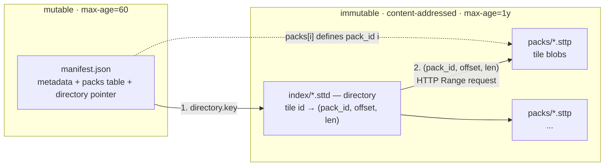

# STT Packed Format — Specification

The canonical STT container. Machine-checkable manifest
contract: [`manifest.schema.json`](./manifest.schema.json). Versioning model: §9.

**One packed format version is current: `formatVersion` 3** — object magic,
manifest schema templates, sectioned layer frame v2, and variant-qualified
directory addressing.
`manifest.formatVersion` is the **authoritative** discriminator (§5.2
authority rule) and readers MUST refuse any value outside the window in §9.1.

> **Spec license.** The STT specification documents — everything under
> `docs/spec/` plus the tile-payload spec
> [`docs/architecture/data-format.md`](../architecture/data-format.md) — are
> licensed [CC-BY-4.0](https://creativecommons.org/licenses/by/4.0/).
> The reference implementations remain MIT like the rest of the repository.
> Implementing this specification requires no code from this repository.

## 1. Motivation

Any single file large enough to hold a real dataset cannot be edge-cached once
it exceeds the CDN per-object limit (Cloudflare Free/Pro/Business = 512 MB): a
multi-GB object returns `cf-cache-status: BYPASS` on every range request, so
all reads hit origin for every user. Reordering blobs does not change this.
Hence a dataset is a directory of small, immutable, content-addressed objects.

The packed format makes the cacheable unit a small object, not the whole
dataset. Data is split into many content-addressed _pack_ objects (each well under
the limit) plus a tiny manifest. A dumb CDN caches each pack natively. No Worker, no
vendor lock-in — cacheability is a property of the format, so it works on R2, S3,
GCS, or any static host.

## 2. On-disk / on-bucket layout (per dataset)

```
data/<dataset>/
  manifest.json            # tiny, MUTABLE   → short TTL (or purge-on-deploy)
  index/<blake3>.sttd      # directory blob  → IMMUTABLE (content-addressed)
  packs/<blake3>.sttp      # tile blob data  → IMMUTABLE (content-addressed)
  packs/<blake3>.sttp
  ...
```

- **Packs and the directory are content-addressed** (blake3, 128-bit → 32 hex chars).
  Their bytes never change without their name changing, so they ship with
  `Cache-Control: public, max-age=31536000, immutable` → cached at the edge forever,
  and re-sync skips unchanged packs (incremental deploys, cross-version dedup).
- **`manifest.json` is the only mutable object** → short `max-age` (e.g. 60 s) and/or
  explicit purge on deploy. It is tiny (a few KB), so this is cheap. It is the only
  thing a deploy must invalidate.
- **Retention contract (origin GC).** Deploys are _additive_: a deploy MUST NOT
  delete objects the previous manifest references, because manifests are cached
  (up to their TTL) and an open session holds its manifest in memory for its whole
  lifetime — both keep resolving old pack names. Origin garbage collection is a
  separate, retention-aware pass: an immutable object may be deleted only when it
  is BOTH unreferenced by the dataset's current manifest AND older than a retention
  window that exceeds every cached manifest's TTL plus the longest expected session
  (the reference deploy script `scripts/r2-sync.sh` defaults to 7 days, override
  `R2_PRUNE_RETENTION`, escape hatch `--prune-now`). The reference script
  additionally applies a one-deploy **grace rule** — before uploading, it captures
  the references of the _currently-deployed_ manifest and protects them from GC for
  that deploy cycle — and a major republish that changes every object SHOULD defer
  pruning entirely (`--no-prune`) until the retention window has passed. Edge
  caches need no purge either way — an evicted-at-origin object simply ages out
  of the edge.



A cold reader fetches the manifest, then the directory (with the paged layout,
only the root page plus the leaf pages its viewport/time window touches), then
issues coalesced Range requests into packs. A deploy re-uploads only new
content-addressed objects and rewrites the manifest.

## 3. `manifest.json` schema

```json
{
  "format": "stt-packed",
  "formatVersion": 3,
  "capabilities": ["attr-quant", "coord-quant", "time-delta"],
  "compression": "zstd",
  "blobOrdering": "spatial",
  "schemas": [{ "hash": "<blake3-128 hex>", "data": "<base64>" }],
  "directory": {
    "key": "index/<hash>.sttd",
    "length": 1234567,
    "directoryVersion": 6,
    "encoding": "zstd",
    "layout": "paged",
    "rootLength": 7024,
    "pageCount": 137,
    "pageEntries": 4096,
    "rootHash": "<blake3-128 of at-rest root frame>",
    "pageHashes": ["<blake3-128 of at-rest leaf 0 frame>", "..."]
  },
  "variants": [
    { "id": 0, "kind": "raw" },
    { "id": 1, "kind": "summary", "layerName": "summary" }
  ],
  "packs": [
    { "key": "packs/<hash0>.sttp", "length": 67108864 },
    { "key": "packs/<hash1>.sttp", "length": 67108864 }
  ],
  "metadata": { "...": "the existing stt-core Metadata JSON, verbatim" }
}
```

- `packs[]` index **is** the `pack_id`. The directory references packs by this index.
- `variants[]` is required. Every directory entry carries a `variant_id`;
  `(z,x,y,t,variant_id,temporal_bucket_ms)` is the complete address. Variant
  `0` is always `raw`; summary metadata names its summary variant.
- `metadata` is the current `crate::metadata::Metadata` JSON — folded into the manifest,
  so the reader needs **no** separate header or metadata fetch.
- `directory.encoding` (OPTIONAL): at-rest encoding of the `.sttd`
  object. `"zstd"` = a zstd frame wrapping the directory codec bytes (~2× smaller; the
  directory sits on the cold-start critical path with no CDN content-encoding rescue).
  For a **paged** directory (below) it describes the framing of _each page_ (root + every
  leaf), not one frame over the whole object. **Absent = raw codec bytes.** The content
  address (`key`) and `length` always describe the **at-rest** bytes (i.e. the compressed
  bytes when `encoding` is set), so readers validate the fetched body length before decoding.
  Readers MUST support both shapes and MUST fail loudly on an unrecognized value.
- `directory.layout` (OPTIONAL): container shape. `"paged"` = a root page + leaf pages
  (§4.1), so a cold reader fetches only the leaves its viewport/time-window touches.
  **Absent or `"single"` = the whole-load object** (one buffer the reader decodes in full).
  When `"paged"`, `rootLength` (at-rest byte length of the root prefix), `pageCount` and
  `pageEntries` accompany it. The leaf codec is v6 — `layout`, not
  `directoryVersion`, discriminates the container. New writers also emit
  `rootHash` and `pageHashes`: blake3-128 addresses of the exact at-rest frame
  bytes, excluding the object magic. Both are REQUIRED on a paged directory
  (§4.1). A reader verifies every partial range before decompression and does
  not trust an unhashed one.
- `capabilities` (OPTIONAL): required-to-understand feature declarations — see §3.1.
  Absent = none used; writers omit the key rather than emit an empty array.
- `blobOrdering` (OPTIONAL, informational): the concrete blob byte-ordering the
  writer resolved and laid down (§5) — `spatial` | `time-major` | `hilbert3` |
  `morton3`, never the unresolved `auto` / `measured`. A reader indexes by
  `(z,x,y,t)` regardless and MUST NOT depend on it.
- `orderingWorkload` (OPTIONAL): co-versioning for `blobOrdering` — the query
  weights, playback-window/runway terms and `coalesce_gap_bytes` the layout was
  priced at (six required snake_case keys, pinned in the JSON Schema). Present
  on exactly the archives whose ordering was resolved by simulation
  (`--blob-ordering measured`), so its presence is itself the signal; it is
  **never** a reader directive. A writer emitting it MUST also write the
  byte-identical mirror at `metadata.ordering_workload`, which is where the
  shipped TS reader reads it from.
- **Unknown fields are permitted at every envelope level** and MUST be ignored by
  readers (additive evolution within a `formatVersion`). The JSON Schema encodes
  this: `format` and `directoryVersion` are strict consts, `formatVersion` is
  the closed enum `[3]`, the envelopes are open.
- `schemas` (OPTIONAL): the dataset's Arrow schema templates, embedded
  (§3.2). A writer that emits only **self-contained** frames (every layer
  inlining its own schema section — `ref_kind 0`, which is what `stt-serve`
  does) references no template and omits the key.

The manifest envelope is the **cross-language wire contract**. Its authoritative,
machine-checkable definition is [`manifest.schema.json`](./manifest.schema.json),
which is pinned in CI against the Rust writer (`crate::pack::Manifest`), the TS
reader type (`@poopdeck.gl/core` `PackedManifest`) and the golden fixture
(`packages/core/test/manifest-schema.test.ts`). Any drift between the three fails
the build.

### 3.1 Required-to-understand capabilities (`capabilities`)

Most format evolution is additive: a new column or manifest field that old
readers safely ignore. A small class of features is different — they **re-type
existing tile columns**, so a reader that predates them doesn't fail, it
silently misdecodes (e.g. `stt:quant` Int32 grid indices read as microscopic
lon/lat degrees, mid-session, per tile). `capabilities` is the manifest-level
must-understand declaration (the same mechanism as Zarr v3's `must_understand`)
that converts the format's worst failure mode — silent garbage — into its best:
a loud refusal at open.

- A **writer MUST** declare, for each registry feature below it used, that
  feature's capability string. A build that used none MUST omit the key
  entirely rather than emit an empty array, so a capability-free build's
  manifest carries no trace of the registry. Entry order is not significant;
  the reference writer emits
  the list sorted + deduped so manifest bytes are byte-reproducible regardless
  of flag order.
- A **reader MUST** refuse a dataset whose `capabilities` contains any string
  outside the set the reader itself implements, naming the unknown entries in
  the error. It MUST NOT warn-and-proceed: every capability marks data that
  decodes to garbage, not to an error, without the feature.
- **Additive features never get a capability.** New columns (vector groups,
  summary tiers, …) and new manifest fields are ignored safely by old readers —
  declaring them here would lock those readers out gratuitously. The triangle
  sidecar is the instructive near-miss: as a COMPLETE column it is additive
  (an old reader earcuts for itself and ignores it), but a column that bakes
  only SOME features is not, because the empty lists read as "this polygon has
  no triangles" rather than as "tessellate this one yourself" — hence
  `triangles-partial`.

Registry (7 entries as of 2026-08-13). The machine-readable copy is the
top-level `x-stt-capability-registry` array of
[`manifest.schema.json`](./manifest.schema.json); both reference
implementations pin their constant lists against that array in CI
(`crates/stt-core/tests/capability_registry.rs`,
`packages/core/test/manifest-schema.test.ts`). This table is a human-readable
copy of the same array and MUST be updated with it — no CI gate covers the
prose.

| capability                   | declared when the writer…                                                                                                                                                                                                                              | payload mechanism                                                                             | since      |
| ---------------------------- | ------------------------------------------------------------------------------------------------------------------------------------------------------------------------------------------------------------------------------------------------------ | --------------------------------------------------------------------------------------------- | ---------- |
| `coord-quant`                | quantized geometry to fixed-point `Int32` (`--quantize-coords`)                                                                                                                                                                                        | `stt:quant` metadata on the `geometry` field                                                  | 2026-07    |
| `attr-quant`                 | quantized any numeric property column (`--quantize-attr` / `--quantize-attrs-auto`)                                                                                                                                                                    | `TILE_META.qa`                                                                                | 2026-07    |
| `elevation-fold`             | folded a property into POINT z (`--point-elevation-column`)                                                                                                                                                                                            | 3-component point leaf instead of 2                                                           | 2026-07    |
| `time-delta`                 | emitted compact feature times (ON by default; `--no-compact-times` suppresses both)                                                                                                                                                                    | `TILE_META.st` / `TILE_META.et` re-type `start_time` / `end_time` (§5.2.4)                    | 2026-07-26 |
| `vertex-value-quant`         | quantized a per-vertex value column (`--quantize-vertex-values`)                                                                                                                                                                                       | `TILE_META.vq` re-types the `vertex_value(_matrix)` list leaf (§5.2.5)                        | 2026-07-26 |
| `triangles-partial`          | emitted a polygon `triangles` column that MIXES baked and empty per-feature lists (ON by default; `--no-partial-triangles` restores the all-or-nothing shape, and `--pre-tessellate` bakes everything)                                                 | empty per-feature list = "reader earcuts this single ring at decode"                          | 2026-08-11 |
| `vertex-time-feature-anchor` | emitted per-vertex times anchored to each feature's own `start_time` instead of a layer-wide origin (automatic — tried between the layer-anchored u16 and u32 tiers when the layer span forces too coarse a step; `--vertex-time-precision` bounds it) | `TILE_META.vtf` re-types the `vertex_time` `List<UInt16>` leaf to per-feature deltas (§5.2.6) | 2026-08-13 |

#### `additive-partition` — declared, and in no reader's registry yet

`stt-build --additive-lod` declares a further must-understand capability,
`additive-partition`, alongside `metadata.partition = "home-zoom"`. It is
**deliberately absent from the registry above and from both reference readers'
implemented sets**, so every conformant reader today refuses such an archive at
open. That is the mechanism working, not a gap: home-zoom puts each feature at
exactly one zoom and requires the reader to union across `[minZoom..z]`, and a
reader that opened it while still defaulting to parent-fallback would render a
sparse per-zoom slice as if it were complete — the silent misdecode the
must-understand gate exists to prevent.

A reader adds `additive-partition` to its implemented set in the same change
that lands defaulting its LOD mode from `metadata.partition`, never before.
Until then the archive is writable, self-describing, and correctly unopenable.

Note that `time-delta` is the first capability a **default** build declares:
compact times are on unless suppressed, so essentially every archive written
from 2026-07-26 onward carries the key. That is intentional — the two keys
re-type columns whose misreading is silent (millisecond offsets read as
absolute Unix ms put every feature in 1970), so the must-understand gate is
exactly the right mechanism.

The value vocabulary is deliberately open-ended (the envelope rules above
stay intact): future registry entries are added by spec revision without a
schema change, and a reader enforces **its own** implemented set — not this
table's snapshot — so a reader correctly refuses a dataset from a future
writer that declares a capability it has never heard of.

### 3.2 Schema templates (`schemas`) — formatVersion 3

The layer frame (§5.2) does not repeat its Arrow IPC schema in every tile;
the schema **template** is written once, embedded in the manifest:

```jsonc
{
  "formatVersion": 3,
  "schemas": [
    {
      "hash": "<blake3-128 hex (32 chars) of the raw template bytes>",
      "data": "<base64 (standard, padded) of the raw template bytes>",
    },
  ],
  // directory / packs / metadata / capabilities: unchanged shape
}
```

- A **template** is a layer's Arrow IPC stream bytes from offset 0 through
  the end of the encapsulated _Schema message_ (continuation `0xFFFFFFFF` +
  `i32 metadata_len` + flatbuffer; the schema message has `bodyLength 0`).
  Templates carry only **dataset-constant** metadata — per-tile-varying keys
  live in the frame's `TILE_META` section (§5.2.2).
- `schemas` MUST be **sorted by `hash`** and deduped (byte-reproducible
  manifests). A writer includes exactly the templates its frames reference.
- A reader MUST validate every entry at open (`blake3_128(data) == hash`) —
  a corrupt manifest fails loudly, dataset-level, before any tile fetch. It
  then builds the hash → bytes **template registry** the frame decoder
  resolves references against.
- Templates are keyed per **distinct stripped schema**, not per layer:
  per-tile type selection legitimately yields several templates per layer.
  The selections that fork a template are attr-quant (`UInt16` / `Int32` /
  `Float64` fallback, §5.2.6), `vertex_time` (`UInt16` / `UInt32` delta vs
  `Int64`, §5.2.6), `triangles` (`UInt16`/`UInt32`), the presence of
  `part_offsets` (§5.2.5), and the compact-time forms (§5.2.4 — an
  `et: "zero"` layer has no `end_time` column at all, and an empty layer
  keeps the absolute pair, so a dataset with empty tiles mints one extra
  CORE template per layer shape). Realized cardinality is expected in the
  single digits per dataset; at a handful of templates × ~900 B raw the
  manifest grows by low KB.
- Embedding (rather than an external `schemas/<hash>` object class) is
  deliberate: no new object class for deploy tooling, no template-404
  failure mode that bricks a dataset, no extra cold-start fetch — every
  session already fetches the manifest.

## 4. Directory format v6

The directory (`index/<hash>.sttd`) is a pure columnar binary buffer
(`crates/stt-core/src/directory.rs`), inspired by PMTiles v3: delta + zig-zag
varint key columns plus blob-run RLE. `DIRECTORY_VERSION = 6` is the codec
writers emit and the only one specified here. It is pack-aware — blob runs
carry pack identity and pack-relative offsets — and every entry carries a
`variant_id`, so raw and derived representations share one archive without
address collisions.

**Varints.** Unsigned values use LEB128; signed deltas use LEB128 over a zig-zag
mapping `zz(v) = (v << 1) ^ (v >> 63)`. Deltas are computed with wrapping
arithmetic, so any `i64` round-trips exactly.

**Sort order.** Entries are sorted into directory order `(zoom, hilbert,
time_start, variant_id)` — the codec's own (stable) sort key; the writer pre-sorts with
the additional `temporal_bucket_ms` tiebreak of §5, which the stable sort
preserves — so every key column is near-monotonic and delta-codes to ~1 byte
per entry.

### The Hilbert key (normative)

The `hilbert` component of the sort key — and therefore the wire `Δhilbert`
column and the paged container's cross-page monotonicity check (§4.1) — is
defined exactly as follows. A third-party writer MUST produce these values
bit-for-bit or its directory will not decode compatibly.

`hilbert(z, x, y)` is the index of the tile's `(x, y)` on the **traditional
Hilbert curve** (D. Hilbert, 1891) over the full `2^z × 2^z` tile grid of the
entry's **own zoom** (curve order = `z`). Coordinates are the standard
XYZ/WebMercatorQuad tile coordinates used everywhere in STT — `x` = column
increasing eastward, `y` = row increasing southward from the top-left
(northwest) origin — fed to the algorithm as raw integers with **no axis flip
or reorientation**. The convention is the classic bottom-up rotate-and-
accumulate `xy2d` algorithm (the widely published Wikipedia form):

```text
fn hilbert(z, x, y) -> u64:
    if z == 0: return 0          # single tile; order-0 curve is degenerate
    n = 1 << z                   # grid size at this zoom
    h = 0
    s = n / 2                    # walk bits from most- to least-significant
    while s > 0:
        rx = (x & s) != 0 ? 1 : 0
        ry = (y & s) != 0 ? 1 : 0
        h += s * s * ((3 * rx) XOR ry)
        # rotate/reflect the quadrant so the remaining low bits are in the
        # canonical frame (n-1-x is a pure bit complement: n-1 is all ones)
        if ry == 0:
            if rx == 1:
                x = (n - 1) - x
                y = (n - 1) - y
            swap(x, y)
        s = s / 2
    return h
```

Consequences of the convention, usable as quick orientation checks:

- the curve **enters** the grid at `(0, 0)` (the NW tile, `h = 0`) and
  **exits** at `(2^z − 1, 0)` (the NE tile, `h = 4^z − 1`);
- at `z = 1` the traversal order is `(0,0) → (0,1) → (1,1) → (1,0)` =
  `h 0, 1, 2, 3` (NW, SW, SE, NE);
- consecutive `h` values are always edge-adjacent tiles (the locality property
  range coalescing rests on).

Keys are **per-zoom**: the same `(x, y)` yields different values at different
zooms, and the directory sorts by `(zoom, hilbert, …)` so keys never compare
across zooms. `h < 4^z` fits `u64` at every zoom the format addresses (the
WebMercatorQuad matrix set tops out at z22 → `h < 2^44`; the codec itself
assumes only `hilbert < 2^63`, the blockquote below). The reference
implementation is
`TileId::hilbert_index` (`crates/stt-core/src/tile.rs`), which delegates to
`hilbert_2d::xy2h_discrete(x, y, order = z, Variant::Hilbert)` — that crate's
traditional variant computes exactly the algorithm above (the equivalence is
test-enforced, exhaustively at low zooms, in
`crates/stt-core/tests/hilbert_vectors.rs`).

**Normative test vectors** (pinned against the reference implementation by
`crates/stt-core/tests/hilbert_vectors.rs`; the spec table and the test table
are the same table):

| z   | x     | y     | h         |
| --- | ----- | ----- | --------- |
| 0   | 0     | 0     | 0         |
| 1   | 0     | 0     | 0         |
| 1   | 0     | 1     | 1         |
| 1   | 1     | 1     | 2         |
| 1   | 1     | 0     | 3         |
| 2   | 0     | 0     | 0         |
| 2   | 0     | 3     | 5         |
| 2   | 1     | 2     | 7         |
| 2   | 3     | 3     | 10        |
| 2   | 2     | 1     | 13        |
| 2   | 3     | 0     | 15        |
| 8   | 0     | 0     | 0         |
| 8   | 0     | 255   | 21845     |
| 8   | 255   | 255   | 43690     |
| 8   | 255   | 0     | 65535     |
| 8   | 128   | 128   | 32768     |
| 8   | 100   | 200   | 28272     |
| 14  | 0     | 0     | 0         |
| 14  | 0     | 16383 | 89478485  |
| 14  | 16383 | 16383 | 178956970 |
| 14  | 16383 | 0     | 268435455 |
| 14  | 8192  | 8192  | 134217728 |
| 14  | 12345 | 6789  | 214230386 |

**Layout.**

```
u8     version_tag = 0x06
uvarint N          # entry count
uvarint R          # run count

# per-entry key columns, N rows, delta-coded against the previous entry:
repeat N:
  ivarint  Δzoom
  ivarint  Δhilbert
  ivarint  Δx
  ivarint  Δy
  ivarint  Δtime_start
  ivarint  duration            # time_end - time_start (wrapping)
  uvarint  feature_count
  uvarint  bucket_present      # temporal_bucket_ms: 0 = None, 1 = Some
  uvarint  bucket_value        #   present only when bucket_present == 1
  uvarint  variant_id          # manifest.variants id; part of tile identity

# per-run blob columns, R rows:
repeat R:
  uvarint  run_length          # entries sharing this blob; Σ run_length == N
  ivarint  Δpack_id            # zig-zag vs the previous run's pack_id
  uvarint  offset_flag         # 0 = contiguous (== expected_offset)
  uvarint  offset              #   present only when offset_flag == 1: raw
                               #   pack-relative offset
  uvarint  length              # compressed blob length
  uvarint  uncompressed_size
  u32 (LE) crc32c              # integrity tag of the compressed blob

# optional trailing covering section:
u8       section_tag = 1       # COVER_SECTION_TMIN
repeat N:
  ivarint  Δcover_t_min        # cover_t_min - time_start (signed)
```

**Run-length encoding.** A _run_ is a maximal stretch of
consecutive entries (in directory order) that reference the **same physical
blob** — same `(pack_id, offset, length, uncompressed_size, crc32c)`. Because
the writer deduplicates byte-identical blobs (§5), a spatial cell whose content
is identical across many consecutive time buckets collapses to a single run:
the heavy blob columns are written **once per run** instead of once per entry —
the temporal analogue of PMTiles collapsing identical ocean tiles across space.
`pack_id` is part of run identity: two entries collapse only when same
pack _and_ same blob.

**Per-run `pack_id` column.** Delta+zig-zag coded against the
previous run's `pack_id`; packs are near-monotonic in directory order, so this
costs ~1 byte/run. It sits immediately after `run_length`, before the offset
sentinel.

**Pack-relative offset contiguity.** Offsets are relative to the run's pack.
A run whose blob immediately follows the previous run's blob in the same pack
(the common, sequential case) stores `0`; a back-reference (a deduped blob
written earlier) stores a `1` flag + the raw offset. The decoder tracks
`expected = prev.offset + prev.length`, and `expected` resets to `0` whenever
`pack_id` changes between consecutive runs — so the first run of each pack
still hits the cheap `0` sentinel.

**Covering section.** One signed varint per entry, `cover_t_min - time_start`
(signed — a feature can start before its bucket boundary), giving the tight
lower temporal bound the reader's backward-coverage checks use. It is
all-or-nothing: emitted only when **every** entry carries a bound, and
otherwise the buffer simply ends after the run columns, leaving
`cover_t_min = None` for every entry. It is the last section, so a decoder
that reaches the end of the buffer is done.

**Decode** reconstructs the N key rows, then walks the R runs, assigning each
run's blob fields to its `run_length` entries; it errors if the run lengths
don't sum to `N` or the buffer is truncated.

> Assumes `hilbert < 2^63` (zoom ≤ ~31) and timestamps within `i64` ms — true
> for Web-Mercator tiles and Unix-ms time. The directory is single-level (no
> leaf directories).

## 4.1 Paged container (optional `layout: "paged"`)

A whole-load directory must be fetched and decoded in full before any tile can
be requested — cost grows with dataset size, not with what a session views (a
15 MB directory on the cold-start critical path). The **paged container** wraps
the v6 codec so a cold reader fetches a tiny root page plus only the leaf pages
its viewport/time-window touches. Implemented in `crates/stt-core/src/directory_page.rs`
(Rust) and `packages/core/src/directory.ts` (`decodePagedRoot`, TS).

**Layout.** The `.sttd` object is a root frame followed by leaf frames:

```text
.sttd  =  [root page frame][leaf 0 frame][leaf 1 frame] ...
```

- A **leaf page** is the §4 v6 codec over a contiguous slice of
  directory order `(zoom, hilbert, time_start, variant_id)`. Slicing resets delta state and
  splits RLE runs at boundaries — the only paging cost (measured +6–19% at rest,
  paid once by the immutable CDN object, not per session).
- Each page (root + every leaf) is an **independent frame**: when
  `encoding == "zstd"` each is its own zstd frame (no shared dictionary, so the
  fzstd TS path decodes every page); absent = raw codec bytes per page.
- Each at-rest frame is independently content-addressed by
  `directory.rootHash` / `directory.pageHashes[i]`. These hashes cover the exact
  bytes selected by the corresponding range request, before decompression. The
  directory object's key continues to address the complete object including
  the `STTD` magic. Hash fields are paired and page-hash order is descriptor
  order; `pageHashes.length == pageCount`.
- The directory is **single-level** (a flat page table; no multi-level tree) —
  sufficient for the whole fleet (~560 K entries → ~137 pages → a ~7 KB root).

**Root page** — a fixed-width header + one fixed-width descriptor per leaf (count
= bytes / width, no per-record framing). All little-endian:

```text
u8   root_version = 1
u8   descriptor_kind = 0          # 0 = geo-bbox + zoom-range + temporal bounds
u16  reserved = 0
u32  page_count P
u32  page_entries                 # nominal entries-per-page used at build

repeat P  (52 bytes each):
  u64  rel_offset                 # leaf byte offset RELATIVE TO rootLength
                                  #   (absolute = rootLength + rel_offset)
  u32  length                     # at-rest (framed) byte length of the leaf
  u32  entry_count                # entries in this leaf (Σ == N)
  u8   min_zoom
  u8   max_zoom
  u16  reserved = 0
  i32  min_lon_e7, min_lat_e7,    # geographic bbox, lon/lat × 1e7 fixed point;
       max_lon_e7, max_lat_e7     #   mins floored / maxes ceiled so the integer
                                  #   bbox always COVERS the leaf's tiles
  i64  t_min                      # min(cover_t_min ?? time_start) over the leaf
  i64  t_max                      # max(time_end) over the leaf
```

Offsets are relative to the root's end so the root encodes without knowing its
own at-rest length first.

**Descriptor kinds.** The kind byte selects the descriptor's fields **and its
width**, so the two are always read together:

| kind | descriptor                                                                                                                                                                                        | width | emitted / accepted                                                                                                                                       |
| ---- | ------------------------------------------------------------------------------------------------------------------------------------------------------------------------------------------------- | ----- | -------------------------------------------------------------------------------------------------------------------------------------------------------- |
| `0`  | geo bbox + zoom range + `t_min`/`t_max`, exactly the table above                                                                                                                                  | 52 B  | the only kind any conformant writer emits; accepted by both reference readers                                                                            |
| `1`  | kind 0 plus a trailing `i64 min_bucket_start` = `min(entry.time_start)` over the leaf — the true minimum BUCKET start, tighter than `t_min` (a _covered_ bound) for a point lookup at one instant | 60 B  | no writer path emits it; the Rust reader decodes it (`DESCRIPTOR_GEO_BBOX_V2`), the TS reader refuses it (`STT paged root: unsupported descriptor kind`) |

A reader MUST reject a root whose `descriptor_kind` it does not implement — a
loud failure at open, never a best-effort decode, and never a skip. There is
nothing to skip past: the table is fixed-width with no per-record framing, and
the width is a function of the kind, so an assumed width misaligns every
descriptor after the first and yields silently wrong prune bounds. That is
narrower than the format's other extension points, and deliberately so —
unknown manifest fields (§3) are ignored and unknown frame section tags (§5.2)
are skipped via their TOC length because both carry their own length; a kind
byte carries none.

A new kind is therefore additive only in the axes it leaves alone: it needs no
`directoryVersion` bump (the leaf codec is untouched) and no `root_version`
bump (the kind byte is reserved precisely so new descriptor shapes fit under
root version 1), but it is **not** transparent to an existing reader, which
refuses the whole archive. A writer emitting any kind other than `0` MUST
therefore declare it as a required-to-understand capability (§3.1, added to
that registry by spec revision), so the refusal lands at open naming the
feature rather than surfacing later as an unexplained root-decode error.

**Descriptor choice (geo-bbox).** A reader prunes a leaf when its **zoom range**
excludes the query zoom, its **geo bbox** misses the viewport, or its
**`[t_min, t_max]`** misses the time window — all without fetching the leaf. The
geographic bbox (rather than a Hilbert key range) is zoom-correct and needs no
Hilbert index in the reader, and it matched or beat Hilbert-range pruning on
every dataset where paging matters (the A/B sim is recorded in
[`stt-packed-format-decisions.md`](../roadmap/stt-packed-format-decisions.md)
§3.1), because a viewport box maps to a Hilbert _interval_ that falsely keeps
spatially-distant pages while geo-bbox tests real overlap. It also composes with
a future per-tile `geoarrow.box` covering column.

**Covering section.** A leaf emits the §4 covering section iff **every** entry in
the _whole directory_ carries `cover_t_min` (a global decision, so a paged
directory decodes byte-for-identical-entries to a whole-load directory of the
same corpus). Per-leaf `t_min` already encodes the tight lower bound on the page
pointer.

**Validation.** A ranged reader validates the root and every leaf against its
independent frame hash before decompression. `rootHash` and `pageHashes` are
therefore **required** on a paged manifest — the JSON Schema makes them
conditionally required on `layout: "paged"`, and a reader rejects a paged
directory that omits either. There is no unhashed paged shape to write.
Beyond plain decode (root frame, leaf byte-ranges, per-leaf entry counts),
`stt-validate` checks the paged-specific invariants
(`verify_paged_structure`): every descriptor's bounds **cover** its leaf's
entries (geo bbox, zoom range, temporal) so a prune never drops a matching tile,
and cross-page key order is monotonic in `(zoom, hilbert, time_start)`.

## 5. Pack-cutting (writer)

1. Order blobs by `BlobOrdering` (default `Auto`, i.e. `--blob-ordering auto`:
   resolved at finalize via `BlobOrdering::choose` from the dataset's space-vs-time
   cardinality — wide-time → spatial-major, else 3D Hilbert). Locality → fewer packs
   per viewport.
   The curve key is extended with a **total tiebreak** `(z, x, y, time_start,
temporal_bucket_ms)` — the curve alone ties between a cell's base and temporal-LOD
   tiles (and the 21-bit cube cap can collide), and the input arrives in nondeterministic
   (parallel) order. The tiebreak makes the blob byte order — and therefore every
   content address — **byte-reproducible across identical rebuilds**, which is what the
   immutable-pack caching economics rest on. The directory entry sort gets the same
   treatment: `(zoom, hilbert, time_start, variant_id, temporal_bucket_ms)`.
2. Per-blob zstd, byte-identical dedup (blake3). **No shared dictionary** — each blob
   decompresses standalone (keeps the fzstd TS reader able to decode without a
   cross-blob dictionary).
3. Cut the ordered, deduped blob stream into packs of **≤ `pack_target_bytes`** (default
   **64 MiB**, override `--pack-size`). Never split a blob across packs.
4. Assign `pack_id` in cut order; `offset_in_pack` resets to 0 per pack.
5. zstd-compress the encoded directory (declared via `directory.encoding`, §3), then
   blake3 each finished pack and the at-rest directory → content-addressed filenames.
6. Emit `manifest.json` (metadata + directory pointer + pack table).

### 5.1 Why `0xFFFF` opens the frame

A frame announces itself with a leading `u16` of `0xFFFF` — a value the
retired predecessor frame could never write, so it is unambiguous without ever
having been negotiated. That is defense-in-depth, not a version channel:
`manifest.formatVersion` is the authoritative discriminator (§5.2), Rust
`arrow_tile::decode_tile` refuses any payload not opening with the escape, and
`PackedReader::open` refuses the manifest before a payload is ever reached.

Two rules §5.2 relies on: pads to 8 are **derived** (`(8 - pos % 8) % 8`) and
never stored, and declared lengths are exact at-rest byte counts with padding
excluded.

### 5.2 Tile payload layer frame v2 (sectioned, template-referencing)

A **formatVersion-3** tile blob decompresses to the sectioned layer-frame-v2
payload:

```text
u16  0xFFFF                    # frame escape (§5.1)
u8   frame_version = 2
u8   flags = 0                 # reserved, MUST be 0
u16  layer_count
per layer:
  u16  name_len, [name utf8]
  u8   ref_kind_core           # 0 = INLINE_SCHEMA_CORE section present;
                               # 1 = the next 16 bytes are the template hash
  [16] core template hash      # present iff ref_kind_core == 1
  u8   ref_kind_props          # 0/1 as above; 2 = NO props sections at all
  [16] props template hash     # present iff ref_kind_props == 1
  u8   section_count
  per section (TOC): u8 tag, u32 length     # at-rest bytes, pad excluded
  [pad to 8, derived]
  per section: [section bytes][pad to 8, derived]
```

All multi-byte fields are little-endian. Sections MUST appear in ascending tag
order, both in the TOC and in the body — a third-party writer that reorders
them produces a different content address for identical data.

**Authority rule.** `manifest.formatVersion` is the authoritative
discriminator; the `0xFFFF` escape is defense-in-depth, not a negotiation
channel (§5.1). A payload that does not open with the escape is a **hard
error**, never a fallback to another frame shape: current readers hard-reject
`formatVersion != 3`, a loud refusal by design.

**Section tag registry** (unknown tags are SKIPPABLE via their TOC length —
additive evolution):

| tag  | name                  | content                                             |
| ---- | --------------------- | --------------------------------------------------- |
| 0x01 | `INLINE_SCHEMA_CORE`  | full IPC schema prefix (self-contained mode)        |
| 0x02 | `TILE_META`           | canonical per-tile metadata JSON (§5.2.2)           |
| 0x03 | `CORE_BATCH`          | IPC tail: dictionary batch(es) + record batch + EOS |
| 0x04 | `INLINE_SCHEMA_PROPS` | as 0x01, props schema                               |
| 0x05 | `PROPS_BATCH`         | as 0x03, props schema                               |

**CORE / PROPS split.** Reserved columns form the **CORE** batch;
non-reserved property columns form the **PROPS** batch with its own
schema/template, emitted only when properties exist (`ref_kind_props = 2`
otherwise). The reserved set is closed, and a CORE batch presents its
members in exactly this order, each optional member omitted rather than
null-filled:

```text
id, start_time, [end_time], geometry,
[vertex_time], [vertex_value], [vertex_value_matrix],
[triangles], [part_offsets]
```

`part_offsets` (§5.2.5) is appended **last** precisely so every pre-existing
layer shape keeps its exact column order and no already-published template
changes. Column-level types and presence rules are the tile-payload spec's
([`data-format.md`](../architecture/data-format.md)); §§5.2.4–5.2.6 below
specify only what the frame itself discriminates.

**Frame alignment.** Pads to 8 are derived, never stored; TOC lengths are
exact at-rest byte counts (§5.1).

**Arrow IPC buffer alignment = 8 (normative).** Each `*_BATCH` section, and
each `INLINE_SCHEMA_*` prefix, MUST be written by an Arrow IPC writer
configured for **8-byte** buffer alignment — _not_ arrow-rs'
`IpcWriteOptions::default()` of 64. A third-party writer reproducing STT
bytes will not match content addresses at any other value. 8 is the Arrow IPC
spec's own requirement (64 is a SIMD _recommendation_) and is the floor both
reference readers need: their zero-copy `subarray` paths require each buffer's
byte offset to be a multiple of its element width, and it matches the frame's
own pad. 64 inflates uncompressed payloads ~19–39% across the reference fleet
— which is what drives reader allocation and the client memory budget, even
though the compressed delta is only ~2–3%. Reference implementation:
`IPC_BUFFER_ALIGNMENT` in `crates/stt-core/src/arrow_tile/encode.rs`.

#### 5.2.1 Template splice (normative guards)

A `*_BATCH` section is the layer's Arrow IPC stream **tail** — dictionary
batches are per-tile (categories vary) and MUST live in the tail; an empty
tile still carries one DictionaryBatch per dictionary column; the 8-byte
end-of-stream marker (`FFFFFFFF 00000000`) belongs to the tail. The reader
materializes `concat(template, section)` and hands it to a stock Arrow
reader, resolving `ref_kind 1` hashes through the manifest's template
registry (§3.2) and `ref_kind 0` through the inline section.

Guards: the splice MUST use exactly the TOC-declared section length, and
readers MUST verify the section (and the template) begins with the
`0xFFFFFFFF` continuation marker — stray zero bytes otherwise parse as a
legacy 4-byte end-of-stream and **silently empty the tile** in arrow-rs (and
silently drop zero-copy in arrow-js). A frame that references a template
hash absent from the registry is a hard error naming the hash.

#### 5.2.2 `TILE_META` section

Per-tile-varying metadata, hoisted out of the (now dataset-constant) Arrow
schema. Canonical serialization: JSON, **keys sorted, no whitespace** — the
serialized key order is therefore fixed at `et, qa, sorted, st, t0, vb, vq,
vt, vtf`. Readers MUST ignore unknown **keys**; an unrecognized **value** of a
key the reader does know (`st`, `et`) is a hard decode error, never a
fallback. A key is present iff the corresponding feature is:

| key      | type                         | present iff                                                                                                                                                                       | reference decoder restores it as                                        |
| -------- | ---------------------------- | --------------------------------------------------------------------------------------------------------------------------------------------------------------------------------- | ----------------------------------------------------------------------- |
| `et`     | `"dur32"` \| `"zero"`        | `end_time` is compact (§5.2.4); absent ⇒ absolute non-null `Int64` column                                                                                                         | the absolute `Int64` `end_time` column                                  |
| `qa`     | object of `[number, number]` | any property column is quantized (absence of a column key = not quantized)                                                                                                        | `stt:qa` field metadata, as `{column: [o, s]}`                          |
| `sorted` | `true`                       | rows are stable-sorted by `start_time`                                                                                                                                            | — (a declaration; nothing to restore)                                   |
| `st`     | `"u32"`                      | `start_time` is compact (§5.2.4); absent ⇒ absolute non-null `Int64` column                                                                                                       | the absolute `Int64` `start_time` column                                |
| `t0`     | integer Unix ms              | a start-time column exists — **REQUIRED** whenever `st` is present                                                                                                                | `stt:time_offset_ms` schema metadata                                    |
| `vb`     | integer                      | a vertex-value matrix exists                                                                                                                                                      | `stt:vertex_value_buckets` schema metadata                              |
| `vq`     | object of `[number, number]` | a per-vertex value column ships quantized (§5.2.5)                                                                                                                                | the `Float32` vertex-value column                                       |
| `vt`     | `[integer, integer]`         | `vertex_time` is LAYER-anchored delta-encoded — at **either** width, u16 or u32 (§5.2.6)                                                                                          | `stt:vertex_time_origin_ms` / `stt:vertex_time_step_ms` schema metadata |
| `vtf`    | integer                      | `vertex_time` is FEATURE-anchored delta-encoded (§5.2.6) — mutually exclusive with `vt`; no companion origin key, the anchor is each feature's own `start_time` in the CORE batch | `stt:vertex_time_feature_step_ms` schema metadata                       |

```json
{
  "et": "dur32",
  "qa": { "speed": [0.0, 0.15] },
  "sorted": true,
  "st": "u32",
  "t0": 1577836800000,
  "vb": 24,
  "vq": { "vertex_value": [-2.0, 0.00052] },
  "vt": [1577836800000, 1000]
}
```

Readers MUST source these from `TILE_META`; dataset-constant keys
(`ARROW:extension:name`, `ARROW:extension:metadata`, `stt:quant`,
`stt:layer`, `stt:geometry`, `stt:has_triangles`) stay in the template.

Every key is omitted when its feature is unused, so a tile that uses none of
them serializes a `TILE_META` containing only the keys it needs. That is what
lets a key be added without churning the bytes of tiles that do not use it.

#### 5.2.3 Row order

Writers stable-sort each layer's rows by `start_time` at encode, AFTER
feature-id assignment (ids are order-independent), and declare it via
`TILE_META.sorted: true` — enabling client window slicing and future partial
decode. Readers MUST NOT assume sortedness without the flag.

#### 5.2.4 Compact feature times (`st` / `et`) — capability `time-delta`

The two feature-time columns are the format's most redundant CORE columns:
absolute `Int64` Unix ms repeated per feature, with `end_time` equal to
`start_time` on every instantaneous event. The compact forms re-type them
against the layer's own `TILE_META.t0` anchor. **The forms are chosen per
layer, independently of each other, from that layer's own data**, so two
tiles of one dataset may differ — a reader MUST branch on the keys, never on
the Arrow `DataType` and never on a form cached from another tile.

| key + value   | wire column                                                       | reconstruction                  |
| ------------- | ----------------------------------------------------------------- | ------------------------------- |
| `st: "u32"`   | `start_time`: non-null `UInt32`, ms **offset from `t0`**          | `start = t0 + offset`           |
| `st` absent   | `start_time`: non-null `Int64`, absolute Unix ms                  | `start = value`                 |
| `et: "dur32"` | `end_time`: non-null `UInt32`, ms **duration from its own start** | `end = start + dur`             |
| `et: "zero"`  | `end_time` column **OMITTED from the CORE batch entirely**        | `end = start` for every feature |
| `et` absent   | `end_time`: non-null `Int64`, absolute Unix ms                    | `end = value`                   |

Normative rules:

- `st: "u32"` **REQUIRES** `t0`. A `TILE_META` carrying `st` without a
  finite `t0` is malformed and MUST be rejected — the anchor is load-bearing,
  not an optimization.
- Durations are measured against **each feature's own start**, not `t0`, so
  a long-lived feature inside a wide tile still compacts.
- `et: "zero"` means the column is absent from the batch, not present-and-
  zero. A reader MUST **synthesize** `end_time` back at CORE index
  `start_idx + 1` (i.e. immediately after `start_time`, restoring the
  canonical column order of §5.2) with the reconstructed absolute values. A
  `TILE_META` declaring `et: "zero"` alongside a present `end_time` column
  — or `et: "dur32"` with no `end_time` column — is malformed.
- A writer selects a form only when **every** feature fits: every
  `start − t0` and every `end − start` must lie in `[0, u32::MAX]`, computed
  with checked arithmetic. Otherwise it emits the absolute `Int64` column.
  `et: "zero"` is selected iff every duration is exactly 0.
- An **empty layer** takes the absolute pair for both columns (no `t0`
  exists to anchor against, and an "all durations are zero" verdict over
  zero features would fork the schema template for empty tiles alone).
- Both keys are suppressed together by `stt-build --no-compact-times`, which
  also suppresses the `time-delta` capability declaration.

A reader that ignores these keys reads millisecond offsets as absolute Unix
ms — every feature lands in January 1970 — which is exactly the silent
class §3.1 exists for; hence the `time-delta` capability.

#### 5.2.5 `part_offsets` (additive — no capability)

`geoarrow.polygon` is `List<List<FixedSizeList>>`: one flat ring list per
feature, exterior first then holes. A MultiPolygon's parts are flattened
into that same ring list, so **part-vs-hole is unrecoverable from the
geometry column alone** — every conformant GeoArrow consumer reads parts
2..n as holes of part 1. `part_offsets` restores the part boundary.

- **Type** `List<UInt32>`, non-null, one list per feature, **last** among
  the reserved CORE columns.
- **Units** RING INDICES relative to that feature's **own first ring**. Part
  0 therefore always starts at `0`; a single-part feature's list is `[0]`.
  Values are strictly increasing and the last start is < that feature's ring
  count.
- **Presence** emitted iff at least one feature in the layer has more than
  one part, and only on polygon layers. **Absence means every feature is
  single-part** — a reader MUST NOT treat it as "unknown".
- **Purely additive**: an older reader ignores an unknown column, so there
  is no capability and no `formatVersion` bump. It does fork a CORE template
  per layer shape between multi-part and single-part tiles, which is the
  inherent cost of "emit only when it carries information".
- Holes do **not** make a feature multi-part; the part list describes parts
  only, and each part's own exterior/holes remain in ring order inside it
  (feature ⊇ part ⊇ ring).

#### 5.2.6 Per-tile column-width selections

Three CORE columns pick a width from the tile's own data. All three are
long-standing except where dated; they are collected here because each one
forks a schema template (§3.2) and a third-party reader must branch on all
of them.

| column                                 | widths                                          | discriminator                                                                                                                              |
| -------------------------------------- | ----------------------------------------------- | ------------------------------------------------------------------------------------------------------------------------------------------ |
| `vertex_time`                          | `List<UInt16>` → `List<UInt32>` → `List<Int64>` | `TILE_META.vt` ⇒ LAYER-anchored delta at either integer width; `TILE_META.vtf` ⇒ FEATURE-anchored `UInt16` delta; neither ⇒ absolute Int64 |
| `triangles`                            | `List<UInt16>` \| `List<UInt32>`                | Arrow leaf type (feature-local indices; no metadata)                                                                                       |
| quantized `<prop>`                     | `UInt16` \| `Int32` \| `Float64` (unquantized)  | a `TILE_META.qa` entry for that column                                                                                                     |
| `vertex_value` / `vertex_value_matrix` | `List<Float32>` \| `List<UInt16>`               | a `TILE_META.vq` entry for that column                                                                                                     |

The **`vertex_time` `List<UInt32>` tier is new on 2026-07-26** and sits
between the u16 tier and the exact-`Int64` fallback: the encoder walks
`[u16::MAX, u32::MAX]` in order, taking the first width whose smallest
sufficient step is within the precision ceiling
(`--vertex-time-precision`, default 1000 ms), and falls back to absolute
`Int64` only past the widest. It carries `vt` exactly like the u16 tier and
reconstructs identically (`t = origin + delta * step`); the practical effect
is that layers spanning ~18.2 h – ~49.7 days now stay delta-coded instead of
widening 4× to `Int64`.

The **FEATURE-ANCHORED `List<UInt16>` tier** (capability
`vertex-time-feature-anchor`, §3.1) is tried between the layer-anchored u16
tier and the u32 tier, and only there: a trip-shaped layer has a wide LAYER
span but a narrow PER-FEATURE one, so anchoring each feature's deltas on its
own `start_time` keeps them in u16 at a step the layer-wide origin would have
forced past the precision ceiling. It is discriminated by `TILE_META.vtf`,
which carries the step alone — the anchor already ships in the CORE
`start_time` column, so there is deliberately no companion origin key — and
reconstructs as `t = feature.start_time + delta * step`. `vt` and `vtf` are
**mutually exclusive**. The tier declines — falling through to the u32 tier,
then to absolute `Int64` — when the widest per-feature span still needs a step
past the ceiling, and when any feature's vertex times reach before its own
`start_time`, which would need a signed delta.

**A reader MUST key "is this a delta column?" off `vt` OR `vtf` (never both),
and "how wide is the leaf?" off the Arrow type — never off the leaf type
alone.**

**Per-vertex value quantization (`vq`) — capability `vertex-value-quant`.**
`vertex_value` and `vertex_value_matrix` are the format's only
`List<Float32>` columns and had no size lever at all. With
`stt-build --quantize-vertex-values` each ships as `List<UInt16>` under its
own range-adaptive affine, recorded in `TILE_META.vq`:

- `vq` maps column name → `[o, s]`; `value = o + q * s`. Keys are a
  **closed set**, `{"vertex_value", "vertex_value_matrix"}` — a `vq` key
  outside it, or naming a column the layer does not carry, or naming a
  column whose leaf is not `UInt16`, is malformed and MUST be rejected.
- The affine is chosen **per column, per layer, independently**, so a tile
  may carry one column quantized and the other raw `Float32`. Branch on
  `vq`, not on the Arrow type.
- The finite range maps onto `[0, 0xFFFE]` (65 535 levels). The reserved
  index **`0xFFFF` decodes to `NaN`** — the format's "no value at this
  vertex" marker — and finite values are clamped so none can collide with
  it. Absent affine for a column ⇒ that column is raw `List<Float32>`.
- Degenerate cases, so writers agree byte-for-byte: a column with **no**
  finite value takes `{o: 0, s: 1}` (every entry is the sentinel, so the
  affine is never applied — pinning it keeps the bytes reproducible instead
  of serializing `±inf`); a **constant** column, or one whose `span/65534`
  underflows, takes `{o: min, s: 1}`, where every value maps to index 0 and
  reconstructs to `o` exactly.
- This is the one **lossy** encoding in the set, hence off by default.

Both `vq` and the compact-time forms are frame-level: they are discriminated
by `TILE_META`, which only a frame carries. A layer serialized outside a
frame (the standalone self-describing IPC shape) MUST NOT use them.

## 6. Reader flow (identical contract, Rust + TS)

1. `GET manifest.json` → metadata, directory
   `{key,length,encoding?,layout?,rootLength?,rootHash?,pageHashes?}`, `packs[]`.
2. Load the directory, branching on `layout`:
   - **single** (or `layout` absent): `GET <directory.key>` (one whole-object fetch,
     immutable/cached) → validate body length against `directory.length`, unwrap
     `encoding` if set, then decode the v6 entries, each carrying
     `(pack_id, offset_in_pack, length, …)`. Build the in-memory `(z,x,y[/t])`
     indexes.
   - **paged**: if `directory.length` ≤ a small cutoff (the reader's
     `directoryPageThresholdBytes`, default 256 KiB), whole-load as above
     (decode root + all leaves and verify the whole-object address). Otherwise
     range-`GET
bytes=0-(8+rootLength-1)` for
     the **root page** only, verify `rootHash`, decode its descriptors, and leave
     the entry indexes empty. A query then selects the
     leaves overlapping its `(viewport bbox, zoom, time window)` from the root descriptors,
     range-fetches the missing ones, verifies each corresponding `pageHashes[i]`
     (coalescing adjacent leaf ranges within the object), and
     merges their entries — so the entry indexes fill in **incrementally**, proportional to
     the query footprint.
3. Tile read: `entry` → `pack = packs[entry.pack_id]` → range `GET pack.key`
   `bytes=<offset>-<offset+length-1>`.
4. **Coalescing is per-pack**: group needed entries by `pack_id`, then coalesce by offset
   gap _within_ each pack (a range can't bridge two pack objects); a concurrency pool runs
   groups in parallel. (Leaf-page reads against the `.sttd` object coalesce the same way.)
5. Decompress per-blob zstd (fzstd in TS — no dict).

Cold load (single) = 1 manifest + 1 directory + N pack ranges. Cold load (paged) =
1 manifest + 1 root range + the few leaf ranges the first viewport touches + N pack
ranges — directory bytes proportional to the viewport, not the dataset. Warm = all
served from edge cache.

## 7. Design decisions

The rationale behind the format's locked-in choices (fuller reasoning:
[`stt-packed-format-decisions.md`](../roadmap/stt-packed-format-decisions.md)):

- **D1 — pack target size = 64 MiB** (override `--pack-size`). Well under the 512 MB
  CDN per-object cap, fine enough for granular caching + parallel range reads, coarse
  enough to keep the object count (and R2 GET ops to warm) modest. A single blob larger
  than the target gets its own oversized pack (blobs are never split).
- **D2 — content address = blake3, 128-bit** (32 hex chars). blake3 is already the
  dedup hash; 128 bits is collision-safe at our object counts and keeps keys short.
- **D3 — one writer path, no transcode.** `stt-build` builds packed directories
  directly: the in-memory pipeline hands blobs to the `PackWriter`, and the
  lower-memory non-arrow `--streaming` path streams tiles into the same `PackWriter` as
  each zoom level completes. There is no format-to-format conversion step in the
  toolchain — a dataset that needs a different shape is rebuilt from source, which keeps
  exactly one code path able to produce archive bytes.
- **D4 — manifest freshness = short `max-age` + `must-revalidate`.** `manifest.json`
  ships `max-age=60, must-revalidate`; packs/index ship `immutable, max-age=31536000`.
  Revalidation (`REVALIDATED`) keeps the tiny manifest fresh without a mandatory purge;
  packs never need an _edge_ purge (origin GC is the §2 retention pass).
  `scripts/r2-sync.sh` applies the two cache-control classes.
- **D5 — directory compressed at rest.** The `.sttd` object is compressed at
  rest, declared via `directory.encoding` (§3): one zstd frame for a `single`
  directory, one independent frame per page (root + every leaf) for a `paged`
  one; absent = raw codec bytes, which readers also accept. ~2× smaller on the
  cold-start critical path.
- **D6 — byte-reproducible builds (two layers, one open gap).** Reproducibility
  is what the immutable-object caching economics rest on: an identical rebuild
  should re-derive identical content addresses so a re-sync skips unchanged packs
  and unchanged data never invalidates the edge cache. STT's reproducibility has
  two layers:

  1. **Ordering layer — fully deterministic.** The blob order and the directory
     entry order carry total tiebreaks (§5: `(z, x, y, time_start,
temporal_bucket_ms)`), so given identical payload bytes the pack layout,
     directory, and every content address are byte-identical across rebuilds —
     independent of input arrival order or thread scheduling.

  2. **Payload-bytes layer — cross-process reproducible on Arrow ≥59.** A tile
     blob is `zstd(Arrow IPC stream)`, so its content address depends on the IPC
     bytes being deterministic. `arrow_tile::encode_layer_cfg` assembles all
     schema- and field-level custom metadata from **sorted `BTreeMap`s**, and the
     pinned `arrow` 59 IPC writer serializes that metadata in **stable (sorted)
     key order**. So the same logical tile, built in two different processes,
     serializes its `stt:*` / `ARROW:extension:*` metadata keys in identical order
     → byte-identical IPC bytes → identical blake3 → the same pack name.

     This was an open gap under Arrow 54, which stored Schema/Field metadata in a
     per-process-seeded `HashMap` and emitted it in iteration order (the encoder
     always fed sorted `BTreeMap`s; only the writer's ordering lagged). The
     upgrade to Arrow ≥59 closed it.

  **Consequence (precise).** Cross-process reproducibility makes incremental
  re-sync and cross-version dedup exact: an unchanged dataset rebuilt in a fresh
  process re-produces byte-identical packs, so nothing re-uploads, and identical
  tiles across datasets/versions share one physical object. (Correctness never
  depended on this — a fresh full rebuild always produced a self-consistent
  dataset, the manifest swap is atomic (§2), and stale objects age out via the §2
  GC retention pass; reproducibility is a _cache-efficiency_ win on top.)

  **Conformance.** A conformant writer SHOULD serialize Arrow schema/field custom
  metadata in a canonical (lexicographic) key order so payload bytes are
  reproducible across processes. The reference Rust writer **meets this on Arrow
  ≥59** (sorted-`BTreeMap` metadata assembly + Arrow 59's stable IPC metadata
  serialization); `crates/stt-core/tests/reproducible_build.rs` guards it with an
  active `same_tile_encodes_byte_identically` test. See
  [conformance §3](./conformance.md#3-conformant-writer-requirements).

## 8. Non-goals

- **Low-zoom data volume** (the 80 MB zoom-out) → needs the summary/aggregate tier, not packing.
- **Worker / edge compute** → unnecessary; cacheability now lives in the format.

## 9. Versioning & file extensions

STT has **three independent version axes**; this spec governs only the first.

| Axis                        | Where                                      | Current                                                    | Meaning                                                                             |
| --------------------------- | ------------------------------------------ | ---------------------------------------------------------- | ----------------------------------------------------------------------------------- |
| Packed **format** version   | `manifest.formatVersion`                   | **3** — the only value written or read                     | The manifest envelope, object layout, and variant-qualified address described here. |
| **Directory** codec version | `manifest.directory.directoryVersion`      | **6**                                                      | The run-length tile index encoding; every entry carries a `variant_id`.             |
| **Tile payload** encoding   | Arrow IPC schema / GeoArrow field metadata | — (declared per feature via `manifest.capabilities`, §3.1) | Per-tile geometry + properties; archive-format-independent.                         |

The writer emits packed v3, directory v6, and layer-frame v2 — three
independent axes, each with one current value. The `arrow_tile` tile-encode
path hard-errors on any layer-frame version other than 2
(`crates/stt-core/src/arrow_tile/encode.rs`). Bumping any axis is a
separate, independently-negotiated change.

**File extensions:** `.sttp` = pack object (tile blob data), `.sttd` = directory
object (the v6 index), `manifest.json` = the per-dataset manifest, `.sttb` = the
single-file **bundle** interchange profile (§13, non-normative draft — a whole
dataset as one file for hand-off, never for serving). `.stt` is **not** a
container extension: a dataset is a directory. `stt-build` accepts a
`-o foo.stt` output path purely as shorthand, stripping the extension to a
`foo/` dataset directory.

### 9.1 Stability & versioning promise

What bumps each axis, made explicit (§3's "unknown fields are permitted"
rule generalized):

- **`formatVersion` (packed format)** bumps only when a conformant reader of
  the current version could **misread** a dataset — a changed meaning for an
  existing manifest field, object layout, or addressing rule. Adding new
  optional manifest
  fields does **not** bump it: every envelope level is open, readers MUST
  ignore unknown fields, and the JSON Schema encodes exactly that. Within a
  `formatVersion`, evolution is **additive-only**.
- **`directoryVersion` (directory codec)** bumps when the byte layout of the
  `.sttd` codec changes such that the current decoder would misdecode it. A new
  _trailing section tag_ (like the covering section's tag 1) is additive —
  old decoders stop at the first unrecognized tag — but because trailing
  sections carry no length prefix, an unrecognized tag hides every section
  after it; a second section therefore requires a future codec revision or a
  length-prefixed extension design.
  A new root-page `descriptor_kind` (§4.1) does not bump this axis either —
  the byte is reserved precisely so new descriptor shapes don't bump the
  codec — but it is **not** additive in the same way: the root's descriptor
  table is fixed-width, so a reader that does not implement the kind refuses
  the whole root instead of skipping past it, and a writer emitting one MUST
  declare it as a capability (§3.1, §4.1).
- **Tile payload** evolves per its own spec
  ([`data-format.md`](../architecture/data-format.md)): new columns and new
  schema-metadata keys are additive; **re-typings of existing columns**
  (`stt:quant`, `stt:qa`, and the `TILE_META` keys `st`/`et`/`vq`) are the
  dangerous class — the writer declares each one in `manifest.capabilities`
  (§3.1) so a reader that lacks it refuses at open instead of misdecoding.
- **What this specification covers:** `formatVersion: 3` with directory v6 —
  the only shape a conformant writer produces, and the whole of what is
  specified here. Within it, additive fields and unknown skippable sections
  retain the compatibility guarantees above.

  > The reference readers also open already-published `formatVersion: 2`
  > archives (directory codec v5) **read-only**, pinned as
  > `MIN_PACKED_FORMAT_VERSION ..= PACKED_FORMAT_VERSION`. That window is a
  > property of those implementations, not of this format: nothing writes v2,
  > and an implementation of this specification need not read it. The break it
  > spans is **container-only** — the manifest gained the `variants` registry,
  > the directory codec went v5 → v6 to carry `variant_id`, and the object
  > magic's version byte moved 2 → 3 (§9.2) — so no tile payload byte differs
  > across it, no decode path forks below the container, and every v2 entry
  > reads as variant 0. A v2 archive is therefore promotable to v3 by
  > rewriting only its manifest and its directory object, every pack left
  > byte-identical at its existing content address
  > (`stt_core::pack::migrate_dataset_v2_to_v3` — a library API; no CLI
  > exposes it). Such a promotion MUST refuse an archive carrying a summary
  > tier rather than guess: a v2 directory records nothing about which of its
  > entries are summary, so the raw/summary split v3 requires is not
  > recoverable from the archive and only a rebuild can produce it.

### 9.2 Media types & magic bytes

Intended media type registrations (vendor tree; registration is planned, not
yet filed — producers SHOULD serve these today so the eventual registration
is a no-op):

| object                                                | media type                          |
| ----------------------------------------------------- | ----------------------------------- |
| `manifest.json`                                       | `application/vnd.stt.manifest+json` |
| `.sttd` directory object                              | `application/vnd.stt.directory`     |
| `.sttp` pack object                                   | `application/vnd.stt.pack`          |
| uncompressed layer frame (`stt-serve` tile responses) | `application/vnd.stt.tile`          |

The earlier informal `application/x-stt-tile` label (still emitted by
`stt-serve` today — see the
[serve protocol §3.4.3](./stt-serve-protocol.md#343-success-response)) uses
the deprecated `x-` prefix and retires when the `vnd.` types register.

**Magic bytes:** under **formatVersion 3**, every object self-identifies
with an 8-byte magic prelude:

```text
.sttp = "STTP" u8 version(3) 0x00 0x00 0x00   # then concatenated zstd blobs
.sttd = "STTD" u8 version(3) 0x00 0x00 0x00   # then root frame (+ leaves)
```

Readers MUST validate the tag and version byte and require the reserved
bytes to be zero. The version byte is **written as 3 and accepted in
`2..=3`**: it versions the OBJECT layout — a 4-byte kind tag, this byte,
three reserved zeros — while `manifest.formatVersion` versions the
ADDRESSING model, and the two axes moved at different times. A reader MUST
therefore accept a `.sttp` or `.sttd` whose magic version is 2 independently
of the manifest's `formatVersion`, and a `formatVersion: 3` manifest may
legitimately reference packs carrying v2 magic (§9.1). Anything outside the
accepted range is a loud refusal; the reference reader pins the pair as
`MIN_OBJECT_MAGIC_VERSION ..= OBJECT_MAGIC_VERSION`
(`crates/stt-core/src/pack/mod.rs`). Directory blob offsets are
**object-absolute** (a pack's first blob sits at offset 8), so the directory
codec is unchanged. The manifest `length` fields and the blake3 content
addresses cover the **entire object including the magic**. `rootLength`
keeps meaning the root frame's at-rest length — a paged reader's cold root
fetch is `bytes=0..(8+rootLength-1)`, validating the magic before the root math;
leaf `rel_offset` stays relative to the end of the root frame.

The `.sttb` bundle (§13) carries its own `STTB` magic prelude.

## 10. Relationship to standards

**No existing open standard covers temporally-tiled vector data.** That is the
niche this format occupies: a spatial tile pyramid crossed with a temporal axis,
columnar GPU-ready payloads, and cacheability as a property of the container.
The adjacent standards are listed here so the "why not an existing standard?"
question has a concrete answer, and so future convergence points are explicit.

### 10.1 OGC API – Tiles / Tile Matrix Sets

[OGC API – Tiles](https://docs.ogc.org/is/20-057/20-057.html) standardizes 2D
tile addressing and retrieval. Its only temporal hook is a `datetime`
conformance class — a _filter parameter_ on requests, not a temporal axis in
the tile address. Multi-dimensional tiling exists only as **informative
Annex J** of the 2D Tile Matrix Set standard; no conformance class implements
it. STT's `(zoom, x, y, bucket)` addressing is exactly an Annex-J-style extra
dimension made normative:

| STT address component                               | Annex-J-style TMS concept                                                                                                                    |
| --------------------------------------------------- | -------------------------------------------------------------------------------------------------------------------------------------------- |
| `zoom`                                              | `tileMatrix` (identifier within the TileMatrixSet)                                                                                           |
| `x`, `y`                                            | `tileCol`, `tileRow` (WebMercatorQuad-compatible)                                                                                            |
| `bucket` (`time_start`, width `temporal_bucket_ms`) | an additional dimension: `name: "time"`, regular interval of `temporal_bucket_ms` milliseconds, bounded by the dataset `metadata.time_range` |
| `--temporal-lod` coarser buckets                    | per-tileMatrix dimension resolution (coarser time step at lower zoom)                                                                        |

If OGC ever promotes multi-dimensional tiling to a normative conformance
class, STT's directory is already expressible in those terms; until then this
mapping is documentation, not a compliance claim. The full mapping and a
machine-readable TMS artifact (WebMercatorQuad + a regular `time` dimension) are
in the [time model spec §7](./time-model.md#7-mapping-to-ogc-tile-matrix-sets-normative)
and [`tile-matrix-set.json`](./tile-matrix-set.json).

### 10.2 OGC Moving Features (MF-JSON)

[OGC Moving Features JSON](https://docs.ogc.org/is/19-045r3/19-045r3.html) is
the semantic ancestor: it standardizes _trajectory encodings_
(`MF_TemporalGeometry`, per-coordinate timestamp arrays — the same model as
our per-vertex `vertex_time` column). But it is feature-at-a-time JSON with no
tiling, no columnar layout, and no GPU story — a payload semantics standard,
not a delivery format. The natural convergence point is an ingest path
(`stt-build --input mf-json`): MF-JSON trajectories map losslessly onto STT's
per-vertex-timestamped LineStrings.

### 10.3 STAC profile

[STAC](https://stacspec.org/) catalogs assets; it does not constrain their
format. An STT dataset is self-describing enough to be advertised as a STAC
Item with no extra metadata: `metadata.bounds` → `bbox`/`geometry`,
`metadata.time_range` → `start_datetime`/`end_datetime`, and the manifest as
an asset with an `stt` role.

`stt-build --stac` emits exactly this Item to `stac.json`, beside the manifest
(`stt_build::stac`). It is **normative** for that emitter:

```json
{
  "type": "Feature",
  "stac_version": "1.0.0",
  "id": "drifters",
  "bbox": [-180.0, -78.4, 180.0, 81.5],
  "geometry": {
    "type": "Polygon",
    "coordinates": [
      [
        [-180.0, -78.4],
        [180.0, -78.4],
        [180.0, 81.5],
        [-180.0, 81.5],
        [-180.0, -78.4]
      ]
    ]
  },
  "properties": {
    "datetime": null,
    "start_datetime": "1979-02-15T00:00:00.000Z",
    "end_datetime": "2022-10-04T00:00:00.000Z",
    "description": "Global drifter trajectories",
    "stt:format_version": 3,
    "stt:min_zoom": 0,
    "stt:max_zoom": 4,
    "stt:tile_count": 1234,
    "stt:feature_count": 98765,
    "stt:distinct_feature_count": 54321,
    "stt:layers": ["default"],
    "stt:temporal_bucket_ms": 86400000,
    "providers": [{ "name": "NOAA GDP", "roles": ["producer"] }]
  },
  "links": [],
  "assets": {
    "stt": {
      "href": "./manifest.json",
      "type": "application/json",
      "roles": ["data", "stt"],
      "title": "STT packed dataset (manifest)"
    }
  }
}
```

Field derivation, all of it mechanical from the manifest:

| Item field                                   | Manifest source                                                                                      |
| -------------------------------------------- | ---------------------------------------------------------------------------------------------------- |
| `id`                                         | `metadata.name`; falls back to the dataset directory name                                            |
| `bbox`, `geometry`                           | `metadata.bounds` (closed 5-point CCW exterior ring)                                                 |
| `properties.start_datetime` / `end_datetime` | `metadata.time_range` (RFC 3339, UTC, millisecond precision)                                         |
| `properties.description`                     | `metadata.description` (omitted when empty)                                                          |
| `properties.providers`                       | `metadata.attribution` (omitted when empty)                                                          |
| `properties.stt:*`                           | `formatVersion`, zoom range, counts, `layers`, `temporalBucketMs`, and `capabilities` when non-empty |
| `assets.stt.href`                            | fixed `./manifest.json`                                                                              |

Notes on the required shape (a validator rejects an Item that gets these
wrong):

- `properties.datetime` MUST be **present and `null`** — not omitted — when the
  Item carries an interval, and `start_datetime`/`end_datetime` MUST both
  accompany it. An STT dataset is always an interval.
- `links` is REQUIRED even with nothing to link; an empty array is valid. A
  publisher placing the Item in a catalog adds `self`/`parent`.
- The asset href is **relative**. STAC resolves it against the Item's own
  location, and the Item ships inside the dataset directory, so the pair
  survives being published at any base URL. An absolute URL would have to be
  guessed at build time.
- `stt:feature_count` is tile-weighted (a feature in N tiles counts N times);
  `stt:distinct_feature_count` is the user-facing total, and is absent for
  archives built before that field existed. A catalog showing "N features"
  wants the distinct one.

A reader discovers the dataset via STAC, then follows `assets.stt.href` into
the §6 reader flow. Since `manifest.json` already embeds the full dataset
metadata, the Item is generable mechanically from the manifest alone — so it
can also be regenerated for an already-published dataset.

### 10.4 GeoZarr

[GeoZarr](https://github.com/zarr-developers/geozarr-spec) (V1 RC ~May 2026)
is the emerging standard for chunked, cloud-native **rasters and datacubes**.
Time-varying gridded data is explicitly out of STT's scope — STT is for
temporally-tiled _vector_ data (trajectories, events, time-varying features).
Cite GeoZarr (or COG for static rasters), don't compete with it; the two
formats are complementary halves of a spatiotemporal stack.

### 10.5 Foursquare Hex Tiles

[Hex Tiles](https://foursquare.com/resources/blog/developer/hex-tiles-building-a-new-data-tiling-system-with-h3/)
is the closest existing analog — a tiling system designed for spatiotemporal
analytics, with an explicit temporal axis. It is proprietary (Foursquare
Studio's internal format) and H3-cell-based rather than vector-geometry-based.
STT differs in being open and vector-based: a published spec (this document +
[`manifest.schema.json`](./manifest.schema.json)), two reference implementations
(Rust writer/reader, TypeScript reader), and exact vector geometry rather than
hex aggregates — with an optional H3 summary tier where pre-aggregation is the
right tool.

### 10.6 GeoArrow

[GeoArrow 0.2](https://geoarrow.org/extension-types.html) is the
payload-level standard STT conforms to: every tile's `geometry`
column carries `ARROW:extension:name` metadata
(conformance-tested in `crates/stt-core`), which is why a decompressed STT
tile opens directly in geoarrow-python / GeoPandas / Lonboard. The container
described in this spec is format-agnostic above the blob level; GeoArrow is
the normative payload contract (see
[`docs/architecture/data-format.md`](../architecture/data-format.md)).

### 10.7 vis.gl temporal column metadata

GeoArrow describes _where_; nothing in it describes _when_. An `Int64` column
named `start_time` is indistinguishable from an opaque counter, so a generic
Arrow consumer has no way to learn that STT's time columns are absolute UTC
epoch milliseconds.

Both STT readers therefore stamp the `visgl:temporal-*` field-metadata
vocabulary that luma.gl's `@luma.gl/arrow` writes onto a prepared temporal
field (`modules/arrow/src/arrow/vectors/arrow-temporal-gpu-vector.ts`), and
that the
[deck.gl v10 Arrow API direction](https://github.com/visgl/luma.gl/blob/master/docs/api-reference/arrow/deck-target-api.mdx)
assumes under _Time Handling_. It is applied to `start_time`, `end_time` and
`vertex_time`:

| key                            | value                                         |
| ------------------------------ | --------------------------------------------- |
| `visgl:temporal-kind`          | `timestamp`                                   |
| `visgl:temporal-unit`          | `millisecond`                                 |
| `visgl:temporal-timezone`      | `UTC`                                         |
| `visgl:temporal-origin`        | `0` — **only on absolute columns**, see below |
| `visgl:temporal-origin-policy` | `zero` — present exactly when `origin` is     |

**This is a decode-side contract; the keys never appear on the wire.** Every
value is derivable from the decoded column, so encoding them would be paying to
restate what the reader already knows — and a self-contained frame (§5.2, the
inline-schema shape `stt-serve` emits) would pay it on every tile. Deriving
instead means the descriptor covers archives written long before it existed,
and that no content address moves. Rust applies it in
`arrow_tile::layer::decorate_temporal_fields`, TypeScript in
`toGeoArrowTable()`; the two agree key for key.

**The origin rule.** An origin is stated only for a column that actually holds
absolute values, which is decided from the column's own type: signed `Int64`
(or `List<Int64>`), never one of the unsigned compact forms. Re-inflation
(§5.2.4) has already turned compact `start_time`/`end_time` back into whole
milliseconds by the time the descriptor is applied, so those two say
`origin = 0` however they were written. `vertex_time` is _not_ re-inflated —
its `List<UInt16>`/`List<UInt32>` deltas stay deltas — so it states the domain
and stays silent about the origin, leaving the per-tile
`stt:vertex_time_origin_ms` as the sole authority for its anchor. Advertising a
per-tile anchor as a column origin would place every vertex of every other tile
at the wrong instant.

**Batch stability.** The deck.gl v10 direction requires that for streamed
`RecordBatch` inputs "the temporal origin should be stable across all
batches… later batches should not silently shift the animation clock for
already uploaded data." STT satisfies this by construction: the hand-off is
absolute, so every tile of an archive reports origin `0` and tiles may be
concatenated into one Arrow-backed layer freely. The per-tile
`BinaryFeatures.timeOffset` is an internal float32-precision device for STT's
own render path and is deliberately absent from this surface.

## 11. Security considerations

A reader consuming a dataset from an untrusted origin processes three
attacker-controlled inputs: the manifest JSON, the directory codec bytes, and
the compressed tile blobs.

- **Decompression bounds.** Every directory entry declares
  `uncompressed_size`; a reader MUST bound decompression by it (allocate at
  most `uncompressed_size`, fail if the zstd frame produces more) rather than
  trusting the zstd frame header — otherwise a crafted blob is a
  decompression bomb. The same applies to the at-rest directory: decode
  output is bounded by the declared entry/page counts, not by whatever the
  frame inflates to.
- **Manifest validation.** A reader SHOULD validate the manifest against
  [`manifest.schema.json`](./manifest.schema.json) before use. In particular
  the schema's pack/index **key pattern** (`packs/<32-hex>.sttp`,
  `index/<32-hex>.sttd`) is the path-traversal guard: object keys are
  relative names within the dataset prefix, and a reader MUST NOT follow
  absolute keys, parent-relative (`../`) keys, or keys addressing a different
  origin. Resolve keys strictly against the manifest's own base URL/prefix.
- **Allocation caps.** Directory `N` (entry count), `R` (run count), and the
  paged root's `page_count` are attacker-controlled varints/integers; a
  reader SHOULD sanity-cap them (and cross-check `Σ run_length == N`, leaf
  byte ranges within the object, `Σ entry_count == N`) before sizing
  allocations. The reference decoders error on truncation and on run/entry
  mismatches rather than trusting counts.
- **Integrity tags are not authentication.** `crc32c` and the blake3 content
  addresses detect corruption and enable dedup; they do not authenticate a
  hostile origin. Serve datasets over TLS; treat the manifest URL as the
  trust anchor (its content addresses then pin the immutable objects).
- **Adversarial-decode hardening.** The reference directory and paged-root decoders are
  property-tested never to panic on arbitrary and mutated inputs
  (`crates/stt-core/tests/adversarial_decode.rs`); an independent
  implementation SHOULD apply equivalent fuzz/property testing to its decode
  surface.

## 12. Container limits

Normative ceilings implied by the wire types, plus the reserved escape
hatches. These are documented so an implementer hits a spec sentence, not a
silent overflow:

- **u32 blob caps.** A directory entry's `length` (compressed blob),
  `uncompressed_size`, and `feature_count` are `u32` → a single tile blob and
  its decompressed payload are each capped at **4 GiB − 1**, and a tile at
  ~4.29 B features. Each frame section's TOC `length` (§5.2) is also `u32`,
  capping one layer's IPC stream at the same 4 GiB − 1. A writer MUST fail
  loudly, never wrap, when a tile exceeds these.
- **Frame layer count.** `u16` → at most 65 535 layers per tile.
- **Single-level page table.** The paged directory (§4.1) has one root and
  one level of leaves. The root grows 52 B/page at descriptor kind 0; at the
  default 4096 entries/page the practical ceiling is roughly **5–10 M
  directory entries** (~1200–2400 pages, a 60–130 KB root) before the root
  itself deserves paging. The escape hatch is reserved: a multi-level root
  ships as a new `descriptor_kind` (§4.1's reserved byte), not a codec bump —
  but unlike the additive `packsRef` below, an unimplemented kind is a hard
  refusal rather than an ignored field, so it ships with a capability
  declaration (§4.1).
- **`packs[]` linearity.** The manifest's pack table is O(packs) JSON on the
  _mutable_ critical path. At the default 64 MiB target a 10 TB dataset is
  ~160 K entries → a ~15 MB manifest, which defeats the "tiny mutable object"
  design. The escape hatch is reserved, additive: a future optional
  `packsRef` indirection (a content-addressed `packs.json` object holding the
  table) keeps the mutable manifest tiny; readers that don't know the field
  ignore it per §3, so it ships without a `formatVersion` bump, as a writer
  opt-in.
- **Directory entry count.** The codec itself is varint-sized (no hard `N`
  cap below `u64`), but see §11 for the reader-side allocation caps, and the
  fleet-scale note in §4.1 (the whole fleet today is ~560 K entries).

## 13. Bundle profile (`.sttb`) — interchange, non-normative DRAFT

> Status: **non-normative draft.** Implemented and shipped by `stt-bundle`
> (see the [CLI reference](../api/cli-reference.md#stt-bundle)) and covered
> by round-trip tests, but not yet frozen as a normative part of this spec.
> It is a container _around_ the packed objects, not a change to them, so it
> is independent of the format version it wraps. Design rationale:
> [`stt-packed-format-decisions.md`](../roadmap/stt-packed-format-decisions.md)
> §3.2.

A `dataset.sttb` is a packed dataset as **one file**, restoring the
"download one file" usability property the exploded layout gave up
(PMTiles-style hand-off). Strictly an **interchange** profile: the CDN story
remains the exploded layout, and nothing serves bundles over HTTP ranges.

```text
"STTB"  u8 version(1)  [3 × 0x00]   # 8-byte magic prelude
u32     header_len                  # little-endian
[header JSON, header_len bytes]
[zero pad to the next 8-byte boundary]
[objects back-to-back, each at an 8-byte-aligned offset]
```

Header JSON:

```jsonc
{
  "manifest": {/* the dataset's manifest.json, VERBATIM */},
  "objects": [
    // canonical order: directory first, then packs in pack_id order, then
    // any future manifest object tables in listed order (formatVersion 3
    // adds NO objects — its `schemas` templates are embedded in the
    // manifest, §3.2, and ride the verbatim manifest bytes)
    { "key": "index/<hash>.sttd", "offset": 16, "length": 812 },
    { "key": "packs/<hash>.sttp", "offset": 832, "length": 4096 },
  ],
}
```

Rules:

- `offset` / `length` are u64 byte positions within the bundle file, emitted
  as JSON numbers — exact through 2^53 (a 9-PB bundle) for JavaScript
  readers.
- Object offsets are 8-byte aligned; inter-object gaps are zero padding.
- The manifest is embedded **verbatim** so unpacking reproduces
  `manifest.json` byte-identically; every other object round-trips
  byte-identically by construction (objects are content-addressed, and
  `stt-bundle` re-verifies each blake3 key on both pack and unpack).
- Packing is deterministic: one dataset ⇒ one bundle byte stream.
- The container is **object-agnostic** — keys and bytes are opaque to it —
  so it carries any packed dataset (including future manifest revisions)
  unchanged; the embedded manifest's `formatVersion` governs how the
  unpacked/bundle-backed dataset is read. A bundle wrapping a withdrawn
  `formatVersion` still unpacks byte-identically — the container never
  inspects it — but the resulting dataset will not open.
- Consumers MUST apply §11's key rules to header keys before resolving them
  to filesystem paths on unpack: relative paths only, no `..`/`.`/empty
  segments, no absolute keys.
- Truncated, wrong-magic, wrong-version or malformed-header bundles MUST be
  rejected loudly at open, never partially decoded.

`stt-validate` accepts a `.sttb` directly: the integrity tier verifies each
in-bundle object's blake3 against its key exactly like the exploded case,
and the decode tier runs through the bundle-backed reader
(`PackedReader::open_bundle`), whose pack reads are `(offset, length)`
windows into the single mapping.
