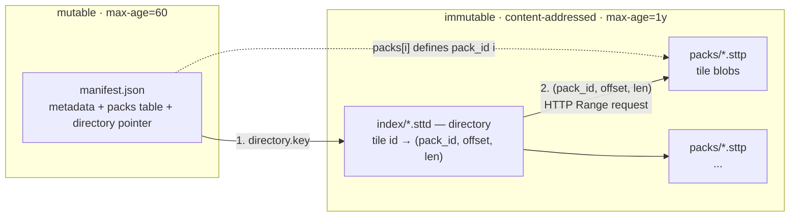

# STT Packed Format — Specification

The canonical STT container. Machine-checkable manifest
contract: [`manifest.schema.json`](./manifest.schema.json). Versioning model: §9.

Two packed format versions are current: **formatVersion 1** (the 0.3.x
layout — frozen; §§2–8 describe it and remain normative for v1 datasets) and
**formatVersion 2** (the 2026-07 coordinated byte break — object magic §9.2,
manifest schema templates §3.2, sectioned layer frame §5.2). Everything not
called out as version-specific is common to both. `manifest.formatVersion`
is the **authoritative** discriminator between them (§5.2 authority rule).

> **Spec license.** The STT specification documents — everything under
> `docs/spec/` plus the tile-payload spec
> [`docs/architecture/data-format.md`](../architecture/data-format.md) — are
> licensed [CC-BY-4.0](https://creativecommons.org/licenses/by/4.0/).
> The reference implementations remain MIT like the rest of the repository.
> Implementing this specification requires no code from this repository.

## 1. Motivation

A single-file archive cannot be edge-cached once it exceeds the CDN per-object
limit (Cloudflare Free/Pro/Business = 512 MB): a multi-GB dataset returns
`cf-cache-status: BYPASS` on every range request, so all reads hit origin for
every user. Reordering blobs does not change this.

The packed format makes the cacheable unit a small object, not the whole
dataset. Data is split into many content-addressed *pack* objects (each well under
the limit) plus a tiny manifest. A dumb CDN caches each pack natively. No Worker, no
vendor lock-in — cacheability is a property of the format, so it works on R2, S3,
GCS, or any static host.

## 2. On-disk / on-bucket layout (per dataset)

```
data/<dataset>/
  manifest.json            # tiny, MUTABLE   → short TTL (or purge-on-deploy)
  index/<blake3>.sttd      # directory blob  → IMMUTABLE (content-addressed)
  packs/<blake3>.sttp      # tile blob data  → IMMUTABLE (content-addressed)
  packs/<blake3>.sttp
  ...
```

- **Packs and the directory are content-addressed** (blake3, 128-bit → 32 hex chars).
  Their bytes never change without their name changing, so they ship with
  `Cache-Control: public, max-age=31536000, immutable` → cached at the edge forever,
  and re-sync skips unchanged packs (incremental deploys, cross-version dedup).
- **`manifest.json` is the only mutable object** → short `max-age` (e.g. 60 s) and/or
  explicit purge on deploy. It is tiny (a few KB), so this is cheap. It is the only
  thing a deploy must invalidate.
- **Retention contract (origin GC).** Deploys are *additive*: a deploy MUST NOT
  delete objects the previous manifest references, because manifests are cached
  (up to their TTL) and an open session holds its manifest in memory for its whole
  lifetime — both keep resolving old pack names. Origin garbage collection is a
  separate, retention-aware pass: an immutable object may be deleted only when it
  is BOTH unreferenced by the dataset's current manifest AND older than a retention
  window that exceeds every cached manifest's TTL plus the longest expected session
  (the reference deploy script `scripts/r2-sync.sh` defaults to 7 days, override
  `R2_PRUNE_RETENTION`, escape hatch `--prune-now`). The reference script
  additionally applies a one-deploy **grace rule** — before uploading, it captures
  the references of the *currently-deployed* manifest and protects them from GC for
  that deploy cycle — and a major republish that changes every object SHOULD defer
  pruning entirely (`--no-prune`) until the retention window has passed. Edge
  caches need no purge either way — an evicted-at-origin object simply ages out
  of the edge.



A cold reader fetches the manifest, then the directory (with the paged layout,
only the root page plus the leaf pages its viewport/time window touches), then
issues coalesced Range requests into packs. A deploy re-uploads only new
content-addressed objects and rewrites the manifest.

## 3. `manifest.json` schema

```json
{
  "format": "stt-packed",
  "formatVersion": 1,
  "capabilities": ["attr-quant", "coord-quant"],
  "compression": "zstd",
  "directory": { "key": "index/<hash>.sttd", "length": 1234567, "directoryVersion": 5, "encoding": "zstd",
                 "layout": "paged", "rootLength": 7024, "pageCount": 137, "pageEntries": 4096 },
  "packs": [
    { "key": "packs/<hash0>.sttp", "length": 67108864 },
    { "key": "packs/<hash1>.sttp", "length": 67108864 }
  ],
  "metadata": { "...": "the existing stt-core Metadata JSON, verbatim" }
}
```

- `packs[]` index **is** the `pack_id`. The directory references packs by this index.
- `metadata` is the current `crate::metadata::Metadata` JSON — folded into the manifest,
  so the reader needs **no** separate header or metadata fetch.
- `directory.encoding` (OPTIONAL): at-rest encoding of the `.sttd`
  object. `"zstd"` = a zstd frame wrapping the directory codec bytes (~2× smaller; the
  directory sits on the cold-start critical path with no CDN content-encoding rescue).
  For a **paged** directory (below) it describes the framing of *each page* (root + every
  leaf), not one frame over the whole object. **Absent = raw codec bytes.** The content
  address (`key`) and `length` always describe the **at-rest** bytes (i.e. the compressed
  bytes when `encoding` is set), so readers validate the fetched body length before decoding.
  Readers MUST support both shapes and MUST fail loudly on an unrecognized value.
- `directory.layout` (OPTIONAL): container shape. `"paged"` = a root page + leaf pages
  (§4.1), so a cold reader fetches only the leaves its viewport/time-window touches.
  **Absent or `"single"` = the whole-load object** (one buffer the reader decodes in full).
  When `"paged"`, `rootLength` (at-rest byte length of the root prefix), `pageCount` and
  `pageEntries` accompany it. The leaf codec is unchanged v5 — `layout`, not
  `directoryVersion`, discriminates the container.
- `capabilities` (OPTIONAL): required-to-understand feature declarations — see §3.1.
  Absent = none used (the shape of every pre-capabilities manifest; writers omit the
  key rather than emit an empty array).
- **Unknown fields are permitted at every envelope level** and MUST be ignored by
  readers (additive evolution within a `formatVersion`). The JSON Schema encodes
  this: `format` and `directoryVersion` are strict consts, `formatVersion` is
  the closed enum `[1, 2]`, the envelopes are open.
- `formatVersion: 2` manifests additionally carry the **`schemas`** table
  (§3.2) — the dataset's Arrow schema templates, embedded. v1 manifests MUST
  NOT carry it.

The manifest envelope is the **cross-language wire contract**. Its authoritative,
machine-checkable definition is [`manifest.schema.json`](./manifest.schema.json),
which is pinned in CI against the Rust writer (`crate::pack::Manifest`), the TS
reader type (`@poopdeck.gl/core` `PackedManifest`) and the golden fixture
(`packages/core/test/manifest-schema.test.ts`). Any drift between the three fails
the build.

### 3.1 Required-to-understand capabilities (`capabilities`)

Most format evolution is additive: a new column or manifest field that old
readers safely ignore. A small class of features is different — they **re-type
existing tile columns**, so a reader that predates them doesn't fail, it
silently misdecodes (e.g. `stt:quant` Int32 grid indices read as microscopic
lon/lat degrees, mid-session, per tile). `capabilities` is the manifest-level
must-understand declaration (the same mechanism as Zarr v3's `must_understand`)
that converts the format's worst failure mode — silent garbage — into its best:
a loud refusal at open.

- A **writer MUST** declare, for each registry feature below it used, that
  feature's capability string. A build that used none MUST omit the key
  entirely, so pre-capabilities manifests and non-quantized builds stay
  byte-identical. Entry order is not significant; the reference writer emits
  the list sorted + deduped so manifest bytes are byte-reproducible regardless
  of flag order.
- A **reader MUST** refuse a dataset whose `capabilities` contains any string
  outside the set the reader itself implements, naming the unknown entries in
  the error. It MUST NOT warn-and-proceed: every capability marks data that
  decodes to garbage, not to an error, without the feature.
- **Additive features never get a capability.** New columns (`triangles`,
  vector groups, summary tiers, …) and new manifest fields are ignored safely
  by old readers — declaring them here would lock those readers out
  gratuitously.

Registry (`formatVersion` 1):

| capability | declared when the writer… | payload mechanism |
| --- | --- | --- |
| `coord-quant` | quantized geometry to fixed-point `Int32` (`--quantize-coords`) | `stt:quant` metadata on the `geometry` field |
| `attr-quant` | quantized any numeric property column (`--quantize-attr` / `--quantize-attrs-auto`) | `stt:qa` metadata on the property field |
| `elevation-fold` | folded a property into POINT z (`--point-elevation-column`) | 3-component point leaf instead of 2 |

The value vocabulary is deliberately open-ended (the envelope rules above
stay intact): future registry entries are added by spec revision without a
schema change, and a reader enforces **its own** implemented set — not this
table's snapshot — so a v1 reader correctly refuses a dataset from a future
writer that declares a capability the reader has never heard of.

### 3.2 Schema templates (`schemas`) — formatVersion 2

A v2 layer frame (§5.2) does not repeat its Arrow IPC schema in every tile;
the schema **template** is written once, embedded in the manifest:

```jsonc
{
  "formatVersion": 2,
  "schemas": [
    { "hash": "<blake3-128 hex (32 chars) of the raw template bytes>",
      "data": "<base64 (standard, padded) of the raw template bytes>" }
  ]
  // directory / packs / metadata / capabilities: unchanged shape
}
```

- A **template** is a layer's Arrow IPC stream bytes from offset 0 through
  the end of the encapsulated *Schema message* (continuation `0xFFFFFFFF` +
  `i32 metadata_len` + flatbuffer; the schema message has `bodyLength 0`).
  Templates carry only **dataset-constant** metadata — per-tile-varying keys
  live in the frame's `TILE_META` section (§5.2.2).
- `schemas` MUST be **sorted by `hash`** and deduped (byte-reproducible
  manifests). A writer includes exactly the templates its frames reference.
- A reader MUST validate every entry at open (`blake3_128(data) == hash`) —
  a corrupt manifest fails loudly, dataset-level, before any tile fetch. It
  then builds the hash → bytes **template registry** the frame decoder
  resolves references against.
- Templates are keyed per **distinct stripped schema**, not per layer:
  per-tile type selection (attr-quant `UInt16` vs `Float64` fallback,
  `vertex_time` u16-delta vs `Int64`, `triangles` u16/u32) legitimately
  yields several templates per layer. Realized cardinality is expected in
  the single digits per dataset; at 1–2 templates × ~900 B raw the manifest
  grows by low KB.
- Embedding (rather than an external `schemas/<hash>` object class) is
  deliberate: no new object class for deploy tooling, no template-404
  failure mode that bricks a dataset, no extra cold-start fetch — every
  session already fetches the manifest.

## 4. Directory format v5

The directory (`index/<hash>.sttd`) is a pure columnar binary buffer
(`crates/stt-core/src/directory.rs`), inspired by PMTiles v3: delta + zig-zag
varint key columns plus blob-run RLE. v5 is the pack-aware directory codec
(`DIRECTORY_VERSION = 5`), extending the earlier single-file v4 codec with
pack awareness. Specified in full here since this is the codec's only
deployment.

**Varints.** Unsigned values use LEB128; signed deltas use LEB128 over a zig-zag
mapping `zz(v) = (v << 1) ^ (v >> 63)`. Deltas are computed with wrapping
arithmetic, so any `i64` round-trips exactly.

**Sort order.** Entries are sorted into directory order `(zoom, hilbert,
time_start)` — the codec's own (stable) sort key; the writer pre-sorts with
the additional `temporal_bucket_ms` tiebreak of §5, which the stable sort
preserves — so every key column is near-monotonic and delta-codes to ~1 byte
per entry.

### The Hilbert key (normative)

The `hilbert` component of the sort key — and therefore the wire `Δhilbert`
column and the paged container's cross-page monotonicity check (§4.1) — is
defined exactly as follows. A third-party writer MUST produce these values
bit-for-bit or its directory will not decode compatibly.

`hilbert(z, x, y)` is the index of the tile's `(x, y)` on the **traditional
Hilbert curve** (D. Hilbert, 1891) over the full `2^z × 2^z` tile grid of the
entry's **own zoom** (curve order = `z`). Coordinates are the standard
XYZ/WebMercatorQuad tile coordinates used everywhere in STT — `x` = column
increasing eastward, `y` = row increasing southward from the top-left
(northwest) origin — fed to the algorithm as raw integers with **no axis flip
or reorientation**. The convention is the classic bottom-up rotate-and-
accumulate `xy2d` algorithm (the widely published Wikipedia form):

```text
fn hilbert(z, x, y) -> u64:
    if z == 0: return 0          # single tile; order-0 curve is degenerate
    n = 1 << z                   # grid size at this zoom
    h = 0
    s = n / 2                    # walk bits from most- to least-significant
    while s > 0:
        rx = (x & s) != 0 ? 1 : 0
        ry = (y & s) != 0 ? 1 : 0
        h += s * s * ((3 * rx) XOR ry)
        # rotate/reflect the quadrant so the remaining low bits are in the
        # canonical frame (n-1-x is a pure bit complement: n-1 is all ones)
        if ry == 0:
            if rx == 1:
                x = (n - 1) - x
                y = (n - 1) - y
            swap(x, y)
        s = s / 2
    return h
```

Consequences of the convention, usable as quick orientation checks:

- the curve **enters** the grid at `(0, 0)` (the NW tile, `h = 0`) and
  **exits** at `(2^z − 1, 0)` (the NE tile, `h = 4^z − 1`);
- at `z = 1` the traversal order is `(0,0) → (0,1) → (1,1) → (1,0)` =
  `h 0, 1, 2, 3` (NW, SW, SE, NE);
- consecutive `h` values are always edge-adjacent tiles (the locality property
  range coalescing rests on).

Keys are **per-zoom**: the same `(x, y)` yields different values at different
zooms, and the directory sorts by `(zoom, hilbert, …)` so keys never compare
across zooms. `h < 4^z` fits `u64` at every zoom the format addresses (the
WebMercatorQuad matrix set tops out at z24 → `h < 2^48`; the codec itself
assumes only `hilbert < 2^63`, the blockquote below). The reference
implementation is
`TileId::hilbert_index` (`crates/stt-core/src/tile.rs`), which delegates to
`hilbert_2d::xy2h_discrete(x, y, order = z, Variant::Hilbert)` — that crate's
traditional variant computes exactly the algorithm above (the equivalence is
test-enforced, exhaustively at low zooms, in
`crates/stt-core/tests/hilbert_vectors.rs`).

**Normative test vectors** (pinned against the reference implementation by
`crates/stt-core/tests/hilbert_vectors.rs`; the spec table and the test table
are the same table):

| z  | x     | y     | h           |
|----|-------|-------|-------------|
| 0  | 0     | 0     | 0           |
| 1  | 0     | 0     | 0           |
| 1  | 0     | 1     | 1           |
| 1  | 1     | 1     | 2           |
| 1  | 1     | 0     | 3           |
| 2  | 0     | 0     | 0           |
| 2  | 0     | 3     | 5           |
| 2  | 1     | 2     | 7           |
| 2  | 3     | 3     | 10          |
| 2  | 2     | 1     | 13          |
| 2  | 3     | 0     | 15          |
| 8  | 0     | 0     | 0           |
| 8  | 0     | 255   | 21845       |
| 8  | 255   | 255   | 43690       |
| 8  | 255   | 0     | 65535       |
| 8  | 128   | 128   | 32768       |
| 8  | 100   | 200   | 28272       |
| 14 | 0     | 0     | 0           |
| 14 | 0     | 16383 | 89478485    |
| 14 | 16383 | 16383 | 178956970   |
| 14 | 16383 | 0     | 268435455   |
| 14 | 8192  | 8192  | 134217728   |
| 14 | 12345 | 6789  | 214230386   |

**Layout.**

```
u8     version_tag = 0x05
uvarint N          # entry count
uvarint R          # run count

# per-entry key columns, N rows, delta-coded against the previous entry:
repeat N:
  ivarint  Δzoom
  ivarint  Δhilbert
  ivarint  Δx
  ivarint  Δy
  ivarint  Δtime_start
  ivarint  duration            # time_end - time_start (wrapping)
  uvarint  feature_count
  uvarint  bucket_present      # temporal_bucket_ms: 0 = None, 1 = Some
  uvarint  bucket_value        #   present only when bucket_present == 1

# per-run blob columns, R rows:
repeat R:
  uvarint  run_length          # entries sharing this blob; Σ run_length == N
  ivarint  Δpack_id            # zig-zag vs the previous run's pack_id (v5)
  uvarint  offset_flag         # 0 = contiguous (== expected_offset)
  uvarint  offset              #   present only when offset_flag == 1: raw
                               #   pack-relative offset
  uvarint  length              # compressed blob length
  uvarint  uncompressed_size
  u32 (LE) crc32c              # integrity tag of the compressed blob

# optional trailing covering section:
u8       section_tag = 1       # COVER_SECTION_TMIN
repeat N:
  ivarint  Δcover_t_min        # cover_t_min - time_start (signed)
```

**Run-length encoding (the headline win).** A *run* is a maximal stretch of
consecutive entries (in directory order) that reference the **same physical
blob** — same `(pack_id, offset, length, uncompressed_size, crc32c)`. Because
the writer deduplicates byte-identical blobs (§5), a spatial cell whose content
is identical across many consecutive time buckets collapses to a single run:
the heavy blob columns are written **once per run** instead of once per entry —
the temporal analogue of PMTiles collapsing identical ocean tiles across space.
`pack_id` is part of run identity (v5): two entries collapse only when same
pack *and* same blob.

**Per-run `pack_id` column (new in v5).** Delta+zig-zag coded against the
previous run's `pack_id`; packs are near-monotonic in directory order, so this
costs ~1 byte/run. It sits immediately after `run_length`, before the offset
sentinel.

**Pack-relative offset contiguity.** Offsets are relative to the run's pack.
A run whose blob immediately follows the previous run's blob in the same pack
(the common, sequential case) stores `0`; a back-reference (a deduped blob
written earlier) stores a `1` flag + the raw offset. The decoder tracks
`expected = prev.offset + prev.length`, and `expected` resets to `0` whenever
`pack_id` changes between consecutive runs — so the first run of each pack
still hits the cheap `0` sentinel.

**Covering section.** One signed varint per entry, `cover_t_min - time_start`
(signed — a feature can start before its bucket boundary), giving the tight
lower temporal bound the reader's backward-coverage checks use. Emitted only
when **every** entry carries a bound; a pre-covering directory simply ends
after the run columns (`cover_t_min = None`), and a decoder that doesn't
recognise a trailing section tag stops reading.

**Decode** reconstructs the N key rows, then walks the R runs, assigning each
run's blob fields to its `run_length` entries; it errors if the run lengths
don't sum to `N` or the buffer is truncated.

> Assumes `hilbert < 2^63` (zoom ≤ ~31) and timestamps within `i64` ms — true
> for Web-Mercator tiles and Unix-ms time. The directory is single-level (no
> leaf directories).

## 4.1 Paged container (optional `layout: "paged"`)

A whole-load directory must be fetched and decoded in full before any tile can
be requested — cost grows with dataset size, not with what a session views (a
15 MB directory on the cold-start critical path). The **paged container** wraps
the v5 codec so a cold reader fetches a tiny root page plus only the leaf pages
its viewport/time-window touches. Implemented in `crates/stt-core/src/directory_page.rs`
(Rust) and `packages/core/src/directory.ts` (`decodePagedRoot`, TS).

**Layout.** The `.sttd` object is a root frame followed by leaf frames:

```text
.sttd  =  [root page frame][leaf 0 frame][leaf 1 frame] ...
```

- A **leaf page** is the *unchanged* §4 v5 codec over a contiguous slice of
  directory order `(zoom, hilbert, time_start)`. Slicing resets delta state and
  splits RLE runs at boundaries — the only paging cost (measured +6–19% at rest,
  paid once by the immutable CDN object, not per session).
- Each page (root + every leaf) is an **independent frame**: when
  `encoding == "zstd"` each is its own zstd frame (no shared dictionary, so the
  fzstd TS path decodes every page); absent = raw codec bytes per page.
- The directory is **single-level** (a flat page table; no multi-level tree) —
  sufficient for the whole fleet (~560 K entries → ~137 pages → a ~7 KB root).

**Root page** — a fixed-width header + one fixed-width descriptor per leaf (count
= bytes / width, no per-record framing). All little-endian:

```text
u8   root_version = 1
u8   descriptor_kind = 0          # 0 = geo-bbox + zoom-range + temporal bounds
u16  reserved = 0
u32  page_count P
u32  page_entries                 # nominal entries-per-page used at build

repeat P  (52 bytes each):
  u64  rel_offset                 # leaf byte offset RELATIVE TO rootLength
                                  #   (absolute = rootLength + rel_offset)
  u32  length                     # at-rest (framed) byte length of the leaf
  u32  entry_count                # entries in this leaf (Σ == N)
  u8   min_zoom
  u8   max_zoom
  u16  reserved = 0
  i32  min_lon_e7, min_lat_e7,    # geographic bbox, lon/lat × 1e7 fixed point;
       max_lon_e7, max_lat_e7     #   mins floored / maxes ceiled so the integer
                                  #   bbox always COVERS the leaf's tiles
  i64  t_min                      # min(cover_t_min ?? time_start) over the leaf
  i64  t_max                      # max(time_end) over the leaf
```

Offsets are relative to the root's end so the root encodes without knowing its
own at-rest length first.

**Descriptor choice (geo-bbox).** A reader prunes a leaf when its **zoom range**
excludes the query zoom, its **geo bbox** misses the viewport, or its
**`[t_min, t_max]`** misses the time window — all without fetching the leaf. The
geographic bbox (rather than a Hilbert key range) is zoom-correct and needs no
Hilbert index in the reader; it was frozen over the alternative by an A/B sim
at 4096 entries/page: it matched or beat Hilbert-range pruning on every dataset
where paging matters
(nyc-taxi-points 9.5%/15.5% of whole-load med/p90; drifters 25.0%/35.1%),
because a viewport box maps to a Hilbert *interval* that falsely keeps
spatially-distant pages while geo-bbox tests real overlap. It also composes with
a future per-tile `geoarrow.box` covering column.

**Covering section.** A leaf emits the §4 covering section iff **every** entry in
the *whole directory* carries `cover_t_min` (a global decision, so a paged
directory decodes byte-for-identical-entries to a whole-load directory of the
same corpus). Per-leaf `t_min` already encodes the tight lower bound on the page
pointer.

**Validation.** Beyond plain decode (root frame, leaf byte-ranges, per-leaf
entry counts), `stt-validate` checks the paged-specific invariants
(`verify_paged_structure`): every descriptor's bounds **cover** its leaf's
entries (geo bbox, zoom range, temporal) so a prune never drops a matching tile,
and cross-page key order is monotonic in `(zoom, hilbert, time_start)`.

## 5. Pack-cutting (writer)

1. Order blobs by `BlobOrdering` (default `Auto`, i.e. `--blob-ordering auto`:
   resolved at finalize via `BlobOrdering::choose` from the dataset's space-vs-time
   cardinality — wide-time → spatial-major, else 3D Hilbert). Locality → fewer packs
   per viewport.
   The curve key is extended with a **total tiebreak** `(z, x, y, time_start,
   temporal_bucket_ms)` — the curve alone ties between a cell's base and temporal-LOD
   tiles (and the 21-bit cube cap can collide), and the input arrives in nondeterministic
   (parallel) order. The tiebreak makes the blob byte order — and therefore every
   content address — **byte-reproducible across identical rebuilds**, which is what the
   immutable-pack caching economics rest on. The directory entry sort gets the same
   treatment: `(zoom, hilbert, time_start, temporal_bucket_ms)`.
2. Per-blob zstd, byte-identical dedup (blake3). **No shared dictionary** — each blob
   decompresses standalone (keeps the fzstd TS reader able to decode without a
   cross-blob dictionary).
3. Cut the ordered, deduped blob stream into packs of **≤ `pack_target_bytes`** (default
   **64 MiB**, override `--pack-size`). Never split a blob across packs.
4. Assign `pack_id` in cut order; `offset_in_pack` resets to 0 per pack.
5. zstd-compress the encoded directory (declared via `directory.encoding`, §3), then
   blake3 each finished pack and the at-rest directory → content-addressed filenames.
6. Emit `manifest.json` (metadata + directory pointer + pack table).

### 5.1 Tile payload layer frame v1 (alignment rule)

A **formatVersion-1** tile blob decompresses to the *layer frame*:

```text
[u16 layer_count | 0x8000]
  repeated: [u16 name_len][name utf8][u32 ipc_len][pad to 8][Arrow IPC stream]
```

The leading u16's top bit (`0x8000`, `ALIGNED_FRAME_FLAG`) marks the **aligned
frame**: after each `ipc_len`, zero bytes pad the position to the
next 8-byte boundary *relative to the payload start*, so every Arrow IPC stream
begins 8-byte aligned and a reader can hand it to an Arrow implementation zero-copy
(Arrow guarantees buffer alignment only *within* a stream; a stream at a misaligned
offset forces a copy of every buffer). The pad length is **never stored** — readers
derive it as `(8 - pos % 8) % 8` from the position after `ipc_len`; `ipc_len` is the
exact IPC byte length, padding excluded. Frames with the flag unset carry no padding
and decode without it; readers MUST accept both. The flag caps the layer count at
`0x7fff` — v2 writers additionally cap it one lower, because
`0x7fff | 0x8000 == 0xFFFF` is the v2 escape (§5.2).

### 5.2 Tile payload layer frame v2 (sectioned, template-referencing)

A **formatVersion-2** tile blob decompresses to the sectioned frame:

```text
u16  0xFFFF                    # v2 escape (unreachable in v1: the v1 writer
                               #   rejects layer_count | 0x8000 == 0xFFFF)
u8   frame_version = 2
u8   flags = 0                 # reserved, MUST be 0
u16  layer_count
per layer:
  u16  name_len, [name utf8]
  u8   ref_kind_core           # 0 = INLINE_SCHEMA_CORE section present;
                               # 1 = the next 16 bytes are the template hash
  [16] core template hash      # present iff ref_kind_core == 1
  u8   ref_kind_props          # 0/1 as above; 2 = NO props sections at all
  [16] props template hash     # present iff ref_kind_props == 1
  u8   section_count
  per section (TOC): u8 tag, u32 length     # at-rest bytes, pad excluded
  [pad to 8, derived]
  per section: [section bytes][pad to 8, derived]
```

**Authority rule.** `manifest.formatVersion` is the authoritative
discriminator; the `0xFFFF` escape is defense-in-depth, not a negotiation
channel. A v2 frame reached through a v1-declared manifest is a **hard
error**, and vice versa. (Deployed 0.3.x readers already hard-reject
`formatVersion != 1` by name at open — the v2 failure mode for old clients
is the loud refusal, by design.)

**Section tag registry** (unknown tags are SKIPPABLE via their TOC length —
additive evolution):

| tag | name | content |
| --- | --- | --- |
| 0x01 | `INLINE_SCHEMA_CORE` | full IPC schema prefix (self-contained mode) |
| 0x02 | `TILE_META` | canonical per-tile metadata JSON (§5.2.2) |
| 0x03 | `CORE_BATCH` | IPC tail: dictionary batch(es) + record batch + EOS |
| 0x04 | `INLINE_SCHEMA_PROPS` | as 0x01, props schema |
| 0x05 | `PROPS_BATCH` | as 0x03, props schema |

Reserved columns (`id`/times/geometry/`vertex_*`/`triangles`) form the
**CORE** batch; non-reserved property columns form the **PROPS** batch with
its own schema/template, emitted only when properties exist
(`ref_kind_props = 2` otherwise). Alignment follows §5.1: pads to 8 are
derived, never stored; TOC lengths are exact at-rest byte counts.

#### 5.2.1 Template splice (normative guards)

A `*_BATCH` section is the layer's Arrow IPC stream **tail** — dictionary
batches are per-tile (categories vary) and MUST live in the tail; an empty
tile still carries one DictionaryBatch per dictionary column; the 8-byte
end-of-stream marker (`FFFFFFFF 00000000`) belongs to the tail. The reader
materializes `concat(template, section)` and hands it to a stock Arrow
reader, resolving `ref_kind 1` hashes through the manifest's template
registry (§3.2) and `ref_kind 0` through the inline section.

Guards: the splice MUST use exactly the TOC-declared section length, and
readers MUST verify the section (and the template) begins with the
`0xFFFFFFFF` continuation marker — stray zero bytes otherwise parse as a
legacy 4-byte end-of-stream and **silently empty the tile** in arrow-rs (and
silently drop zero-copy in arrow-js). A frame that references a template
hash absent from the registry is a hard error naming the hash.

#### 5.2.2 `TILE_META` section

Per-tile-varying metadata, hoisted out of the (now dataset-constant) Arrow
schema. Canonical serialization: JSON, keys sorted, no whitespace. Readers
MUST ignore unknown keys. A key is present iff the corresponding feature is:

| key | v1 equivalent | present iff |
| --- | --- | --- |
| `qa` | `stt:qa` field metadata, as `{column: [o, s]}` | any property column is quantized (absence of a column key = not quantized) |
| `sorted` | — (new) | rows are stable-sorted by `start_time` |
| `t0` | `stt:time_offset_ms` | a start-time column exists |
| `vb` | `stt:vertex_value_buckets` | a vertex-value matrix exists |
| `vt` | `stt:vertex_time_origin_ms`/`stt:vertex_time_step_ms`, as `[origin, step]` | vertex_time is u16-delta encoded |

```json
{"qa":{"speed":[0.0,0.15]},"sorted":true,"t0":1577836800000,"vb":24,"vt":[1577836800000,1000]}
```

Readers MUST source these from `TILE_META` in v2; dataset-constant keys
(`ARROW:extension:name`, `ARROW:extension:metadata`, `stt:quant`,
`stt:layer`, `stt:geometry`, `stt:has_triangles`) stay in the template.

#### 5.2.3 Row order

v2 writers stable-sort each layer's rows by `start_time` at encode, AFTER
feature-id assignment (ids are order-independent), and declare it via
`TILE_META.sorted: true` — enabling client window slicing and future partial
decode. Readers MUST NOT assume sortedness without the flag.

## 6. Reader flow (identical contract, Rust + TS)

1. `GET manifest.json` → metadata, directory `{key,length,encoding?,layout?,rootLength?}`, `packs[]`.
2. Load the directory, branching on `layout`:
   - **single** (or `layout` absent): `GET <directory.key>` (one whole-object fetch,
     immutable/cached) → validate body length against `directory.length`, unwrap
     `encoding` if set, then decode v5 entries, each carrying `(pack_id, offset_in_pack,
     length, …)`. Build the in-memory `(z,x,y[/t])` indexes.
   - **paged**: if `directory.length` ≤ a small cutoff (the reader's
     `directoryPageThresholdBytes`, default 256 KiB), whole-load as above (decode root +
     all leaves). Otherwise range-`GET bytes=0-(rootLength-1)` for the **root page** only,
     decode its descriptors, and leave the entry indexes empty. A query then selects the
     leaves overlapping its `(viewport bbox, zoom, time window)` from the root descriptors,
     range-fetches the missing ones (coalescing adjacent leaf ranges within the object) and
     merges their entries — so the entry indexes fill in **incrementally**, proportional to
     the query footprint.
3. Tile read: `entry` → `pack = packs[entry.pack_id]` → range `GET pack.key`
   `bytes=<offset>-<offset+length-1>`.
4. **Coalescing is per-pack**: group needed entries by `pack_id`, then coalesce by offset
   gap *within* each pack (a range can't bridge two pack objects); a concurrency pool runs
   groups in parallel. (Leaf-page reads against the `.sttd` object coalesce the same way.)
5. Decompress per-blob zstd (fzstd in TS — no dict).

Cold load (single) = 1 manifest + 1 directory + N pack ranges. Cold load (paged) =
1 manifest + 1 root range + the few leaf ranges the first viewport touches + N pack
ranges — directory bytes proportional to the viewport, not the dataset. Warm = all
served from edge cache.

## 7. Design decisions

The rationale behind the format's locked-in choices:

- **D1 — pack target size = 64 MiB** (override `--pack-size`). Well under the 512 MB
  CDN per-object cap, fine enough for granular caching + parallel range reads, coarse
  enough to keep the object count (and R2 GET ops to warm) modest. A single blob larger
  than the target gets its own oversized pack (blobs are never split).
- **D2 — content address = blake3, 128-bit** (32 hex chars). blake3 is already the
  dedup hash; 128 bits is collision-safe at our object counts and keeps keys short.
- **D3 — the single-file container has been removed.** `stt-build` builds packed
  directories directly: the in-memory pipeline hands blobs to the `PackWriter`, and the
  lower-memory non-arrow `--streaming` path streams tiles into the same `PackWriter` as
  each zoom level completes. The old single-file writer, the `--streaming-arrow` transcode
  intermediate, and every transcode path are gone; datasets are rebuilt from source rather
  than transcoded.
- **D4 — manifest freshness = short `max-age` + `must-revalidate`.** `manifest.json`
  ships `max-age=60, must-revalidate`; packs/index ship `immutable, max-age=31536000`.
  Revalidation (`REVALIDATED`) keeps the tiny manifest fresh without a mandatory purge;
  packs never need an *edge* purge (origin GC is the §2 retention pass).
  `scripts/r2-sync.sh` applies the two cache-control classes.
- **D5 — directory compressed at rest.** The `.sttd` object is one
  zstd frame, declared via `directory.encoding` (§3); absent = raw codec bytes, which
  readers also accept. ~2× smaller on the cold-start critical path.
- **D6 — byte-reproducible builds (two layers, one open gap).** Reproducibility
  is what the immutable-object caching economics rest on: an identical rebuild
  should re-derive identical content addresses so a re-sync skips unchanged packs
  and unchanged data never invalidates the edge cache. STT's reproducibility has
  two layers:

  1. **Ordering layer — fully deterministic.** The blob order and the directory
     entry order carry total tiebreaks (§5: `(z, x, y, time_start,
     temporal_bucket_ms)`), so given identical payload bytes the pack layout,
     directory, and every content address are byte-identical across rebuilds —
     independent of input arrival order or thread scheduling.

  2. **Payload-bytes layer — cross-process reproducible on Arrow ≥59.** A tile
     blob is `zstd(Arrow IPC stream)`, so its content address depends on the IPC
     bytes being deterministic. `arrow_tile::encode_layer_cfg` assembles all
     schema- and field-level custom metadata from **sorted `BTreeMap`s**, and the
     pinned `arrow` 59 IPC writer serializes that metadata in **stable (sorted)
     key order**. So the same logical tile, built in two different processes,
     serializes its `stt:*` / `ARROW:extension:*` metadata keys in identical order
     → byte-identical IPC bytes → identical blake3 → the same pack name.

     This was an open gap under Arrow 54, which stored Schema/Field metadata in a
     per-process-seeded `HashMap` and emitted it in iteration order (the encoder
     always fed sorted `BTreeMap`s; only the writer's ordering lagged). The
     upgrade to Arrow ≥59 closed it.

  **Consequence (precise).** Cross-process reproducibility makes incremental
  re-sync and cross-version dedup exact: an unchanged dataset rebuilt in a fresh
  process re-produces byte-identical packs, so nothing re-uploads, and identical
  tiles across datasets/versions share one physical object. (Correctness never
  depended on this — a fresh full rebuild always produced a self-consistent
  dataset, the manifest swap is atomic (§2), and stale objects age out via the §2
  GC retention pass; reproducibility is a *cache-efficiency* win on top.)

  **Conformance.** A conformant writer SHOULD serialize Arrow schema/field custom
  metadata in a canonical (lexicographic) key order so payload bytes are
  reproducible across processes. The reference Rust writer **meets this on Arrow
  ≥59** (sorted-`BTreeMap` metadata assembly + Arrow 59's stable IPC metadata
  serialization); `crates/stt-core/tests/reproducible_build.rs` guards it with an
  active `same_tile_encodes_byte_identically` test (formerly an `#[ignore]`d
  canary under Arrow 54). See
  [conformance §3](./conformance.md#3-conformant-writer-requirements).

## 8. Non-goals
- **Low-zoom data volume** (the 80 MB zoom-out) → needs the summary/aggregate tier, not packing.
- **Worker / edge compute** → unnecessary; cacheability now lives in the format.

## 9. Versioning & file extensions

STT has **three independent version axes**; this spec governs only the first.

| Axis | Where | Current | Meaning |
| --- | --- | --- | --- |
| Packed **format** version | `manifest.formatVersion` | **2** (writer default; **1** frozen, kill-switch `stt-build --format-version 1`) | The manifest envelope + object layout + layer-frame shape described here. |
| **Directory** codec version | `manifest.directory.directoryVersion` | **5** | The run-length tile index encoding (`crate::directory`). v5 adds the per-run `pack_id` column + pack-relative offsets over v4. |
| **Tile payload** encoding | Arrow IPC schema / GeoArrow field metadata | — | Per-tile geometry + properties; archive-format-independent. |

Packed format v1 AND v2 emit directory v5 (v2 wraps the same codec bytes in
an 8-byte object magic prelude, §9.2). The single-file container (magic
`STT\x04`, "v4") is a fourth, retired axis — removed from the Rust toolchain
(no writer, reader, or transcode) and no longer read by either reference reader;
it survives only as a committed legacy fixture (`sample.stt`) that a test helper
transcodes to packed. Bumping any axis is a separate, independently-negotiated
change.

**File extensions:** `.sttp` = pack object (tile blob data), `.sttd` = directory
object (the v5 index), `manifest.json` = the per-dataset manifest, `.sttb` = the
single-file **bundle** interchange profile (§13, non-normative draft — a whole
dataset as one file for hand-off, never for serving). `.stt` is no
longer a container extension — the single-file archive has been removed;
`stt-build` accepts a `-o foo.stt` output path only as shorthand, stripping the
extension to a `foo/` dataset directory.

### 9.1 Stability & versioning promise

What bumps each axis, made explicit (§3's "unknown fields are permitted"
rule generalized):

- **`formatVersion` (packed format)** bumps only when a conformant v1 reader
  could **misread** a dataset — a changed meaning for an existing manifest
  field, object layout, or addressing rule. Adding new optional manifest
  fields does **not** bump it: every envelope level is open, readers MUST
  ignore unknown fields, and the JSON Schema encodes exactly that. Within a
  `formatVersion`, evolution is **additive-only**.
- **`directoryVersion` (directory codec)** bumps when the byte layout of the
  `.sttd` codec changes such that a v5 decoder would misdecode it. A new
  *trailing section tag* (like the covering section's tag 1) is additive —
  old decoders stop at the first unrecognized tag — but because trailing
  sections carry no length prefix, an unrecognized tag hides every section
  after it; a second section therefore effectively spends the remaining
  headroom, and the planned v6 moves to length-prefixed tagged sections.
  A new root-page `descriptor_kind` (§4.1) is additive the same way: the
  byte is reserved precisely so new descriptor shapes don't bump the codec.
- **Tile payload** evolves per its own spec
  ([`data-format.md`](../architecture/data-format.md)): new columns and new
  schema-metadata keys are additive; **re-typings of existing columns**
  (`stt:quant`, `stt:qa`) are the dangerous class — the writer declares each
  one in `manifest.capabilities` (§3.1) so a reader that lacks it refuses at
  open instead of misdecoding.
- **Deprecation promise:** shipped datasets are immutable, so no spec
  revision may retroactively invalidate a dataset that was conformant when
  written. Readers stay backward-compatible within a major axis version;
  writers MAY always emit the older shape.

### 9.2 Media types & magic bytes

Intended media type registrations (vendor tree; registration is planned, not
yet filed — producers SHOULD serve these today so the eventual registration
is a no-op):

| object | media type |
| --- | --- |
| `manifest.json` | `application/vnd.stt.manifest+json` |
| `.sttd` directory object | `application/vnd.stt.directory` |
| `.sttp` pack object | `application/vnd.stt.pack` |
| uncompressed layer frame (`stt-serve` tile responses) | `application/vnd.stt.tile` |

The earlier informal `application/x-stt-tile` label (still emitted by
`stt-serve` today — see the
[serve protocol §3.4.3](./stt-serve-protocol.md#343-success-response)) uses
the deprecated `x-` prefix and retires when the `vnd.` types register.

**Magic bytes:** under **formatVersion 2**, every object self-identifies
with an 8-byte magic prelude:

```text
.sttp = "STTP" u8 version(2) 0x00 0x00 0x00   # then concatenated zstd blobs
.sttd = "STTD" u8 version(2) 0x00 0x00 0x00   # then root frame (+ leaves)
```

Readers MUST validate the tag and version byte and require the reserved
bytes to be zero. Directory blob offsets are **object-absolute** (a pack's
first blob sits at offset 8), so the directory codec is unchanged. The
manifest `length` fields and the blake3 content addresses cover the
**entire object including the magic**. `rootLength` keeps meaning the root
frame's at-rest length — a paged reader's cold root fetch is
`bytes=0..(8+rootLength-1)`, validating the magic before the root math;
leaf `rel_offset` stays relative to the end of the root frame.

**formatVersion-1** objects carry **no magic number** — a v1 `.sttp` is
headerless concatenated zstd frames, and a v1 `.sttd` begins with the bare
codec version byte (or a zstd frame when `directory.encoding: "zstd"`), so
`file(1)` cannot identify either; a v1 dataset is identified by its
`manifest.json` (`"format": "stt-packed"`). The `.sttb` bundle (§13)
carries its own `STTB` magic prelude from day one under either version.

### 9.3 Changelog

- **v2 (2026-07)** — the coordinated byte break (design:
  `docs/roadmap/stt-packed-v2-design-2026-07.md`; every wire-breaking change
  batched into ONE version bump so content addresses churn once):
  `STTP`/`STTD` object magic with object-absolute blob offsets (§9.2);
  manifest-embedded schema templates (`schemas`, §3.2) killing the per-tile
  schema tax; the sectioned, template-referencing layer frame v2 with
  `TILE_META` and skippable section TOC (§5.2); rows stable-sorted by
  `start_time` (§5.2.3). Directory codec v5 and the manifest envelope are
  otherwise unchanged. `stt-build` emits v2 by default; `--format-version 1`
  is the one-release transitional kill switch, byte-identical to the 0.3.x
  writer (golden-pinned). `stt-serve` responses stay v1 frames (the serve
  protocol has no version channel; see
  [`stt-serve-protocol.md`](./stt-serve-protocol.md)).
- **v1, builder-behavior (2026-07)** — synthetic feature ids (string-id and
  id-less features, clipped segments) moved from Rust's toolchain-unspecified
  `DefaultHasher` to a pinned FNV-1a 64. Not a wire change — readers are
  unaffected — but a **one-time content-address churn**: the first rebuild of
  an affected dataset re-uploads every pack, and a deployment mixing a
  pre-change archive with a post-change live `stt-serve` over the same source
  disagrees on synthetic ids for identical features (rebuild the archive to
  realign). The old hasher was never stable across Rust toolchains, so this
  churn event class already existed — pinning FNV-1a makes it the last one.
  Features with explicit numeric GeoJSON ids are unaffected.
- **v1, additive (2026-07)** — `manifest.capabilities` required-to-understand
  declarations (§3.1): registry `coord-quant` / `attr-quant` /
  `elevation-fold`; writers omit the key when unused (no byte change for
  existing builds), readers refuse unknown entries at open. The
  machine-readable registry is the schema's top-level
  `x-stt-capability-registry` array, pinned by both reference readers' test
  suites.
- **v1 (2026-07)** — first spec-complete revision of the packed format:
  manifest envelope (`formatVersion: 1`), directory codec v5 (per-run
  `pack_id`, pack-relative offsets, covering section), optional paged
  directory container (root_version 1, descriptor_kind 0), aligned layer
  frame (`0x8000`), normative Hilbert key definition with test vectors,
  security considerations (§11) and container limits (§12). Earlier
  single-file containers (`STT\x01`–`STT\x04`) are retired and documented in
  the payload spec's magic table only as a paper record.

## 10. Relationship to standards

**No existing open standard covers temporally-tiled vector data.** That is the
niche this format occupies: a spatial tile pyramid crossed with a temporal axis,
columnar GPU-ready payloads, and cacheability as a property of the container.
The adjacent standards are listed here so the "why not an existing standard?"
question has a concrete answer, and so future convergence points are explicit.

### 10.1 OGC API – Tiles / Tile Matrix Sets

[OGC API – Tiles](https://docs.ogc.org/is/20-057/20-057.html) standardizes 2D
tile addressing and retrieval. Its only temporal hook is a `datetime`
conformance class — a *filter parameter* on requests, not a temporal axis in
the tile address. Multi-dimensional tiling exists only as **informative
Annex J** of the 2D Tile Matrix Set standard; no conformance class implements
it. STT's `(zoom, x, y, bucket)` addressing is exactly an Annex-J-style extra
dimension made normative:

| STT address component | Annex-J-style TMS concept |
| --- | --- |
| `zoom` | `tileMatrix` (identifier within the TileMatrixSet) |
| `x`, `y` | `tileCol`, `tileRow` (WebMercatorQuad-compatible) |
| `bucket` (`time_start`, width `temporal_bucket_ms`) | an additional dimension: `name: "time"`, regular interval of `temporal_bucket_ms` milliseconds, bounded by the dataset `metadata.time_range` |
| `--temporal-lod` coarser buckets | per-tileMatrix dimension resolution (coarser time step at lower zoom) |

If OGC ever promotes multi-dimensional tiling to a normative conformance
class, STT's directory is already expressible in those terms; until then this
mapping is documentation, not a compliance claim. The full mapping and a
machine-readable TMS artifact (WebMercatorQuad + a regular `time` dimension) are
in the [time model spec §7](./time-model.md#7-mapping-to-ogc-tile-matrix-sets-normative)
and [`tile-matrix-set.json`](./tile-matrix-set.json).

### 10.2 OGC Moving Features (MF-JSON)

[OGC Moving Features JSON](https://docs.ogc.org/is/19-045r3/19-045r3.html) is
the semantic ancestor: it standardizes *trajectory encodings*
(`MF_TemporalGeometry`, per-coordinate timestamp arrays — the same model as
our per-vertex `vertex_time` column). But it is feature-at-a-time JSON with no
tiling, no columnar layout, and no GPU story — a payload semantics standard,
not a delivery format. The natural convergence point is an ingest path
(`stt-build --input mf-json`): MF-JSON trajectories map losslessly onto STT's
per-vertex-timestamped LineStrings.

### 10.3 STAC profile

[STAC](https://stacspec.org/) catalogs assets; it does not constrain their
format. An STT dataset is self-describing enough to be advertised as a STAC
Item with no extra metadata: `metadata.bounds` → `bbox`/`geometry`,
`metadata.time_range` → `start_datetime`/`end_datetime`, and the manifest as
an asset with an `stt` role:

```json
{
  "type": "Feature",
  "stac_version": "1.0.0",
  "id": "drifters",
  "bbox": [-180.0, -78.4, 180.0, 81.5],
  "geometry": { "type": "Polygon", "coordinates": [[[-180.0,-78.4],[180.0,-78.4],[180.0,81.5],[-180.0,81.5],[-180.0,-78.4]]] },
  "properties": {
    "datetime": null,
    "start_datetime": "1979-02-15T00:00:00Z",
    "end_datetime": "2022-10-04T00:00:00Z"
  },
  "assets": {
    "stt": {
      "href": "https://example.com/data/drifters/manifest.json",
      "type": "application/json",
      "roles": ["data", "stt"],
      "title": "STT packed dataset (manifest)"
    }
  }
}
```

A reader discovers the dataset via STAC, then follows `assets.stt.href` into
the §6 reader flow. Since `manifest.json` already embeds the full dataset
metadata, the Item is generable mechanically from the manifest alone.

### 10.4 GeoZarr

[GeoZarr](https://github.com/zarr-developers/geozarr-spec) (V1 RC ~May 2026)
is the emerging standard for chunked, cloud-native **rasters and datacubes**.
Time-varying gridded data is explicitly out of STT's scope — STT is for
temporally-tiled *vector* data (trajectories, events, time-varying features).
Cite GeoZarr (or COG for static rasters), don't compete with it; the two
formats are complementary halves of a spatiotemporal stack.

### 10.5 Foursquare Hex Tiles

[Hex Tiles](https://foursquare.com/resources/blog/developer/hex-tiles-building-a-new-data-tiling-system-with-h3/)
is the closest existing analog — a tiling system designed for spatiotemporal
analytics, with an explicit temporal axis. It is proprietary (Foursquare
Studio's internal format) and H3-cell-based rather than vector-geometry-based.
STT is positioned as **the open alternative**: a published spec
(this document + [`manifest.schema.json`](./manifest.schema.json)), two
reference implementations (Rust writer/reader, TypeScript reader), exact
vector geometry rather than hex aggregates — with an optional H3 summary tier
where pre-aggregation is the right tool.

### 10.6 GeoArrow

[GeoArrow 0.2](https://geoarrow.org/extension-types.html) is the
payload-level standard STT conforms to: every tile's `geometry`
column carries `ARROW:extension:name` metadata
(conformance-tested in `crates/stt-core`), which is why a decompressed STT
tile opens directly in geoarrow-python / GeoPandas / Lonboard. The container
described in this spec is format-agnostic above the blob level; GeoArrow is
the normative payload contract (see
[`docs/architecture/data-format.md`](../architecture/data-format.md)).

## 11. Security considerations

A reader consuming a dataset from an untrusted origin processes three
attacker-controlled inputs: the manifest JSON, the directory codec bytes, and
the compressed tile blobs.

- **Decompression bounds.** Every directory entry declares
  `uncompressed_size`; a reader MUST bound decompression by it (allocate at
  most `uncompressed_size`, fail if the zstd frame produces more) rather than
  trusting the zstd frame header — otherwise a crafted blob is a
  decompression bomb. The same applies to the at-rest directory: decode
  output is bounded by the declared entry/page counts, not by whatever the
  frame inflates to.
- **Manifest validation.** A reader SHOULD validate the manifest against
  [`manifest.schema.json`](./manifest.schema.json) before use. In particular
  the schema's pack/index **key pattern** (`packs/<32-hex>.sttp`,
  `index/<32-hex>.sttd`) is the path-traversal guard: object keys are
  relative names within the dataset prefix, and a reader MUST NOT follow
  absolute keys, parent-relative (`../`) keys, or keys addressing a different
  origin. Resolve keys strictly against the manifest's own base URL/prefix.
- **Allocation caps.** Directory `N` (entry count), `R` (run count), and the
  paged root's `page_count` are attacker-controlled varints/integers; a
  reader SHOULD sanity-cap them (and cross-check `Σ run_length == N`, leaf
  byte ranges within the object, `Σ entry_count == N`) before sizing
  allocations. The reference decoders error on truncation and on run/entry
  mismatches rather than trusting counts.
- **Integrity tags are not authentication.** `crc32c` and the blake3 content
  addresses detect corruption and enable dedup; they do not authenticate a
  hostile origin. Serve datasets over TLS; treat the manifest URL as the
  trust anchor (its content addresses then pin the immutable objects).
- **Adversarial-decode hardening.** The reference v5/paged decoders are
  property-tested never to panic on arbitrary and mutated inputs
  (`crates/stt-core/tests/adversarial_decode.rs`); an independent
  implementation SHOULD apply equivalent fuzz/property testing to its decode
  surface.

## 12. Container limits

Normative ceilings implied by the wire types, plus the reserved escape
hatches. These are documented so an implementer hits a spec sentence, not a
silent overflow:

- **u32 blob caps.** A directory entry's `length` (compressed blob),
  `uncompressed_size`, and `feature_count` are `u32` → a single tile blob and
  its decompressed payload are each capped at **4 GiB − 1**, and a tile at
  ~4.29 B features. The per-layer `ipc_len` in the layer frame (§5.1) is also
  `u32`. A writer MUST fail loudly, never wrap, when a tile exceeds these.
- **Single-level page table.** The paged directory (§4.1) has one root and
  one level of leaves. The root grows 52 B/page; at the default 4096
  entries/page the practical ceiling is roughly **5–10 M directory entries**
  (~1200–2400 pages, a 60–130 KB root) before the root itself deserves
  paging. The escape hatch is reserved, additive: a multi-level root ships as
  a new `descriptor_kind` (§4.1's reserved byte), not a codec bump.
- **`packs[]` linearity.** The manifest's pack table is O(packs) JSON on the
  *mutable* critical path. At the default 64 MiB target a 10 TB dataset is
  ~160 K entries → a ~15 MB manifest, which defeats the "tiny mutable object"
  design. The escape hatch is reserved, additive: a future optional
  `packsRef` indirection (a content-addressed `packs.json` object holding the
  table) keeps the mutable manifest tiny; readers that don't know the field
  ignore it per §3, so it ships under `formatVersion` 1 with a writer opt-in.
- **Directory entry count.** The codec itself is varint-sized (no hard `N`
  cap below `u64`), but see §11 for the reader-side allocation caps, and the
  fleet-scale note in §4.1 (the whole fleet today is ~560 K entries).

## 13. Bundle profile (`.sttb`) — interchange, non-normative DRAFT

> Status: **non-normative draft.** Implemented and shipped by `stt-bundle`
> (see the [CLI reference](../api/cli-reference.md#stt-bundle)) and covered
> by round-trip tests, but not yet frozen as a normative part of this spec.
> It corresponds to §6 of the packed-v2 design
> (`docs/roadmap/stt-packed-v2-design-2026-07.md`) and ships independently
> of any byte-breaking revision — it is a container *around* the packed
> objects, not a change to them.

A `dataset.sttb` is a packed dataset as **one file**, restoring the
"download one file" usability property the exploded layout gave up
(PMTiles-style hand-off). Strictly an **interchange** profile: the CDN story
remains the exploded layout, and nothing serves bundles over HTTP ranges.

```text
"STTB"  u8 version(1)  [3 × 0x00]   # 8-byte magic prelude
u32     header_len                  # little-endian
[header JSON, header_len bytes]
[zero pad to the next 8-byte boundary]
[objects back-to-back, each at an 8-byte-aligned offset]
```

Header JSON:

```jsonc
{
  "manifest": { /* the dataset's manifest.json, VERBATIM */ },
  "objects": [
    // canonical order: directory first, then packs in pack_id order, then
    // any future manifest object tables in listed order (formatVersion 2
    // adds NO objects — its `schemas` templates are embedded in the
    // manifest, §3.2, and ride the verbatim manifest bytes)
    { "key": "index/<hash>.sttd", "offset": 16,   "length": 812 },
    { "key": "packs/<hash>.sttp", "offset": 832,  "length": 4096 }
  ]
}
```

Rules:

- `offset` / `length` are u64 byte positions within the bundle file, emitted
  as JSON numbers — exact through 2^53 (a 9-PB bundle) for JavaScript
  readers.
- Object offsets are 8-byte aligned; inter-object gaps are zero padding.
- The manifest is embedded **verbatim** so unpacking reproduces
  `manifest.json` byte-identically; every other object round-trips
  byte-identically by construction (objects are content-addressed, and
  `stt-bundle` re-verifies each blake3 key on both pack and unpack).
- Packing is deterministic: one dataset ⇒ one bundle byte stream.
- The container is **object-agnostic** — keys and bytes are opaque to it —
  so it carries `formatVersion` 1 and 2 datasets (and future manifest
  revisions) unchanged; the embedded manifest's `formatVersion` governs how
  the unpacked/bundle-backed dataset is read.
- Consumers MUST apply §11's key rules to header keys before resolving them
  to filesystem paths on unpack: relative paths only, no `..`/`.`/empty
  segments, no absolute keys.
- Truncated, wrong-magic, wrong-version or malformed-header bundles MUST be
  rejected loudly at open, never partially decoded.

`stt-validate` accepts a `.sttb` directly: the integrity tier verifies each
in-bundle object's blake3 against its key exactly like the exploded case,
and the decode tier runs through the bundle-backed reader
(`PackedReader::open_bundle`), whose pack reads are `(offset, length)`
windows into the single mapping.
