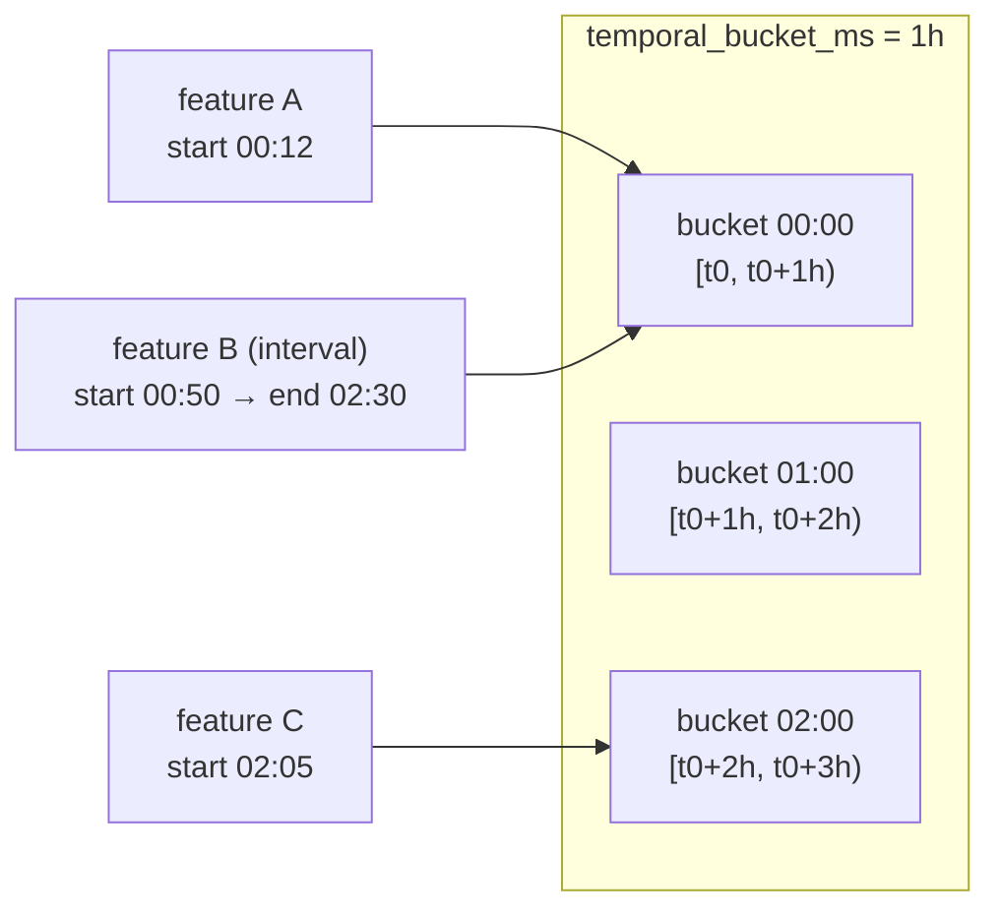
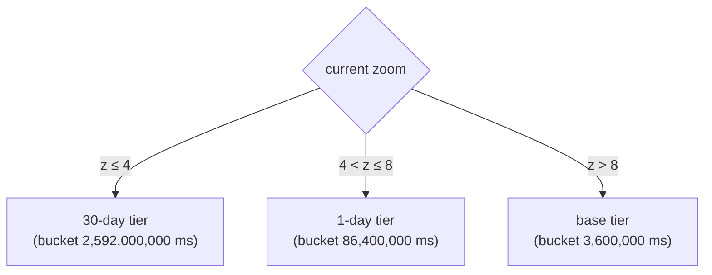

# STT Time Model — Specification

> **Scope:** the normative model for STT's *temporal* axis — how time is
> represented on a feature, how features are bucketed into tiles, how the
> coarser-bucket pyramid works, and how a reader prunes by time. The spatial
> axis (WebMercator tile pyramid) and the byte container are specified in
> [`stt-packed-format.md`](./stt-packed-format.md); the per-tile payload is in
> [`../architecture/data-format.md`](../architecture/data-format.md). This page
> makes normative what those documents reference in passing.

STT is a spatial tile pyramid crossed with a temporal axis: a tile is addressed
by `(zoom, x, y, bucket)`. This document specifies the `bucket` half.

**This document is normative.** The reference implementations are
`crates/stt-build/src/tiler.rs` (bucketing, covering bounds, LOD validation)
and `crates/stt-core/src/metadata.rs` (`time_range`, `temporal_lod`) on the
Rust side, and `packages/core/src/archive.ts` (LOD selection, time-window
pruning) plus `packages/playback/src/time-controller.ts` (the playhead) on the
TS side. If an implementation and this document disagree, that divergence is a
**bug in one of them** — resolved by an erratum to whichever is wrong, never by
silently redefining the spec to match the code. Spec revisions follow the
stability promise and changelog in the
[packed spec §9.1/§9.3](./stt-packed-format.md#91-stability--versioning-promise).

## 1. Time base — Unix milliseconds, UTC

All times in STT are **`i64` Unix epoch milliseconds, UTC**. There is no
timezone field and no local-time concept anywhere in the format: the directory
key columns, the per-feature `start_time` / `end_time` columns, the metadata
`time_range`, every `temporal_bucket_ms`, and the playhead clock are all the
same scalar. A producer MUST convert wall-clock / calendar input to Unix-ms UTC
at build time; a consumer that wants local time applies the offset at the
presentation edge only.

This single-scalar choice is what lets the directory delta-code the time column
to ~1 byte per entry (§4 of the packed spec) and lets the GPU do per-frame time
filtering with one `f64`/`i64` uniform.

> **Leap seconds (normative).** Times are Unix milliseconds, which have **no
> representation for a leap second** (there is no `23:59:60`). Whether an
> upstream feed smeared or stepped across a leap second is the **producer's
> presentation concern**: STT stores the Unix-ms scalar it is given and never
> reinterprets or adjusts it.

> **Non-negativity (normative).** Every *absolute* feature and metadata time MUST
> be **non-negative** ms-since-epoch (`t ≥ 0`); the reference builder **rejects
> pre-1970 (negative) timestamps** in both strictness modes, because the
> in-memory temporal index is **unsigned** (`TimeRange.start`/`end` and
> `TileId.t` are `u64`). This narrows — it does not contradict — the `i64`
> payload/wire representation: the tile `start_time`/`end_time` columns are
> `Int64` and the directory codec stores **signed `i64`** values, so a
> `cover_t_min` *delta* against `time_start` and a per-leaf `t_min`/`t_max`
> descriptor may be negative even though the absolute times they encode are not.

## 2. Feature time — instants and intervals

Every feature carries two absolute timestamps in its tile payload (see the
[payload schema](../architecture/data-format.md#per-layer-arrow-schema)):

| column       | type    | meaning                                  |
| ------------ | ------- | ---------------------------------------- |
| `start_time` | `Int64` | inclusive start of the feature's validity |
| `end_time`   | `Int64` | inclusive end of the feature's validity   |

- An **interval** feature (a trip, a storm cell's lifetime, a feature edit
  window) has `start_time < end_time`.
- An **instantaneous** feature (an earthquake, a single ping, a dropoff) is
  represented as `start_time == end_time`. When the input has no end-time field,
  the builder sets `end_time = start_time` (`crates/stt-build/src/columnar.rs`).

For LineStrings built with an end-time field, each *vertex* additionally carries
its own timestamp (the `vertex_time` column) so a trip animates along its path;
that per-vertex encoding is specified in the
[payload spec](../architecture/data-format.md#vertex_time-per-vertex-timestamps).
`start_time` / `end_time` remain the feature's overall span and are what
bucketing and pruning use.

## 3. Buckets — fixed-width, start-anchored

A **bucket** is a half-open interval `[b, b + temporal_bucket_ms)` on the
Unix-ms line. Buckets are **fixed-width** (the same `temporal_bucket_ms`
everywhere in a tier) and **anchored to the epoch**, not to any calendar unit:

```
bucket(t) = floor(t / temporal_bucket_ms) * temporal_bucket_ms
```

`temporal_bucket_ms` MUST be **> 0** — a zero or negative width makes
`bucket(t)` undefined, and the reference builder rejects it.

> **Boundary semantics (normative).** Bucket *assignment* is half-open;
> feature *validity* is inclusive. An instant exactly on a bucket boundary
> (`start_time == b`) belongs to bucket `b` — never to the preceding bucket —
> because assignment is the floor formula above over half-open
> `[b, b + temporal_bucket_ms)`. Meanwhile a feature's `[start_time,
> end_time]` interval is inclusive at **both** ends (§2), so an interval
> feature from an earlier bucket whose `end_time == b` is still *valid* at
> the boundary instant even though no feature is ever *assigned* to a bucket
> by its end. The two rules never conflict: assignment places bytes,
> validity drives pruning and rendering.

> **Calendar caveat (normative).** Buckets are fixed millisecond widths, never
> calendar-aware. A "1 month" LOD is `2_592_000_000 ms` = exactly **30 days**,
> *not* a calendar month; "1 year" would be `31_536_000_000 ms` = 365 days, with
> no leap-year handling. Producers that need calendar-aligned aggregation must
> pre-aggregate upstream and present the result as fixed-width buckets, or use
> the [summary tier](../architecture/data-format.md#summary-tier-layers)
> (shipped — `stt-build --summary-tier`). A reader MUST NOT
> assume bucket boundaries fall on calendar units.

### 3.1 Feature → bucket assignment

At build time a feature is placed in **exactly one** base-tier bucket — the
bucket containing its `start_time` (`tiler.rs`, `chunk_by_temporal_bucket`):

```
feature_bucket = floor(start_time / temporal_bucket_ms) * temporal_bucket_ms
```

A feature is **not** duplicated into every bucket its `[start_time, end_time]`
interval overlaps. This keeps the format lossless and compact (one physical copy
per feature), and pushes interval-overlap handling to read time via the covering
bound (§5). The consequence a reader MUST account for: a long-lived interval
feature lives in the tile of its *start* bucket, so a query window that opens
*after* the feature started must look *back* far enough to find it — which is
exactly what `cover_t_min` (§5) and the directory's per-leaf `t_min`/`t_max`
(§4.1 of the packed spec) make cheap.

### 3.2 The dataset bucket size

`metadata.temporal_bucket_ms` records the base-tier bucket width (set by
`stt-build --temporal-bucket`, default `1h`). It is **load-bearing for
prefetch**: the client enumerates exactly these bucket boundaries when looking
ahead in time during animation, so the chosen width is also the animation cache
granularity. Smaller buckets = finer scrub + more directory entries; larger
buckets = coarser scrub + fewer, fatter tiles.



Feature B spans three buckets but is stored once, in its start bucket (00:00).

## 4. Temporal LOD — the coarser-bucket pyramid

A multi-year dataset animated at the base bucket would stream an impractical
number of fine tiles when zoomed out. `stt-build --temporal-lod` emits one or
more **coarser-bucket tiers** alongside the base, each a strict aggregation of
the base buckets.

**Invariants (enforced at build, `tiler.rs`):**

- Each LOD level's `bucket_ms` MUST be **strictly greater than the base** and an
  **exact integer multiple** of `temporal_bucket_ms`.
- Levels are stored **sorted ascending** by `bucket_ms`.
- Each level carries a `max_zoom_level`: the deepest spatial zoom at which that
  coarse tier is still the right choice.

**Content contract (normative).** A conformant coarse-tier tile contains
**exactly the base features, re-bucketed at the coarser width**: for a given
spatial cell, the coarse tile for bucket `[B, B + bucket_ms)` holds the union
of the features of every base bucket that coarse bucket spans — identical
features, identical geometry and times, **no reduction, aggregation, or
thinning**. A coarse tier trades request count for bytes, nothing else, and a
reader may rely on feature identity between tiers (the same feature `id`
resolves to the same feature in every tier that contains it). Reduced or
aggregated tiers are a **future declared variant** — they will be announced
by an explicit metadata field when specified — not silently permitted; two
writers emitting "1d" tiers today MUST agree on the identity semantics above.

Recorded in metadata as:

```jsonc
"temporal_lod": [
  { "bucket_ms": 86400000,   "max_zoom_level": 8 },  // 1 day,  used up to z8
  { "bucket_ms": 2592000000, "max_zoom_level": 4 }   // 30 days, used up to z4
]
```

LOD tiles are tagged in the directory by their `temporal_bucket_ms` field, so a
base tile and its coarse-tier counterpart for the same cell are distinct
directory entries (and distinct blobs). A tile whose directory entry has no
`temporal_bucket_ms` belongs to the base tier (readers fall back to
`metadata.temporal_bucket_ms`).

### 4.1 Reader LOD selection

LOD tiers are **opt-in via the reader API** — unlike the summary tier, the
tileset does not switch to them automatically. An application calls
`STTArchive.pickTemporalLodForZoom(zoom)` (`archive.ts`), which returns:

> the **coarsest** level (largest `bucket_ms`) whose `max_zoom_level >= zoom`,
> or `undefined` if the zoom is deeper than every level (→ use the base tier).

then reads with `getTilesInBoundsForTemporalLod(...)`. The contract: zoomed out
and scrubbing a decade, read 30-day aggregates; zoomed in, read per-hour base
tiles.



## 5. Read-time temporal pruning — `cover_t_min`

Because a feature lives only in its start bucket (§3.1), a query needs a tight
*lower* bound per tile to know whether to look at it. The directory carries one
per entry:

- **`time_start`** — the tile's bucket boundary (the entry's nominal start).
- **`cover_t_min`** — the **earliest `start_time` of any feature actually in the
  tile** (`tiler.rs`). It may be `<` or `>` `time_start` and is `≤ time_end`.
  Stored as a signed delta against `time_start` in the directory's covering
  section (§4 of the packed spec); `None` on pre-covering archives, where readers
  fall back to `time_start`.
- **`time_end`** — the tile's inclusive upper temporal bound. A writer MUST
  set it to the **maximum feature `end_time` actually in the tile** — the
  *tight* bound, not the nominal bucket end `time_start +
  temporal_bucket_ms - 1`. This is load-bearing for correctness, not an
  optimization: an interval feature lives only in its *start* bucket (§3.1),
  so it is findable by a later query window **only because** `time_end` was
  widened to cover it. A writer emitting nominal bucket ends would produce a
  dataset that decodes cleanly yet silently loses every interval feature from
  queries after its start bucket — the reader's prune below would discard the
  tile. (When every feature ends inside the bucket, the tight bound is *below*
  the nominal end and additionally saves wasted fetches.)

A reader keeps a tile for a query window `[w_start, w_end]` iff:

```
time_end >= w_start  AND  (cover_t_min ?? time_start) <= w_end
```

(`archive.ts`, `getTileIdsInBounds`). The upper test uses the tight `time_end`;
the lower test uses the tight `cover_t_min`, so a tile whose data lies **entirely
after** the window is skipped without a fetch. At the page level, the paged
directory lifts the same idea to per-leaf `[t_min, t_max]` descriptors (§4.1 of
the packed spec) so a cold reader prunes whole leaf pages by time before
fetching them.

## 6. The playhead

Playback is driven by `TimeController` (`packages/playback`). Its time model:

- **`currentTime`** — the playhead, a single Unix-ms scalar.
- **`speed`** — a *signed effective rate* in **sim-ms per wall-ms** (direction ×
  magnitude). `speed: 3600` plays one hour of data per wall-clock second;
  negative plays backward.
- **`timeRange`** — optional `{ start, end }` (Unix-ms) clamp; the playhead
  loops, bounces, or clamps within it.
- **Frame-delta clamp** — a wall-clock gap is capped at `MAX_FRAME_DELTA_MS`
  (250 ms) before being scaled by `speed`, so a backgrounded tab resumes without
  teleporting the playhead. A longer gap is treated as dropped frames, never as a
  seek.

The clock advances `currentTime`; layers GPU-filter their resident tiles against
a window around it (no re-decode per frame); and the
[`PlaybackGovernor`](../api/playback-governor.md) gates the clock on a buffered
runway so the playhead never silently outruns loaded data. Those mechanics are
loading concerns, documented with the governor; the time *semantics* above are
what every consumer shares.

## 7. Mapping to OGC Tile Matrix Sets (normative)

STT's `(zoom, x, y, bucket)` addressing is an OGC **WebMercatorQuad** tile matrix
set with one additional, regularly-spaced **`time` dimension** — the shape
sketched (informatively) in Annex J of the *OGC Two Dimensional Tile Matrix Set*
standard. STT makes that shape concrete and normative. The machine-readable
definition ships as
[`tile-matrix-set.json`](./tile-matrix-set.json) (the standard WebMercatorQuad
matrices plus an STT `dimensions` block); the mapping is:

| STT concept | OGC TMS concept |
| --- | --- |
| `zoom` | `tileMatrix` identifier within the TileMatrixSet (WebMercatorQuad, z0–z24) |
| `x`, `y` | `tileCol`, `tileRow` (WebMercatorQuad, top-left origin) |
| `bucket` start, width `temporal_bucket_ms` | an extra dimension `{ "id": "time", "unitSymbol": "ms", "resolution": temporal_bucket_ms, "default": metadata.time_range.start }` |
| `metadata.time_range` | the dimension's `[start, end]` interval |
| `--temporal-lod` level | a per-`tileMatrix` coarser dimension `resolution` (bigger step at lower zoom) |

```json
{
  "id": "time",
  "unitSymbol": "ms",
  "resolution": 3600000,
  "interval": [1577836800000, 1735689599000],
  "default": 1577836800000
}
```

This is a *documentation and convergence* mapping, not a compliance claim: OGC
API – Tiles has no normative multi-dimensional conformance class today (its only
temporal hook is a `datetime` *filter parameter*, not an addressed axis). If one
is ratified, STT's directory is already expressible in its terms; until then the
[`tile-matrix-set.json`](./tile-matrix-set.json) artifact and this table are how
an external tool can reason about STT addressing in OGC vocabulary. See also
[OGC Moving Features](./stt-packed-format.md#102-ogc-moving-features-mf-json) for
the per-vertex trajectory lineage.

## 8. Summary of normative requirements

- **MUST** represent all times as `i64` Unix-ms UTC; no timezone or calendar
  semantics are carried by the format.
- **MUST** use **non-negative** absolute times (`t ≥ 0`); the reference builder
  rejects pre-1970 (negative) timestamps because the in-memory temporal index
  (`TimeRange`, `TileId.t`) is unsigned `u64`. (The directory codec stores signed
  `i64`, so `cover_t_min` deltas and per-leaf `t_min`/`t_max` may still be
  negative.)
- **MUST** represent instantaneous features as `start_time == end_time`.
- **MUST** use a strictly positive bucket width (`temporal_bucket_ms > 0`) in
  every tier.
- **MUST** place each feature in exactly one base bucket
  (`floor(start_time / temporal_bucket_ms) * temporal_bucket_ms`); a writer MUST
  NOT silently duplicate a feature across buckets. Assignment is half-open —
  an instant exactly on a bucket boundary belongs to the bucket it starts —
  while feature validity `[start_time, end_time]` stays inclusive (§3).
- **MUST** set each directory entry's `time_end` to the **maximum feature
  `end_time` in the tile** (the tight bound, §5) — interval features are
  findable after their start bucket only through it.
- LOD levels **MUST** be strictly-increasing exact multiples of the base bucket,
  stored sorted ascending, each with a `max_zoom_level`.
- A coarse LOD tile **MUST** contain exactly the base features re-bucketed at
  the coarser width — no reduction, aggregation, or thinning (§4); reduced
  tiers are a future *declared* variant, not silently permitted.
- A reader **MUST** prune by `time_end >= w_start AND (cover_t_min ?? time_start)
  <= w_end`, and **MUST** fall back to `time_start` when `cover_t_min` is absent.
- A reader **MUST NOT** assume bucket boundaries align to calendar units.
- A reader **SHOULD** select temporal LOD via `max_zoom_level` (coarsest level
  covering the zoom) when the application opts into the pyramid.
